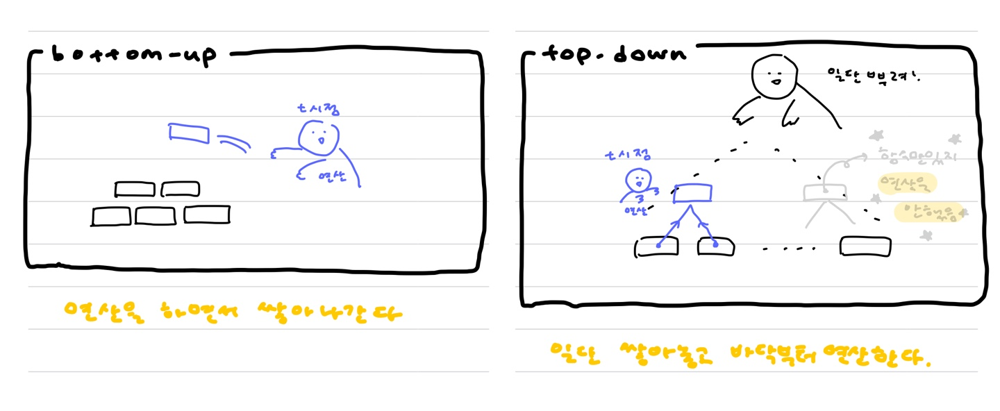
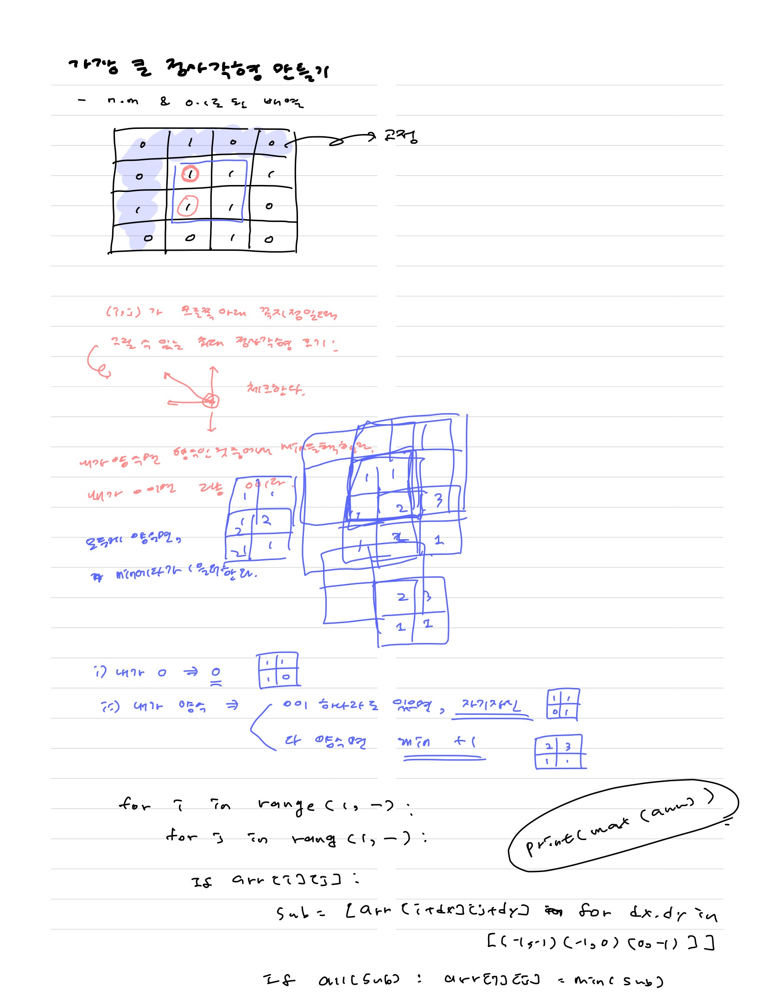

#### :star:  내가 맨날 헷갈리는거 ㅠㅠ :star:



* 재귀로 짤 때, 일단 함수를 뿌려놓고 연산은 바닥부터 함 !!!

  `min(f(x),f(y))` 쓴다고 해서 값이 바로 결정되는게 아님

* **top-down은 그냥 DFS**. 그러므로 일단 tree의 한 쪽 끝까지 쭉 갔다가, 한 칸씩 돌아오면서 연산 !!!

  * 빨강 파랑 초록 연산들을 위해 메모가 필요하다.

  

  


# Dynamic Programming

> 큰 문제를 작은 문제로 나누고, 내가 이미 계산한 결과라면 다시 연산하지 않고 가져다 쓰자 !

* **점화식**을 구하거나, **min max+이전 값**으로 현재 값을 계산한다.

* 큰 문제를 작은 문제로 분할해서 푸는 **"분할 정복"과 유사**하다.

* 답을 저장해놓고 **재활용**한다.

  ex : 피보나치 수열이 계산될 때마다 arr에 저장해놓고 필요할 때 가져다가 쓴다.


* 코테의 DP는 점화식만 구하면 , 그 후는 반복문으로 채워넣기만 하면 됨 !

  구현이 간단한 편 ,,,

  하지만 **점화식 구하는 게 어려운 편** ,,,

* 이 문제가 **DP(즉 점화식을 구해야함)임을 알아내는 것도 쉽지 않음.**


## :star: DP가 작동하기 위한 조건 두개

> https://lee-seul.github.io/algorithm/2017/03/16/dynamic-programming.html
>
> 설명이 잘 되어있다.

1. overlapping subproblem : **어제 한 연산 결과가 오늘 필요**하다 !

   ex : 피보나치 수열에서 F(n)은 이전에 계산한 F(n-1), F(n-2)만 가져오면 된다.

   > 메모해놓는다.

2. Optimal substructure : 쪼개서 답을 구하면 전체 정답을 찾을 수 있다 !

   ex : 피보나치 수열에서 F(n)을 구하기 위해 **F(n-1)과 F(n-2)로 쪼갠다.**

   > 재귀를 이용해 계산한다.


## 1. bottom-up : 생각하기 훨씬 쉬움 !!! 코드도 오히려 간결할지도

* loop를 통해 바닥부터 쌓아나간다.
* 연산을 하면서 쌓아나간다.
* for문을 통해 구현할 수 있다.


## 2. top-down

* 재귀를 통해 최대한 분산시킨 후, 바닥부터 join해서 첫 호출로 돌아온다.
* `arr[n] = min(f(n-1),f(n+1))` 이든 `arr[n] = f(n-1) + f(n-2)` 든, 함수만 미리 정의했을 뿐 **값을 계산하며 내려가는게 아님**!!!


## +. :memo: MEMOIZATION

* 엄밀히 말하면 메모이제이션은 연산한 결과를 단지 기록하는 것. 이를 활용해서 DP의 overlapping subproblem을 한다. 


### 피보나치

##### ==n= 0을 처리하기 위해 [0]을 (n+2)번 곱해줘야함 !!!!!==

* 탑다운 방식. DP를 이용한 피보나치

  ```python
  # top-down
  arr = [0]*(n+2)
  arr[1] = 1
  
  def fibo(n):
      if arr[n] or n == 0:
          return arr[n]
      ############################## 저장안해놓으면 무용지물 !
      arr[n] = fibo(n-1) + fibo(n-2)
      ####################################################
      return arr[n]
  
  fibo(n)
  print("top-down result :",arr[n])
  ```

* 바텀업 방식(재귀는 함수 호출 때문에 overhead가 발생할 수 있음.)

  ```python
  n = int(input())
  arr = [0]*(n+2)
  arr[1] = 1
  
  # bottom-up
  for i in range(2,n+1):
      arr[i] = arr[i-1] + arr[i-2]
  print("bottom-up result :",arr[n])
  ```

  

* 그 외 풀이 : swap, 반복문같은 재귀 ...?

  * 백준 피보나치수2에서는 자연수 n만 들어온다고 했으니까 fibo(0)은 고려하지 않았다 !

  ```python
  x,y = 1,1 # fibo(1), fibo(2)
  
  for _ in range(3,N+1):
      ########################################
      # fibo(1), fibo(2) => fibo(2), fibo(3) #
      ########################################
      x,y = y,x+y
  print(y)
  ```


### 피보나치 함수

> 0이 호출된 횟수와 1이 호출된 횟수를 각각 구해라
>
> ```python
> for _ in range(int(input())):
> n = int(input())
> arr = [0]*(n+2) + [1]
> arr[0], arr[1] = 0,1
> 
> def fibo(n):
>   if arr[n] or n == 0:
>       return arr[n]
>   arr[n] = fibo(n-2) + fibo(n-1)
>   return arr[n]
> fibo(n)
> print(arr[n-1],arr[n])
> ```


### 가장 큰 정사각형 만들기

* (0,0) 부터 시작하려는 고정관념을 버리자 !

* `arr[i][j]` 를 `(i,j)가 오른쪽 아래 꼭지점일 때, 가능한 가장 큰 정사각형의 한 변 크기` 로 정의해주면 문제가 쉬워진다.

  

###### 0829

```python
N,M = map(int, input().split())
arr = [[int(i) for i in input()] for _ in range(N)]

for i in range(1,N):
    for j in range(1,M):
        if arr[i][j]:
            arr[i][j] += min(arr[i-1][j-1], arr[i][j-1], arr[i-1][j])

print(max(max(ls) for ls in arr)**2)
```


```python
import sys
input = sys.stdin.readline

def solution(board):

    for i in range(1,N):
        for j in range(1,M):
            if board[i][j]:
                board[i][j] = min(board[i-1][j] , board[i-1][j-1] , board[i][j-1])+1

    return max(map(max,board))**2

N,M = map(int,input().split())
print(solution([list(map(int,*input().split())) for _ in range(N)]))
```


# :framed_picture: 주어진 arr를 통해 min/max 만들기

* 재귀 + memo를 이용할 수도 있지만, for문을 이용하면 메모할 필요가 없이 훨씬 간단하게 풀리는 문제들


## RGB 거리

* N개의 집을 R,G,B로 칠하는 비용이 주어졌을 때

  각 집을 칠하는 최소 비용을 return해라

* 단 인접한 집은 같은 색으로 칠할 수 없다.


1. 처음 : 시간초과
   * 재귀까진 좋음 !! 그러나 **memo를 하지 않아서** 시간초과.

```python
import sys
sys.setrecursionlimit(10**6)

def DP(i,j):
    if i == N-1 : return arr[i][j]
    return min(DP(i+1,k) for k in range(3) if k != j) + arr[i][j]

N = int(input())
arr = [[int(i) for i in input().split()] for _ in range(N)]

print(min(DP(0,j) for j in range(3)))
```

2. memo추가하면 통과

```python
import sys
sys.setrecursionlimit(10**6)

def DP(i,j):
    if i == N-1 : return arr[i][j]
    if memo[i][j]: return memo[i][j]
    memo[i][j] = min(DP(i+1,k) for k in range(3) if k != j) + arr[i][j]
    return memo[i][j]

N = int(input())
arr = [[int(i) for i in input().split()] for _ in range(N)]
memo = [[0]*3 for _ in range(N)]

print(min(DP(0,j) for j in range(3)))
```

3. **그냥 for문**
   * **따로 memo를 만들 필요가 없다.**

```python
N = int(input())
prices = [[*map(int, input().split())] for _ in range(N)]

for house in range(1,N):
    for color in range(3):
        prices[house][color] += min(prices[house-1][c] for c in {0,1,2}-{color})

print(min(prices[-1]))
```


## 프로그래머스 땅따먹기

* 재귀는 memoization 해도 시간 초과

```python
def solution(land):
    for i in range(len(land)-1):
        for j in range(4):
            land[i+1][j] += max(land[i][k] for k in range(4) if k != j)

    return max(land[-1])
```


# :scissors: 수 줄여나가기

## :large_blue_circle: 1463 1로 만들기 ( //3, //2, -1 )

> BFS도 맞지만**, DP를 이용하면 두줄**만에 끝낼 수 있다

* 시간은 비슷하지만 코드 길이에서 차이가 확 나고 디버깅 시에도 편하다 ~


* 정답을 쪼개보자 !!

  * 12를 1로 만드는 문제를 생각해보자.

  * 12를 1로 만드는건 ...

    1. (12//3 = 4를 1로 만드는 횟수 ) + 1
    2. (12//2 = 6를 1로 만드는 횟수 ) + 1
    3. (12-1 = 11를 1로 만드는 횟수 ) + 1

    셋중에 하나가 가능한데,

  * 우리는 "최소"가 궁금한 것. 즉 세개중에 제일 빨리 도착하는 애가 궁금.

  * 여기서 **도착 == 종료**이고, 이 조건은 **x가 1**이 되었을 때 !!

* 중요 포인트

  * 1은 **==따로 고려할 필요가 없다.==**

    왜냐면 나는 **최대한 빨리 1로 가고 싶으니까** !!!!

  * 일단 **미리 가고**, 그만큼의 **대가를 지불**해준다 !!!

  * 더 큰 step으로 가기 위해 1을 이용한다.

* 나누기 연산에 대한 비용`+1`을 잊지 말자 ~~


#### :yellow_heart: <u>top-down</u>

```
백준 1463번 1로만들기 문제를 풀고 있는데요! DFS로 푼 풀이와 memoization을 이용한 풀이에 시간 차이가 거의 없는 이유가 무엇일까요? memoization을 안하면 당연히 시간초과가 날 것이라고 생각해서 후자로 풀어서 제출했는데 전자로 풀어도 비슷한 시간으로 통과하더라구요! DP를 할 때 -1, /2, /3을 모두 고려하지 않고 바로 2로 나누거나 3으로 나누도록 만들었기 때문에 DFS로 풀어도 괜찮은걸까요? 제가 풀어놓고 헷갈리네요 ㅠㅠ

- 만약 input의 범위가 크지 않으면 차이가 안날수도 있고 (ex : 프로그래머스 타겟넘버)
- 이미 호출된 값에 대해 연산을 수차례 반복해야 하는지 or 한 번만 해도 되는지
  : 피보나치는 F(10)이 또 나오면 또 열심히 연산해야 하지만, 만약 10이 또 나왔어도 몇번 연산이 안필요하면 상관없을것.
```

하지만 확실히 차이가 나는 문제도 있음(숨바꼭질 1697)

그러므로 코드가 길어지더라도 저장을 생활화 하자 ㅎㅎㅎ

```python
# 1. DFS

def DP(x):
    if x <= 1:
        return 0
    return min( DP(x//3) + x%3 ,  DP(x//2) + x%2 ) + 1
```

```python
# 2.memoization

def DP(x):
    if x <= 1 or arr[x]:
        return arr[x]
    arr[x] = min(DP(x//3) + x%3, DP(x//2) + x%2) + 1
    return arr[x]
```


#### :yellow_heart: <u>bottom-up</u>

```python
n = int(input())
arr = [0,0,1,1]+[0]*n

for i in range(4,n+1):
    arr[i] = min(arr[i//2]+i%2, arr[i//3]+i%3) + 1

print(arr[n])
```


* 그럼 무조건 3의 배수가 되도록 하는게 이득 아닌가 ...? 라고 생각했는데

  **운이 좋아서 계속 2의 배수만 나오는 경우에는 2가 빠름 !**

* 결국 3으로 나눌건지 2로 나눌건지는 상황에 따라 다르다.

  > 일단 다 계산해놓고 MIN을 취하자.


##### 재귀를 쓰는 순간 DFS이므로 최단거리를 구할 수 없음에 주의하자.

* 10에서 1로 가는 건 `10>9>3>1`이 제일 빠름에도 불구하고

  **먼저 호출된** `10>5>4>2>1`이 `dict[1]`에 저장되어 **더 짧은게 저장이 안됨**

  min(a,b)해도 되지만 ... 시간이 더 걸릴 것으로 예상됨 !!!

  지나간길 또 지나가니까

* 그래서 BFS를 이용할 수 있도록 바꿔서 AC!

  숨바꼭질 문제가 떠올랐음 !


## :large_blue_circle: 1679 숨바꼭질

##### -1, //2 와 다른점?

* 전자는 값이 더 작아질 경우 돌아올 수 없음.

* 후자는 다시 +1을 해서 돌아올 수 있음.

  


```python
1에서 1을 return해야하는 이유

DP(1) = min( DP(0)+1, DP(1) + 2 ) OMG 무한루프
# DP(0) = 0
```

```python
N,K = map(int,input().split())

def DP(k):
    if N >= k:
        return N-k
    elif k == 1:
        return 1
    if k%2:
        return min( DP((k-1)//2)+2 , DP((k+1)//2)+2 , k-N )

    return min( DP(k//2) +1 , k-N )

print(DP(K))
```


###### 0829 숏코디이이잉


* 위 코드보다 시간이 더 걸린 이유는, x가 2의 배수인지 아닌지를 나누지 않았기 때문 ! 이걸 안나누면 연산을 조금 더해야함

* 만약 x = 4인 경우 `min ( DP(2) , DP(2) + 1 + 2, 4-N )` 즉 `DP(2)`를 두번해야함.

  이를 피하기 위해 저장해줘도 좋을듯?


##### 저장하지 않은 코드 (124ms)

```python
def DP(x):
    if x<=N or x == 1:
        return abs(N-x)
    return min(DP(x//2)+x%2+1,DP((x+1)//2)+(x+1)%2+2,x-N)

N,K = map(int, input().split())
print(DP(K))
```


##### 저장한 코드 (64ms)

```python
def DP(x):
    if x<=N or x == 1:
        return abs(N-x)
    if arr[x]:
        return arr[x]
    arr[x] = min(DP(x//2) + x%2 + 1, DP((x+1)//2) + (x+1)%2 + 2, x-N)
    return arr[x]

N,K = map(int, input().split())
arr = [0]*(K+1)
print(DP(K))
```


## :large_blue_circle: 숨바꼭질2 ; 최소 연산 수와 경로 수를 return해라


```python
def DP(x):
    if x<=N or x == 1:
        return abs(N-x)
    if arr[x][0]:
        return arr[x][0]
    cnt = [DP(x//2) + x%2 + 1, DP((x+1)//2) + (x+1)%2 + 2, x-N]
    arr[x] = [min(cnt),sum(arr[x][1] for x,c in zip([x//2, (x+1)//2, x-N],cnt) if c==min(cnt))]
    return arr[x][0]

N,K = map(int, input().split())
arr = [[0,1]]*(K+1) # [최소 연산수, n으로 오는 최단 경로의 갯수]
print(DP(K))
print(arr[K][1])
```

* 숨바꼭질 1의 코드를 최소한으로 수정했다 !


1. 일단 최단 연산수를 return해야하니까 그대로 두되, 이 연산을 위해 최단을 몇번 마주쳤는지를 어떻게 계산할까에 초점을 두었다.
2. 일단 cnt로 x로 다다르는 최단 연산 수의 종류를 구하고
3. min(cnt)로 최단 연산을 찾는다.
4. 그 다음 최단 연산이 되는 다른 경로가 있는지 보기 위하여 min(cnt)가 되는 애들을 cnt에서 뽑아주고
5. 얘네의 최단 경로 갯수를 모두 더해주면, x로 오는 최단 경로 갯수가 완성된다 !


###### example

* `min( [ cnt[0] = 5 , 5 ] , [ cnt[1] = 10 , 1 ], [ cnt[3] = 3 , 5 ] )` 이라면,

1. x로 오는 최단 연산 수는 5이면서
2. 5가 되는 path가 두개 있다.
3. 이 때 각 path로 오는 경우의 수가 5개, 3개 있으므로
4. x로 오는 최단 연산 수를 갖는 경로의 수는 5 + 3 = 8 !


## :large_blue_circle: 숨바꼭질3 : 경로마다 소요 시간이 다를 때

* *2하는 경우에는 0초가 걸릴 때

* 1번 코드에서 1씩 빼주기만 하면 된다.


##### 저장하지 않은 코드 (124ms)

```python
def DP(x):
    if x<=N or x == 1:
        return abs(N-x)
    return min(DP(x//2)+x%2,DP((x+1)//2)+(x+1)%2+1,x-N)

N,K = map(int, input().split())
print(DP(K))
```


##### 저장한 코드 (64ms)

```python
def DP(x):
    if x<=N or x == 1:
        return abs(N-x)
    if arr[x]:
        return arr[x]
    arr[x] = min(DP(x//2) + x%2, DP((x+1)//2) + (x+1)%2+1, x-N)
    return arr[x]

N,K = map(int, input().split())
arr = [0]*(K+1)
print(DP(K))
```


## :large_blue_circle: 숨바꼭질4 : 경로 자체를 return해야할 때

> https://www.acmicpc.net/problem/13913 아아악 !!!!
>
> 공부가 ,, 필요하다 ,,,


## 2579 계단


* 하나씩 해봐야 점화식이 보인다 ...

  1. k번째 칸에서 최대 점수는?

     2. k-1번째 칸을 밟았거나
     3. k-2번째 칸을 밟았거나

     > 최대 뛸 수 있는 칸이 2칸 뿐이므로 ! 만약 3칸이라면 k-3까지 고려!

  2. k-1번째 칸을 밟았다면?

     * 3칸을 연속해서 갈 수 없으므로

       k-2칸은 안밟았을것이다.

     * 그렇다면 k-3칸은 밟았겠군 !!!

       (최대 뛸 수 있는 칸이 2칸이니까 보장됨.

       3칸이면 k-2를 밟았을 수도 있음)

     * k-1 최대점수 + k-1 밟음 + 현재 k 밟음
       `score[k-3] + steps[k-1] + steps[k]`

  3. k-2번째 칸을 밟았다면?

     * 이건 그냥 `score[k-2] + steps[k]`

  4. 이제 **둘 중의 max**를 가져가면 된다 !

```python
step = [0]+[int(input()) for _ in range(int(input()))] # step[i-1]을 위해 하나 추가
score = [0]*len(step)

for i in range(1,len(step)):
    score[i] = max(score[i-3]+step[i-1], score[i-2])+step[i]
    
print(score[-1])
```

* 거꾸로 생각하면, 현재까지 밟지 않은 애들의 최솟값!으로 만들 수도 있다.

```python
def solution(steps):
    score = [0]*(len(steps)+2)
    # score[i] ; i를 밟았을 때, 이전에 밟지 않은 것의 최솟값
    for k in range(2,len(steps)):
        # k를 밟았다면
        # k-1을 밟았거나 == k-2를 안밟았다 == k-3은 밟았다 == score[k-3] + steps[k-2]
        # k-1을 안밟고 k-2를 밟았거나 == score[k-2] + steps[k-1]
        score[k] = min(score[k-2]+steps[k-1], score[k-3]+steps[k-2])

    return sum(steps)-score[-3] # 마지막 계단을 밟았을 때 지나친 계단의 최솟값을 전체에서 뺀다 !

print(solution([10,20,15,25,10,20]))
```


# 1912 연속합

* arr[i] ; i번째를 **꼭 포함했을 때** 최대값
  1. 그냥 나부터 재시작 하거나
  2. 이전까지 연속합 중 최대인 친구에 나를 더하거나

```python
N = int(input())
arr = [*map(int,input().split())]

D = [0]*N
for i in range(N):
    D[i] = max(arr[i], D[i-1]+arr[i])
    
print(max(D))
```


# 등굣길

* 웅덩이를 피해서 끝점에 도착하는 최단 경로의 갯수 !


1. DP

```python
def solution(m, n, puddles):
    board = [[0]*(m+1) for _ in range(n+1)]
    board[1][1] = 1
    for i,j in puddles: board[j][i] = -1
        
    for i in range(1,n+1):
        for j in range(1,m+1):
            if board[i][j]<0: board[i][j] = 0
            else:
                board[i][j] += (board[i-1][j] + board[i][j-1])%1000000007
    return board[-1][-1]
```


2. 재귀

   ##### 완전 ==피보나치==랑 푸는 방법 똑같음 ㅎㅎ 하지만 함수 호출이 많으므로 DP가 적절

* for문을 그대로 재귀로 바꾼것 뿐 !!!

* 여기서는 웅덩이를 음수로 만들어서, 먄약 웅덩이라면

  아무것도 계산하지 않고 0을 return한다 ! 를 추가.

* 또 따로` board[1][1]=1`을 선언하지 않고

  초항을 1로 return하게 함 !

```python
def solution(m, n, puddles):
    board = [[0]*(m+1) for _ in range(n+1)]
    board[1][1] = 1
    for i,j in puddles : board[j][i] = -1

    def DP(a,b):
        if a < 0 or b < 0 : return 0
        if board[a][b] > 0:
            return board[a][b]
        if board[a][b] < 0:
            return 0

        board[a][b] = (DP(a,b-1) + DP(a-1,b))%1000000007
        return board[a][b]

    return DP(n,m)
```


# 도둑질

* 1번집을 들린다, 안들린다로 나눠서 DP

```python
def solution(money):
    answer = money[0]

    temp = [0] * len(money)
    for i in range(2, len(money) - 1):
        temp[i] = max(temp[i - 2], temp[i - 3]) + money[i]
    answer += max(temp)

    temp = [0] * len(money)
    for i in range(1, len(money)):
        temp[i] = max(temp[i - 2], temp[i - 3]) + money[i]

    return max(answer, max(temp))
```

* for문 1개로 줄이는거 생각해보쟈 ,,
