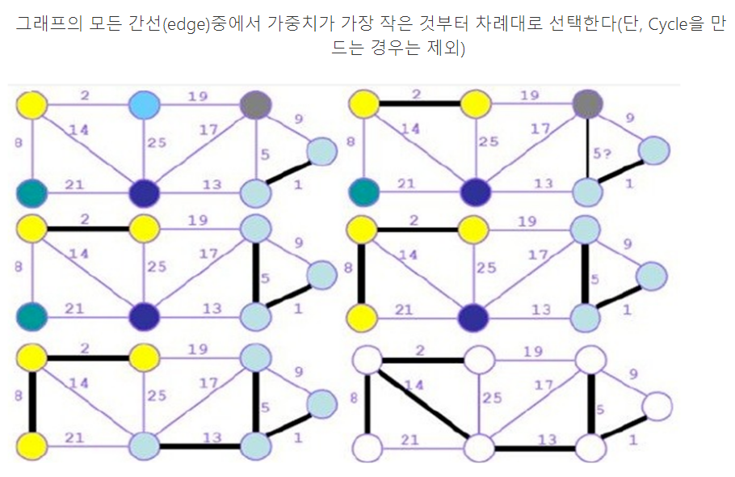
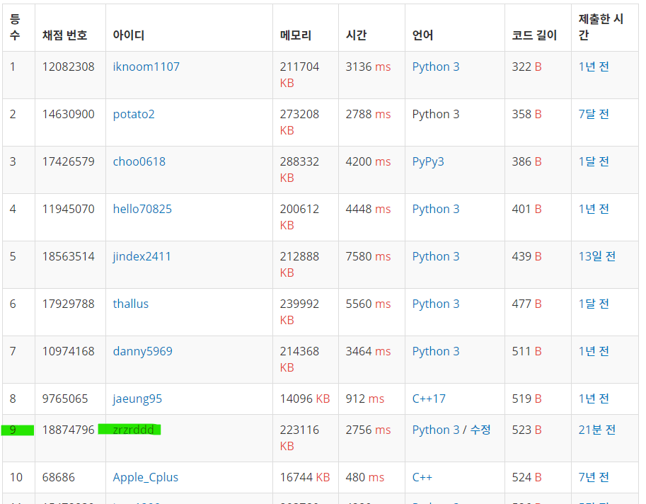

# Kruskal Algorithm

#### <u>모든 정점</u>을 최소 비용으로 방문하자 !

> https://www.youtube.com/watch?v=LQ3JHknGy8c&list=PLRx0vPvlEmdDHxCvAQS1_6XV4deOwfVrz&index=19


* 위 방법은 greedy이다.

  지금 당장 사이클을 만들지 않고, 최소를 선택하는 것이

  전체 cost를 줄이면서 MST 조건을 만족하는 경우가 되므로.


1. 거리를 기준으로 **엣지를** !!! **==오름차순 정렬==**한다.

   (A,B,비용)

   * 즉 크루스칼은 정렬을 어떻게 하느냐에 따라 시간 복잡도가 달라짐.

     quick sort와 같은 효율적 알고리즘을 이용하면 

     **O(Elog~2~E)**       ; E : 간선 갯수

2. 가장 비용이 작은 간선을 선택한다.

3. **cycle이 생기는지 확인한 후** 추가한다.

   아래 예제의 경우 28은 cycle을 형성하므로 건너뛰게 된다.

   cycle 발생 확인은 **`Union Find !`**


### cycle 발생 확인하기 : Union-Find

* 부모노드가 같지 않아야 연결할 수 있다 !!!

```python
if find(a) != find(b):
    union(a,b)
```

### cycle이 있는지 판단하기 : Union-Find

* 모든 노드의 부모가 같으면 !!!


### 구현해보기

* union에서 일반적으로 `x==y`를 포함시키는데, 여기서는 같다면 진행하지 않아야한다는 점을 잊지 말자 !
* **<u>중지 조건을 걸어주지 않으면 `for loop`는 끝까지 돈다.</u>**
* union시에 부모노드는 더 큰 쪽에 가도록 했으므로 `p[N] == -N` 을 체크해준다.
  **즉 p[1]이 -N을 가지면 중지 !**
  * [여기서](https://visualgo.net/en/mst) 보면 이미 다 연결 되었음에도 간선이 남아있어서 계속 진행 !!

```python
from operator import itemgetter

def find(a):
    if p[a] < 0 :return a
    p[a] = find(p[a])
    return p[a]

def check_and_union(a,b):
    """
    합치려는 두 node의 부모가 같은지 확인한 후 진행한다.
    만약 같다면 더 진행하지 않고 False를 return한다.
    """
    x,y = find(a),find(b)
    if x==y : return False
    if x>y : x,y = y,x
    p[y] += p[x]
    p[x] = y
    return True

N,M = 7,11
arr = [(1,7,12),(1,4,28),(1,2,67),(2,4,24),
       (2,5,62),(3,5,20),(3,6,37),(4,7,13),
       (5,6,45),(5,7,73),(1,5,17)]

arr.sort(key = itemgetter(2))

p = [-1 for i in range(N+1)]
total_cost = 0

for a,b,cost in arr:
    if check_and_union(a,b):
        total_cost += cost
        print("연결 ! :",a,b,cost)
        
    #################### # union시에 더 큰 node가 부모가 되도록 만들었기 때문에
                         # 매 loop마다 마지막의 자식 node가 N개인지만 확인하면 된다 !
    if p[N] == -N:
        break
        
    ####################

print(p)
print(total_cost)
```


###### 0921 다시 짜보기이

```python
N,M = 7,11 # n_of_node, n_of_edge
arr = [(1,7,12),(1,4,28),(1,2,67),(2,4,24),
       (2,5,62),(3,5,20),(3,6,37),(4,7,13),
       (5,6,45),(5,7,73),(1,5,17)]

arr.sort(key = lambda x:x[-1])
print(arr)

p = [-1]*(N+1)

def find(x):
    if p[x] < 0:
        return x
    p[x] = find(p[x])
    return p[x]

def union(a,b):
    if a>b:a,b = b,a
    p[b] += p[a]
    p[a] = b

minimum_cost = 0
for a,b,cost in arr:
    pa = find(a)
    pb = find(b)
    if pa == pb:
        continue
    union(pa,pb)
    minimum_cost += cost
    if p[N] == -N: # 큰 노드를 부모로 만들기 때문에 마지막 노드에 대한 값만 매번 체크하면 된다.
        print(f"최소 비용은 {minimum_cost}입니다.")
        print(p)
        break
```


### Kruskal 크루스칼 알고리즘 - 2

1. 그래프 내의 모든 간선을, 가중치의 오름차순으로 정렬한다.
2. 이 목록을 차례로 순회하면서, 찾아나갈 것이다.


1. 먼저 가장 첫번째 원소, 즉 비용이 가장 작은 간선을 고른다.

2. 하나의 간선을 방문했으면, 아직 전체 구조는 tree가 아니다.

   **tree가 될 때까지**, 즉 모든 정점이 이어질 때까지 간선 방문을 실시한다.

3. CE(1) 에서, 다음으로 비용이 작은 AC, CF(2) 를 고른다.

4. 반복한다.


7. 이때 방문하다보면, tree가 아닌, 즉 **cycle이 생길 수도 있다.**

   최소 비용이라 할지라도 tree를 해치는 경우에는 제거한다.


8. 위에서 빨간 간선을 제거한 것이 최종 해가 된다.


* 한눈에 이해하기




# 1197 최소 스패닝 트리

###### 1922 네트워크 연결 (위랑 똑같)


```python
import sys
from operator import itemgetter
input = sys.stdin.readline
V,E = map(int,input().split())

p = [*range(V+1)]
arr = [tuple(map(int,input().split())) for _ in range(E)]
arr.sort(key = itemgetter(2))

def find(a):
    if p[a] == a:return a
    p[a] = find(p[a])
    return p[a]

def union(a,b):
    x,y = find(a),find(b)
    if x==y: return False
    if x>y : x,y = y,x
    p[y] = x
    return True

total = 0
for a,b,cost in arr:
    if union(a,b):
        total += cost

print(total)
```


# 2887 행성 터널

* MIN(X,Y,Z)를 MIN(X,Y), MIN(X,Z), MIN(Y,Z) 로 쪼개서 접근 ~!!


* 간선이 번호로 안주어지고 좌표로 주어져서 ... 

  하 그냥 내가 다 번호를 달아줄까? 하다가

  튜플은 immutable이므로 key로 사용할 수 있다는게 떠오름 !

  그래서 얘 자체를 dic의 key로 사용

* 나는 처음에 comb 함수를 만들어서 모든 조합을 다 구함

  그러나 N이 100,000이므로 , 이렇게 N^2^ 개를 모두 구하면 터짐 !!!

  그렇기 때문에, 조금이라도 가능성이 있는 애들을 걸려줘야한다.

* 이걸 거르는 과정이 핵심인 문제 1!!

  3차원 좌표를 마치 다 봐야할 것 같지만 ... 사실은 x하나만 보면 됨...


* **==X 좌표를 오름차순으로 정렬==**해보자.

  이렇게 하면 자기의 양 옆에 있는 애들이 나와 가장 가까운 친구가 된다.

  최소 비용으로 서로를 잇고싶은거니까, 얘네들을 일렬로 주루륵 이어보자.

  이게 X축 기준 최소 스패닝 트리이고

  이걸 다~~ 해서 추가한 다음 FIND로 걸러주면 된다.

```python
import sys
from operator import itemgetter
input = sys.stdin.readline

N = int(input())
arr = [tuple(map(int, input().split())) for i in range(N)]
p = {i:i for i in arr}

def find(a):
    if p[a] == a: return a
    p[a] = find(p[a])
    return p[a]

def union(a,b):
    x,y = find(a), find(b)
    if x==y : return False
    if x>y : x,y = y,x
    p[y] = x
    return True

############################################ 꼭 다 해야하는건 아님
def dist(a,b,c,d,e,f):
    return min(*map(abs,[a-d,b-e,c-f]))
###############################################################

distance = []
for i in range(3):
    arr.sort(key = itemgetter(i))
    distance.extend( [(dist(*a,*b),a,b) for a,b in zip(arr,arr[1:])] )
distance.sort()

total = 0
for cost,a,b in distance:
    if union(a,b):
        total += cost

print(total)
```


# 1647 도시 분할 계획




* 센스 문제 ~!!!!!!!

* 두 도시를 분할할건데,

  1. 두 도시 사이에는 다리가 없어야 함

  2. 각 도시 내에서 , A-B 사이에 도달할 수만 있다면(직통이 아니어도)

     최소한의 길을 사용하고 싶음.

  3. 각 도시마다 최소 비용을 사용하고 싶음.

  4. 각 도시에는 최소 한 집 이상이 있음.

* 그렇다면, 두 도시를 분할하는 모든 경우의 수를 생각해야 할까 ...? 놉 !

  * 크루스칼 알고리즘은, 일단 가장 비용이 최소인 정점부터 붙여나감.

    이렇게 해서 먼저 하나의 도시를 만들어 냄.

* 그 다음 이 중에서 가장 비싼 비용을 지불한 edge를 하나 지움.

  크루스칼에 의해 **"tree"**가 만들어지므로, edge를 **하나 지우는 순간** tree는 **두개가됨 !!!!!!!!!!!!!!!!1** >>> 두 도시 만들기 끝 !

  

* 마지막 엣지를 어떻게 지워??

  * 먼저 크루스칼으로 "tree"를 만들기 때문에, N-1개의 간선이 사용됨.

  * **당연히 N-1번째 간선이 가장 비싼 간선**이고, **얘를 제거**해야함.

    union-Find에서 제거란 어렵다 ...

    **==그러므로 애초에 선택을 안하면 된다.==**

  * 진행하면서 N에서 하나씩 빼주다가 0이 되면 중지하도록 하자~!

  

###### 더 생각해보자. 진짜 이게 맞을까?

* 먼저, 크루스칼 알고리즘은 매 선택시마다 모든 간선의 가중치를 확인함,

  그러므로 언제나 최소를 지향하며 선택하게 됨.

* 물론 진행하다보면, 가격은 싸지만 cycle이 만들어져서 선택하지 못하는 엣지가 생기긴 함

* 하지만 얘를 선택하고 싶어서 다른걸 선택 안하더라도 ...

  cycle내에서 하나의 다리를 지워야 함.

  그렇다면 제일 비싼, 즉 마지막에 선택되어 cycle을 만들게 된

  5만원짜리를 지움.

  나보다 이전에 선택된 엣지는 나보다 당연히 싼 가격 !!!!

  ( 그러므로 애초에 선택하나 마나 )

  

```python
import sys
from operator import itemgetter
input = sys.stdin.readline

N,M = map(int, input().split())
arr = [tuple(map(int, input().split())) for i in range(M)]
p = [*range(N+1)]

def find(a):
    if p[a] ==a:return a
    p[a] = find(p[a])
    return p[a]

def union(a,b):
    x,y = find(a), find(b)
    if x==y:return False
    if x>y : x,y = y,x
    p[y] = x
    return True

arr.sort(key = itemgetter(2))

total = 0
N -= 2 # 우리는 N-2개만 고를꺼니까.
for a,b,cost in arr:
    #################################
    if N and union(a,b): # 조건 추가 !
    #################################
        total += cost
        N -= 1

print(total)
```


# 6497 전력난

* 굳이 안해봐도 될 둡 ~

```python
import sys
from operator import itemgetter
input = sys.stdin.readline

while True:
    N,M = map(int, input().split())
    if N==0:sys.exit()
    arr = [tuple(map(int, input().split())) for i in range(M)]
    p = [*range(N+1)]

    def find(a):
        if p[a] ==a:return a
        p[a] = find(p[a])
        return p[a]

    def union(a,b):
        x,y = find(a), find(b)
        if x==y:return False
        if x>y : x,y = y,x
        p[y] = x
        return True

    arr.sort(key = itemgetter(2))

    before = 0
    after = 0
    for a,b,cost in arr:
        if union(a,b):
            after += cost
        before += cost

    print(before - after)
```

