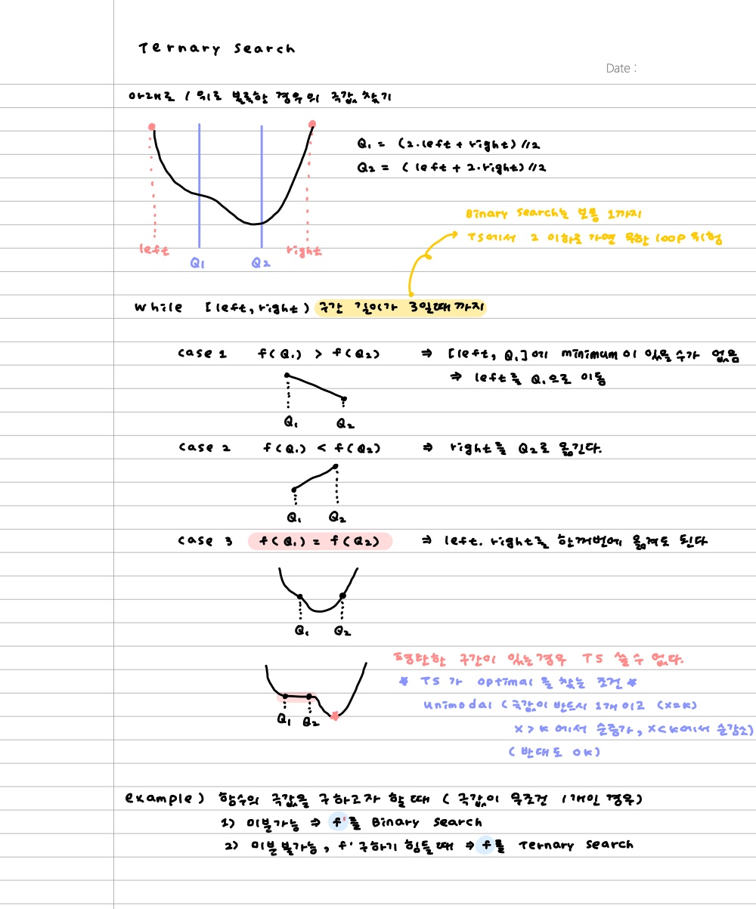

# Ternary Search삼분 탐색





## Binary v.s. Ternary

둘 다 range를 쪼개서 극값을 찾고자 한다. 단

**이분 탐색**은 x가 증가함에 따라 f(x)도 단조 증가 or 단조 감소이다.

* **즉 x와 f(x)가 모두 정렬되어있다.**

**삼분 탐색**은 이차함수처럼, range의 어딘가에 극값이 있고 그 값을 기준으로 단조 증가/감소한다.


**이분 탐색**은 구간의 길이가 1이 될 때까지 시행하지만 **삼분 탐색**은 구간의 길이가 3이하 or 충분히 작아질 때까지 시행하거나, 충분히 많은 횟수만큼 시행하고 구간 내의 모든 값에 대해 optimal이 어디인지를 찾는다.


이분 탐색으로 구할 수 있으면 삼분 탐색으로도 구할 수 있다.


삼분 탐색은 이상 미만으로 해서 `mid-1` 로 가기보다는 (대부분 답이 실수니까 -1하면 큰일 !) **이상 이하**로 두고 length로 중지하는게 낫다!


## Reference

* https://m.blog.naver.com/PostView.nhn?blogId=kks227&logNo=221432986308&proxyReferer=https:%2F%2Fwww.google.com%2F


# 11662

10**(-6) 맞추느라 오래걸렸네 ..ㅠ 1아니고 10000000.0정도로 둬야하는듯

```python
class Node:
    def __init__(self, startX, startY, endX, endY):
        self.startX = startX
        self.startY = startY
        self.endX = endX
        self.endY = endY

        self.dx = self.endX - self.startX
        self.dy = self.endY - self.startY

    def location(self, time):
        return (self.startX + time*self.dx/1000000000.0,
                self.startY + time*self.dy/1000000000.0)

ax,ay,bx,by,cx,cy,dx,dy = map(int, input().split())

minho = Node(ax,ay,bx,by)
gangho = Node(cx,cy,dx,dy)

def distance(point1,point2):
    x,y = point1
    l,m = point2
    return (l-x)**2 + (m-y)**2

left, right = 0, 1000000000.0 # 1000000000초만에 도달한다고 가정

while right - left >= 10**(-6):
    q1 = (2*left+right)/3
    q2 = (left+2*right)/3

    d1 = distance(minho.location(q1), gangho.location(q1))
    d2 = distance(minho.location(q2), gangho.location(q2))

    if d1 >= d2:
        left = q1
    elif d1 < d2:
        right = q2

answer = distance(minho.location(left), gangho.location(left))**(1/2)
print(f'{answer:.10f}')
```
