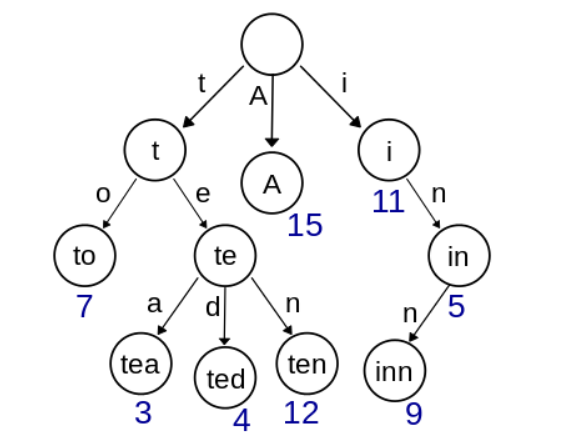
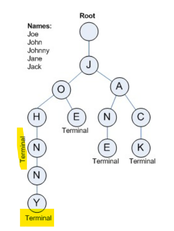

> https://www.acmicpc.net/problem/tag/%ED%8A%B8%EB%9D%BC%EC%9D%B4](https://www.acmicpc.net/problem/tag/트라이)
>
> https://solved.ac/problems/tags/trie


# :evergreen_tree: Trie

> prefix tree, digital search tree, re**trie**val tree

* tree 형태
* 자동 완성, 문자열 검사, 사전에서 찾기 등





* root node는 None. 비어있다.


* root node는 None. 비어있다.
* `john`, `johnny` 단어가 동시에 존재하는 경우 **terminal flag를 통해 어디까지가 단어인지 명시해준다.**


## Time complexity

제일 긴 문자열의 길이 `L` , 총 문자열의 갯수 `N`에 대해

* 생성 : `O(N*L)` 
* 삽입 : `O(L)`

* 탐색 : `O(L)`


##### Binary search Tree와의 비교

* 문자열의 최대 길이가 `M` 이고 전체 node수가 `N`인 경우

|                                            | 검색 시 시간 복잡도     |
| ------------------------------------------ | ----------------------- |
| 숫자형 Binary Search Tree                  | `O(logN)`               |
| 문자열 Binary Search Tree (이게 뭔구조야?) | `O(M*logN)`             |
| Trie                                       | **`O(M)` : 선형시간 !** |


## Trie 구현하기

##### 1 ) Node class 구현

> `Node(a)` ; a로 시작하는 단어들의 모임

* `key` : 부모 노드의 글자를 담는다.

* `children` : dictionary, 자식 노드의 글자를 key로, Node obj를 value로 담는다.

  * `Node(a)` 는 `a`로 시작하는 단어들의 모임 !!
  * `children`은 `query`를 주면, `query`로 시작하는 단어들의 모임을 return해야하므로
    **`{a:Node(a), b:Node(b), ... }` 형태이다. 헷갈리지 말자.**

* `is_terminal` : 단어의 끝인지 아닌지를 명시해준다. **T or F**

  * True, False로 구현할 수도 있고 ! 

  * 단어가 완성되었으니 해당 단어 전체를 저장할 수도 있다. `None or 단어`

    (물론 T/F로 저장하고 역추적 해도 된다.)

```python
class Node: # a
    def __init__(self, key, is_terminal = False):
        self.key = key
        self.is_terminal = is_terminal # T or F로 하거나, a로 시작하는 모든 단어를 넣어놓거나
        self.children = dict() # {p:Node(p), (a-p-p-le), b:Node(b), (a-b-s-olute), ... }
```


##### 2 ) Trie 만들기

###### 0905에 약간 변형해서 짜봄 !

`Class Node` : **내 node에서 갈 수 있는 모든 단어인 `words`**를 추가했다. 역시 is_terminal은 필요함에 주의하자 !

`Class Trie` : insert시에 query가 거쳐가는 모든 node의 words에 query를 append해준다. 

```python
class Node:
    def __init__(self, key):
        self.key = key
        self.is_terminal = False
        self.words = []
        self.children = {}
```

```python
class Trie:
    def __init__(self):
        self.head = Node(None)

    def insert(self, query):
        curr_node = self.head

        for s in query:
            if not curr_node.children.get(s):
                curr_node.children[s] = Node(s)
            curr_node = curr_node.children[s]
            curr_node = curr_node.words.append(query)

        curr_node.is_terminal = True

    def search(self, query):
        curr_node = self.head

        for s in query:
            if not curr_node.children.get(s):
                return False
            curr_node = curr_node.children[s]

        ############################ 무작정 True를 return하면 안된다 !
        return curr_node.is_terminal
        ############################
        
    def show(self):
        q = [(self.head,0)]

        while q:
            curr_node,padding = q.pop()
            print('-' * padding + f'{curr_node.key} :', curr_node.words)
            for node in curr_node.children.values():
                q.append((node, padding+1))

```

###### example

```python
class Node:
    def __init__(self, key):
        self.key = key
        self.is_terminal = False
        self.words = []
        self.children = {}

class Trie:
    def __init__(self):
        self.head = Node(None)

    def insert(self, query):
        curr_node = self.head

        for s in query:
            if not curr_node.children.get(s):
                curr_node.children[s] = Node(s)
            curr_node.words.append(query)
            curr_node = curr_node.children[s]

        curr_node.is_terminal = True

    def search(self, query):
        curr_node = self.head

        for s in query:
            if not curr_node.children.get(s):
                return False
            curr_node = curr_node.children[s]

        return curr_node.is_terminal

    def show(self):
        stack = [(self.head,0)]

        while stack:
            curr_node,padding = stack.pop()
            print('-' * padding + f'{curr_node.key} :', curr_node.words)
            for node in curr_node.children.values():
                stack.append((node, padding+1))

trie = Trie()
words = ["frodo", "front", "frost", "frozen", "frame", "kakao", "korea", "forest"]
for w in words:
    trie.insert(w)

trie.show()
```

처음에는 전체 단어를 출력하고 이후부터는 trie 구조에 따라 단어를 차례로 return한다.

stack구조를 통해 재귀적으로 print하도록 만들었다.

```python
None : ['frodo', 'front', 'frost', 'frozen', 'frame', 'kakao', 'korea', 'forest']
-k : ['kakao', 'korea']
--o : ['korea']
---r : ['korea']
----e : ['korea']
-----a : []
--a : ['kakao']
---k : ['kakao']
----a : ['kakao']
-----o : []
-f : ['frodo', 'front', 'frost', 'frozen', 'frame', 'forest']
--o : ['forest']
---r : ['forest']
----e : ['forest']
-----s : ['forest']
------t : []
--r : ['frodo', 'front', 'frost', 'frozen', 'frame']
---a : ['frame']
----m : ['frame']
-----e : []
---o : ['frodo', 'front', 'frost', 'frozen']
----z : ['frozen']
-----e : ['frozen']
------n : []
----s : ['frost']
-----t : []
----n : ['front']
-----t : []
----d : ['frodo']
-----o : []
```


###### 이전 버전

1. `insert` : 새로운 문자열을 삽입한다.
2. `search` :  해당 문자열이 존재하는지 확인한다. `return T or F`
3. `prefix` : `value`가 접두어인 문자열이 있는지 확인하고, 만약 있다면, 해당 노드를 prefix로 갖는 모든 단어를 return한다.

```python
class Trie:
    def __init__(self):
        self.head = Node(None)

    def insert(self, query):
        curr_node = self.head

        for s in query:
            if not curr_node.children.get(s):
                curr_node.children[s] = Node(s)
            curr_node = curr_node.children[s]
            
		##############################
        curr_node.is_terminal = query
        ##############################

    def search(self, query):
        curr_node = self.head

        for s in query:
            curr_node = curr_node.children.get(s)
            if not curr_node:
                return False, None
            
        ############################################################
        if curr_node.is_terminal: # 끝까지 갔으면서 내가 insert한 단어면 !! 무작정 True인건 아님 !!
            return True, curr_node
        ############################################################

        return False, None # 끝까지 갔지만 내가 insert한 단어가 아닌 경우

    def prefix(self, query): # query를 prefix로 갖는 모든 단어를 return한다.
        query_node = self.head
        for s in query:
            query_node = query_node.children.get(s)

        answer = []

        def __recurssive(node):
            if node.is_terminal:
                answer.append(node.is_terminal)

            for node in node.children.values():
                __recurssive(node)

        __recurssive(query_node)

        return answer
```

```python
trie = Trie()
trie.insert('haeu')
trie.insert('haeyu')
trie.insert('hat')
trie.insert('home')
trie.insert('homme')
trie.insert('cherry')
```

```python
print("query string이 있는가?")
print(trie.search('haeu'))
print(trie.search('ho')) # 내가 입력한 단어는 아니므로 False를 return해야한다.
print(trie.search('homm'))
print(trie.search('homme'))
```

```python
print("\n query를 prefix로 갖는 단어를 모두 return하라")
print(trie.prefix("h"))
print(trie.prefix("ha"))
print(trie.prefix("hae"))
```

