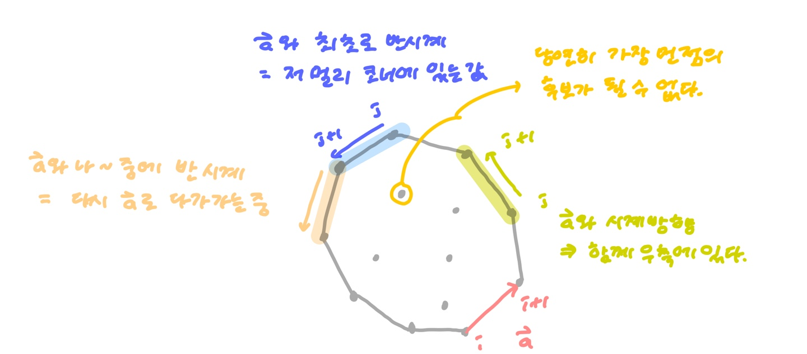

## :milky_way: 좌표 평면에서 가장 먼 점의 쌍 찾기

> [reference1](https://blog.junie.land/6)
>
> [reference2](https://blog.myungwoo.kr/104)


1. 가능한 기울기를 모두 구한다. 점의 쌍이 N개 나올 때, 가능한 기울기의 수는 <= N이다.
2. 같은 직선 상에 여러개의 점이 존재한다면, 이 쌍 중 거리가 가장 먼 쌍은 기울기의 양 끝에 있는 점이 된다.


Lemma1 ) 임의의 기울기의 직선에 닿는 양 끝 점은 N개의 점을 모두 포함하는 볼록껍데기(Convex Hull)의 꼭지점이다.

Lemma2 ) 모든 기울기가 아니라 **볼록 껍데기의 변에 해당하는 기울기에 대해서만 고려**해도 된다.


* 볼록 껍데기를 구하는 데에 graham scan을 이용해서 O(NlogN)

* 가장 먼 두 점을 구하는 데에 O(N)


**수학인 증명은 pass 했고 직관적으로 다음과 같이 이해해보았다**



1. 컨벡스헐을 만든다.
2. 컨벡스헐의 외곽에 해당하는 벡터를 하나씩 꺼내서 (`vec`) 외적해보며 최초로 음수가 되는, 즉 최초로 반시계 방향이 되는 변을 찾는다.
3. 해당 변과 거리를 저장한다.
4. 모든 변에 대해 반복한다.


시계방향으로 돌면서 체크할때는 반시계(양수)일때 추가

거리 측정할 때는 시계 방향이 되는 순간(음수) or 0이 되는 순간에 거리 재기


```python
answer = 0
a,b = 0,0

# vec ; Ai~Ai+1의 벡터를 pair로 리턴
# point ; i번째 점 return

for i in range(n):
    # 외적이 0 이하가 될 때까지 j를 증가시킨다.
    while cross(vec(i),vec(j)) > 0:
        j += 1
        
    # 두가지 후보를 이용해서 answer를 갱신한다. (혹시 vec(i)와 vec(k)가 평행할 때를 대비해서)
    for k in range(j, j+2):
        d = dist(point(i), point(k))
        if d > answer:
            answer = d
            a , b = i,k
```


#### convex hull 찾기

```python
# 정렬한 후 가장 첫번째 값을 기준점으로 두자
points = [(0,0), (0,2), ... ]
points.sort()

# 외적 계산
def cross(v1,v2):
    x1,y1 = v1
    x2,y2 = v2
    return x1*y2 - x2*y1

# index, index+1을 벡터화
def vec(index):
    x1,y1 = points[index]
    x2,y2 = points[index+1]
    return x2-x1, y2-y1

stack = [0,1] # convex hull을 이루는 점 index list
while True:
    if stack[-1] == N-1: # 정렬했으므로 마지막 값은 무조건 포함된다.
        break
    cross_product = cross(vec(stack[-2]), vec(stack[-1]))
    if cross_product > 0: # 두 벡터가 시계방향이면
            stack.append(stack[-1]+1)
            else:
                stack.pop()

                return [temp_star[i] for i in stack] # convex hull을 이루는 node list

```

