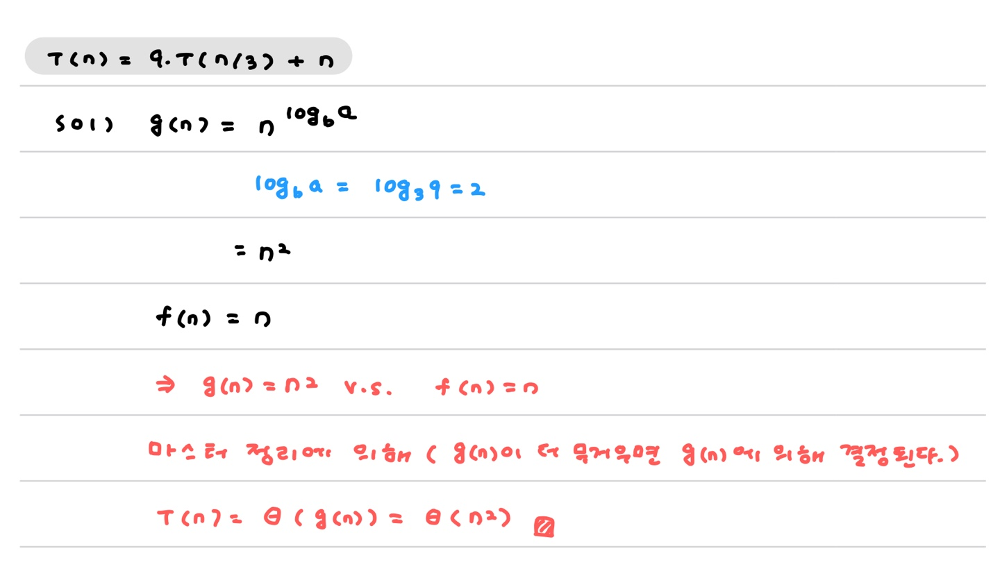
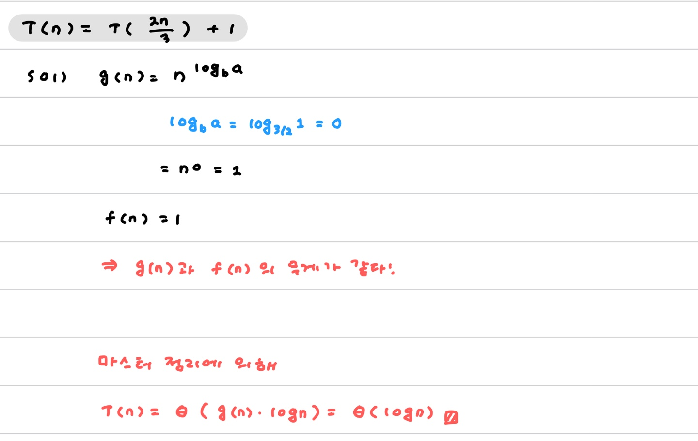
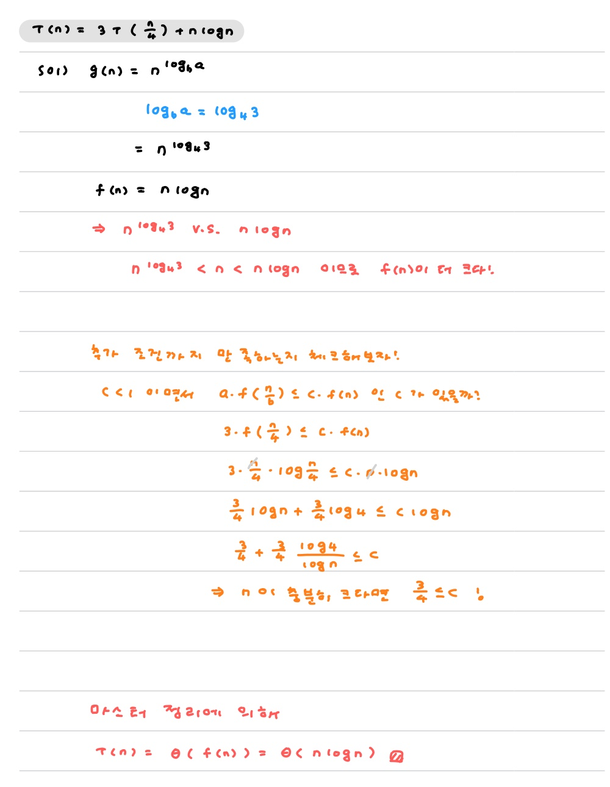

# :books: 마스터 정리

> 21.02.05 : 일단 직관적으로 이해하고 나서 부족한 개념이 있을 때마다 더 추가해볼 예정! 설명이 부족하거나 두루뭉술할 수도 있다.

`T(n) = aT(n/b) + f(n) ` 로 표현할 수 있다면, 마스터 정리에 의해 시간 복잡도를 바로 계산할 수 있다.

위 식의 의미는

* `a` : 몇 번 호출했는가?
* `b` : 기존보다 얼마나 줄였는가?
* `f(n)` : 추가 연산

시간 복잡도를 계산하기 위해 비교할 두 식은

* `g(n) = n ** log_b_(a)`  (지수임!)
  * n을 b만큼 줄였는데 a번 더 수행하므로. 이를 반영한 식이라고 이해해보았다.
* `f(n)`을 이용해서 수행 시간을 결정한다 !

#### 마스터 정리

> 입실론을 편의상 e로 썼다.
>
> f(n)/g(n) = bigo도 있고 theta도 있고 omega도 있다 !

1. g(n)이 무거우면, <u>g(n)이 수행 시간을 결정</u>한다.

   * `f(n)/g(n) = O(1/ne)`이면, `T(n) = theta( g(n) )`

2. g(n)과 f(n)이 같은 무게이면, <u>g(n) * logn</u>이 수행 시간이 된다.

   * `f(n)/g(n) = theta(1)`이면, `T(n) = theta( g(n) * logn )`

3. f(n)이 무거우면서 추가 조건까지 만족시키면, <u>f(n)이 수행 시간을 결정</u>한다.

   * `f(n)/g(n) = ★ omega ★ (1/ne)`이고 `af(n/b) <= cf(n) , all n & constant c < 1` 이면,
      `T(n) = theta( g(n) * logn )`
   * 추가되는 조건은 ... f(n)도 T(n)처럼 b만큼 줄이고 a번 연산했을 때 원래보다 수행 시간이 줄어들 수 있는지 검사하는건가?

   **만약 c<1을 만족하지 못한다면? 보조정리를 활용한다.**

#### example 1.

`T(n) = 3n**3 + 2n**2 + 1`

`f(n)` 뿐이므로, 최고차항인 `n**3`만 보면 된다. 즉` O(N**3)`

#### example 2. g(n)을 따르자.

`T(n) = 9T(n/3) + n`

#### example 3. f(n)을 따르자.

`T(n) = 3*T(n/4) + nlogn`

보조 정리는 일단 패스 ~

#### reference

https://m.blog.naver.com/PostView.nhn?blogId=yyj9301&logNo=221240585554&proxyReferer=https:%2F%2Fwww.google.com%2F
