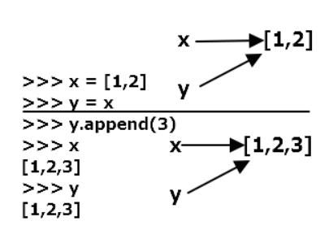
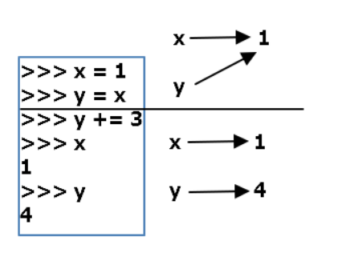

# mutable과 immutable

> https://webnautes.tistory.com/1181
>
> https://ledgku.tistory.com/54 시각적 이해

|              | mutable                                                      | imutable                                                     |
| ------------ | ------------------------------------------------------------ | ------------------------------------------------------------ |
| 수정 가능성  | 값이 수정 가능함.<br />list, dict, set                       | 값이 수정 불가능함.<br />tuple, int, float, string           |
| 값 변경과 id | 값을 변경해도 id는 그대로<br /><br />a = [1,2,3]<br />a.append(100)<br />id(a)는 append전과 같음. | 값을 변경하면 id가 변함<br /><br />a = 3<br />a += 1<br />id(a)가 변함. 객체 2의 주소를 가지게됨 |
| 같은 값과 id | a,b = [1,2,3], [1,2,3] 이더라도 **id가 다름**                | a,b = 3,3이면 id가 같음                                      |
| 새로 할당    | a,b가 같은 주소였을 경우<br />b에 새로 할당하게 되면 b의 **포인터가 변하는 것**<br />이므로 a에는 영향 안줌 | 동일                                                         |
| 포인터       |  |  |

* 참고로 파이썬에서의 변수는 절대 **변수를 담는 그릇이 아님**.
  a = 3이란 ?
  * 3이라는 객체를, 변수 a가 **가르키도록 해라.**
    a -> 3
  * a는 저장 공간을 할당 받는 것이 아니라, 그저 객체를 가르키기만 함.


* 그래서 같은 값이지만 다른 주소를 가지게 만들기 위해서 copy를 사용함.

  ```python
  ls = [1,2,3]
  ls2 = ls.copy()
  
  id(ls)
  id(ls2) # 다른 값
  ```

  * 그러나 주의할 점은, mutable 안의 원소가 또 mutable인 경우임 !!!
    1번 예제는 원소가 int이므로 immutable.
    그래서 ls2[0]의 값을 바꾸더라도, 이 **원소 자체가 다른 객체를 가르키게 되므로** ls[0]에는 영향 없음

    그러나 다음 예제에서는 문제가 생긴다.

    ```python
    ls = [[1,2,3], [4,5,6]]
    ls2 = ls.copy()
    
    ls2[0].append(100)
    print(ls) # [[1,2,3,100], [4,5,6]]
    
    # 왜냐면 얕은 복사의 경우, 전체의 id만 달라지는거지 원소의 id까지 달라지는게 아님
    # 만약 원소가 immutable이었다면 원소 수정시 다른 객체를 가르키게 되므로 다른애애 영향 x
    # 그러나 예제처럼 mutable인 경우 주소가 같기 때문에 값이 같이 바뀌게 됨.
    ```

    그러므로 원소가 mutable일 때 원소 수정이 필요하다면 **깊은 복사**를 하도록 하자.

  * 참고로 `ls2.pop()`는 ls에 영향을 주지 않는다. ls, ls2의 **주소가 다르니까**

    그러나 `ls2[0].pop()`는 ls에 영향을 준다. ls[0], ls2[0]의 **주소가 같으니까**

