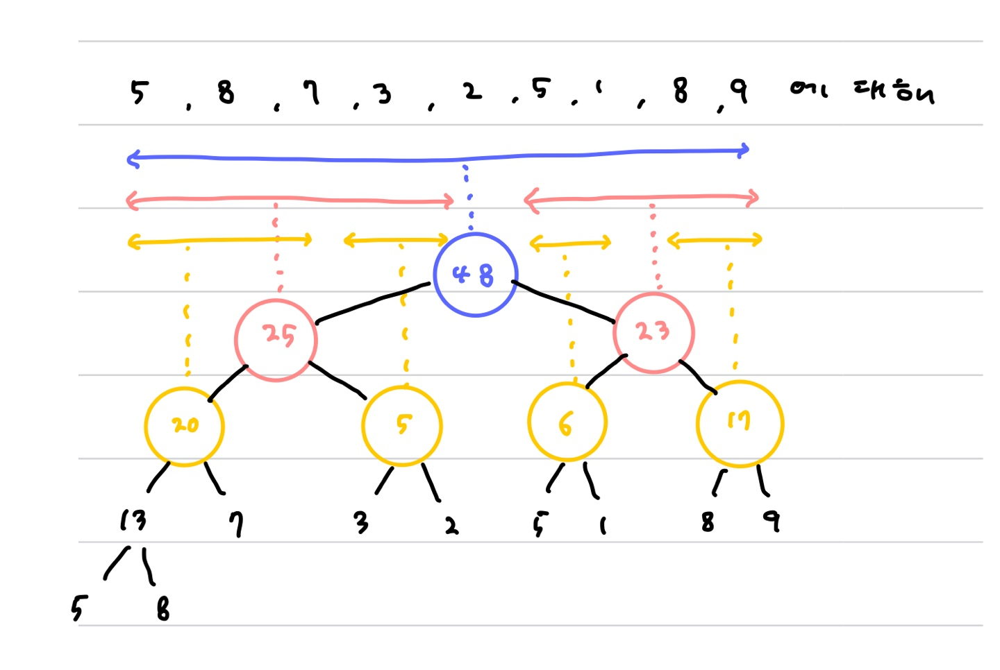
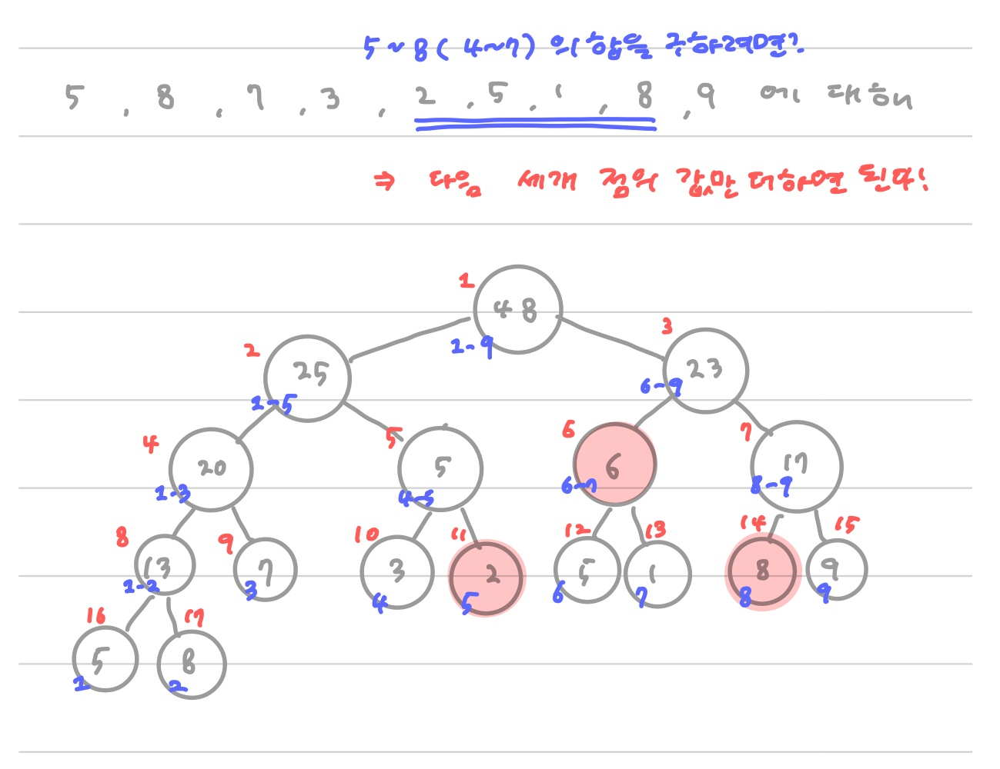

# Segment Tree

#### 길이 N짜리의 임의의 구간 합을 O(logN)만에 구하자 !


길이 N짜리의 구간이 있다고 하자.` sum(arr[k:k+N])`은 `O(N)`이다.

1. 임의의 구간이 들어올 때마다 `O(N)`이 필요하다.
2. 만약 값이 하나가 바뀐다면, 미리 구해놓았던 구간합 중 최대 N개를 수정해주어야 한다, 즉 `O(N)`

더 빠르게, 두 연산 모두 `O(logN)`만에 처리할 수는 없을까?


다음처럼 절반씩 구간을 잘라 합을 저장하자 !




* terminal node는 arr 값 자체가 된다.
* 


##### 알아둘 것

* 이때 index는 왼쪽 위에서 0이 아닌 1부터 시작한다. **(2를 곱하면 나의 왼쪽 자식노드**를 구할 수 있게된다 !)
* 길이 N짜리 arr의 segment tree를 만들기 위해서는 N과 가장 가까운 제곱수 M에 대해 2*M 크기만큼의 arr가 필요하다.
  * 구현시에는 쉽게 4*N크기로 할당한다.


## :thinking: 그래서 어떻게 활용하는데?

##### 1. index 4~8의 구간합을 구하자. 다음 세 노드만 있으면 된다.




##### 2. 두번째 원소인 8을 다른 값으로 수정하자. logN개의 node만 수정해놓으면 된다.

* 8과 관련된 node는 tree의 깊이만큼, 즉 `logN`이다.


## 구현하기

* 재귀를 이용해서 구한다. `IntervalSum(나) = IntervalSum(왼쪽 노드) + IntervalSum(오른쪽 노드)`

```python
arr = [5,9,8,7,3,2,5,1,8,9]
tree = [0]*4*len(arr)

def getIntervalSum(index, start,end,left,right):
    """
    :param index: tree의 node 번호
    :param start: 해당 node가 저장하고 있는 구간합의 시작점
    :param end: 해당 node가 저장하고 있는 구간합의 끝점
    :param left:찾고자 하는 구간합의 시작점
    :param right: 찾고자 하는 구간합의 끝점
    """

    # 범위 밖인 경우
    if left<start or right>end:
        return 0

    # 현재 node의 범위에 포함된 경우
    if start <= left and right <= end:
        return tree[index]

    # 그렇지 않으면 왼쪽 자식과 오른쪽 자식 노드를 이용해서 값 구하기
    mid = (start+end)//2

    idx_left_child = index*2
    idx_right_child = index*2+1

    return getIntervalSum(idx_left_child, start, mid ,left, right) + getIntervalSum(idx_right_child, mid+1, right left, right)
```


* https://ssungkang.tistory.com/entry/Algorithm-%EC%84%B8%EA%B7%B8%EB%A8%BC%ED%8A%B8-%ED%8A%B8%EB%A6%ACSegment-Tree
