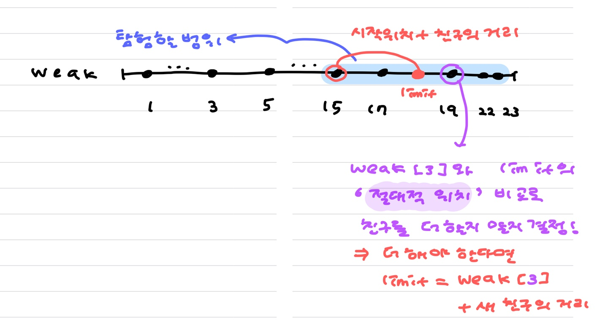
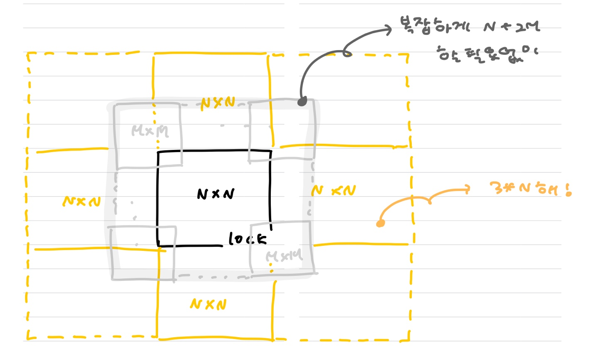

# 총평

1. 기둥과 보 설치, 블록 이동하기의 경우 .... `isin`으로 `O(N)` 연산을 해도 괜찮은 ........ 당황스러운 문제였다 ...
   * 너무 헷갈릴땐 아무것도 생각하지 말고 **가장 로우 레벨로 가서 해결**해보자
2. 효율성이 있다면 어떻게 푸는게 좋을지도 생각해보자.


# 문자열 압축

> 시간복잡도 따위 필요없고 구현해라 !

그냥 진짜 2중 for문 돌리면 끗

##### 배워갈 점

1. `step` 씩 자르게 되면, 마지막 문자열의 길이가 step보다 작아서 pass되버리는 경우가 발생할 수 있다.
   * 이를 방지하기 위해 range의 마지막 값을 `length + step + 1` 로 둔다 !
2. 사실 range를 끝까지 돌릴 필요가 없다
   * `length//2` 까지만 돌려봐도 되는 이유는, 절반 이상으로 잘랐을 때는 더이상 줄어들 가능성이 없기 때문이다.

```python
def solution(s):
    answer = float('inf')
    for step in range(1,len(s)+1):
        temp,prev = '',''
        cnt = 0
        for j in range(0,len(s)+step+1, step):
            if prev == s[j:j+step]:
                cnt += 1
            else:
                temp += f'{cnt if cnt > 1 else ""}{prev}'
                prev = s[j:j+step]
                cnt = 1

        answer = min(answer, len(temp))

    return answer

print(solution('aabbaccc'))
```


# 괄호 변환

> 주어진 조건을 차분하게 이해해야 풀 수 있다.
>
> 괜히 성급하게 했다간 틀린다.

if else의 indentation은 줄일 수 있겠지만 이해를 위해 놔두자.

##### 배워갈 점

1. 재귀함수를 잘 다룰 수 있는가?
2. 괄호에 대한 부분을 다룰 수 있는가?

```python
def solution(p): # p는 이미 균형잡힌 문자열임 !

    if p == '':
        return p
    else:
        count = [0,0] # ["(",")"]
        for i in range(len(p)):
            count[")" == p[i]] += 1
            if count[0] != 0 and count[0] == count[1]:
                u,v = p[:i+1],p[i+1:] # u와 v. 이미 균형잡혔으므로 아무것도 return못하는 경우는 없음
                break

        stack = []
        for s in u:
            if stack and stack[-1] =="(" and  s == ")":
                stack.pop()
                continue
            stack.append(s)

        if not stack: # stack이 비어있다면 올바른 문자열
            return u + solution(v)
        else:
            return '(' + solution(v) + ')' + u[1:-1].translate({ord(")"):"(",ord("("):")"})

print(solution('(()())()'))
print(solution(')('))
print(solution('()))((()'))
```

###### 과거 나의 똑똑한 풀이 ,,,,,

1. 올바른 괄호 문자열인가?
   * `length//2`번 만큼 돌면서 `()`를 빈칸으로 대체해주고, 마지막까지 남아있다면 False
2. 균형잡힌 문자열로 자르기
   * `[(의 갯수, )의 갯수]`로 해놓고 같은지 보는게 아니라 그냥 cnt하나의 변수를 늘렸다 줄였다 하면서 체크

```python
def solution(p):
    
    def ispass(s):
        for _ in range(len(s) // 2):
            s = s.replace("()", "")
        return not s
    
    if ispass(p): return p

    cnt = 0
    for i in range(len(p)):
        if p[i] == "(": cnt += 1
        else : cnt -= 1
        if not cnt:
            u,v = p[:i+1], p[i+1:]
            break

    if ispass(u):
        return u + solution(v)

    u = str.translate(u[1:-1],str.maketrans("()", ")("))
    return "("+solution(v)+")" + u
```


# 기둥과 보 설치

> 1000이면 다 해봐도 된다 !!! 무작정 돌리자.
>
> 모든 case에 대해 조건을 확인하는 문제가 다수 나오고 있다 ! 19년 블록게임도 그렇다.
>
> 여기서는 모든 case를 잘 구현해주는게 포인트이므로 시간복잡도에 목매지 말자.

#### 아니 배열 뒤집는거 헷갈려죽겠네 :disappointed:

**동빈쓰 풀이에서는 (x,y,kind)를 list에 넣고 isin 체크함 ... 이게 통과하다니 ,,,**

```python
def solution(n, build_frame):
    state = [[[] for _ in range(n+2)] for _ in range(n+2)]

    def is_possible():
        for x in range(n+1):
            for y, kinds in enumerate(state[x]):
                if y >= n:break
                for kind in kinds:
                    print(x,y,kind)
                    if kind == 0: # 기둥이면, 바닥이거나 기둥위거나 보의 위
                        if x == 0 or 0 in state[x-1][y] or 1 in state[x][y] or 1 in state[x][y-1]:
                            continue
                        return False
                    else: # 보이면, 한쪽 끝이 기둥위거나 양쪽이 보
                        if 0 in state[x-1][y] or 0 in state[x-1][y+1] or (1 in state[x][y-1] and 1 in state[x][y+1]):
                            continue
                        return False
        return True

    for x,y,kind,action in build_frame:
        x,y = 4-y,x
        if action == 0: # 삭제
            state[x][y].remove(kind)
            if not is_possible():
                state[x][y].append(kind)

        if action == 1: # 설치
            state[x][y].append(kind)
            if not is_possible():
                state[x][y].pop() # 방금 넣었던 거 꺼내기

        answer = [[x,y,kind] for x in range(n) for y,kinds in enumerate(state[x]) if kinds for kind in kinds]
        answer.sort()

    return answer

print(solution(5, [[1,0,0,1],[1,1,1,1],[2,1,0,1],[2,2,1,1],[5,0,0,1],[5,1,0,1],[4,2,1,1],[3,2,1,1]]))
```


# [Greedy 안됨 !]:star: 외벽 점검 :star: : 절대적 위치 비교 !!

#### :red_circle: 시계/반시계를 돌면서 Greedy하게 가는 (dist 정렬) 접근은 안된다 !!! 4 2 3 1 을 걸러낼 수 없음.

#### :red_circle: while문으로 힘들게 짜지 말고 for+break+절대적 위치를 이용하자 제~발


#### :blue_heart: Greedy알고리즘이 안된다는 걸 잊지말자 !!!

* `dist = [5,10,15,10,40]` 이고 정답이 `[40,10,20,5]` 순이라고 하자.
* `[40, 10,20,5]` 는 어떤 방향으로  봐도 오름차순이 아니다 !!!!!!!
* 이 문제에서는 **1만 필요하더라도 괜히 10을 가진 큰 친구를 내보내서 다음에 5가 필요한 경우에 내보낼 수 없는 단점이 있다 !!!!!!!! **
* **==그리디는 안돼 !!!!!!!!!!!!!!==**

#### :blue_heart: 빠르게 탐색하려면? Binary Search 쓰쟈 !!!


##### 배워갈 것

1. 원형인데 도는 횟수가 정해져있다면 k배로 늘려버리자.
   * 아예 처음부터 `[1,2,3,4,    11,12,13,14]` 로 만들던지
   * 아니면 `pop and append`를 통해 그 때 그 때 `[2,3,4,    11]` 로 만들던지 !
2. permutation을 만들건데 , 1도 해봐야하고 2도 해봐야하고 3도 해봐야하고 ... n까지 다 해봐야 한다?
   * 각각 만들지 말고 , **일단 길이가 가장 긴 permutation을 만들어놓은 후**에 조건이 충족되면 break하도록 한다.
3. 완탐 풀이는 `"갈까 말까?"` 가 아니라 `"무조건 간다"`가 가정이다 !!
   * 모든 경우의 수를 보고 있으므로 무조건 간다는 가정 하에 돌린다.
   * 그러므로 지금 갈 수 있는지 없는지는 중요하지 않다 !!!
   * 현재 보고있는 경우의 수가 `(1,5,3)` 이라면, **5를 쓰기 전에 갈 수 있는지 없는지는 중요하지 않다.**
4. 헷갈리니까 while문보다는 :star: **<u>for문 돌리다가 break</u>** :star: 하자.
5. 상대적인 위치가 아니라, **절대적인 위치**를 이용하면 생각이 쉬워진다 !!!!!!!!!!!!!!!!!!!
   


##### 동빈쓰 풀이를 활용한 풀이

```python
from itertools import permutations

def solution(n, weak, dist):
    answer = float('inf')
    candidates = set(permutations(dist, len(dist)))

    for _ in range(len(weak)): # 시작점 0, 1, 2, .... , n-1 을 모두 확인한다.
        for candidate in candidates:
            limit = weak[0] + candidate[0]
            friends = 1
            for i in range(1,len(weak)):
                if weak[i] > limit:
                    friends += 1
                    if friends > len(dist):
                        break
                    limit = weak[i] + candidate[friends - 1]
            else:
                answer = min(answer, friends)

        ###################################### 원형자료 완탐방법 !!
        weak.append(weak.pop(0) + n)
        ########################################################

    return answer if answer < float('inf') else -1

print(solution(12,[1,5,6,10],[1,2,3,4])) # 2
# print(solution(200,[0,10,50,80,120,160],[1,30])) # -1
# print(solution(100,[0,4,8,12,16,20],[4,4,4,4,4,4])) # 3
# print(solution(50,[0],[6,1,1])) # 1
# print(solution(50,[0,2],[6,1,1])) # 1
# print(solution(30, [0, 3, 11, 21], [10, 4])) # 2
```


##### 동빈쓰 풀이

* 원형이지만 해봐야 한번 더 도는 경우이므로 **list를 두 배** 해버리자 !
* while보다 for문 돌려서 break 거는게 더 깔끔
* `weak`를 한 발 씩 가지말고 `for`문으로 `friends`를 돌리는게 낫댜 !!

```python
from itertools import permutations

def solution(n, weak, dist):
    answer = len(dist)+1
    l = len(weak)
    weak += [n+i for i in weak]

    for s in range(l):
        for friends in set(permutations(dist, len(dist))):
            # print("======",weak[s:s+l],friends, end = ' => ')
            cnt = 1
            position = weak[s] + friends[cnt-1]

            for k in range(s, s+l):
                if position < weak[k]:
                    cnt += 1
                    if cnt > len(dist):
                        break
                    position = weak[k] + friends[cnt-1]

            # print(cnt)
            answer = min(answer, cnt)

    if answer > len(dist):
        return -1

    return answer

print(solution(12,[1,5,6,10],[1,2,3,4]))
print(solution(200,[0,10,50,80,120,160],[1,30])) # -1
print(solution(100,[0,4,8,12,16,20],[4,4,4,4,4,4])) # 3
print(solution(50,[0],[6,1,1])) # 1
print(solution(50,[0,2],[6,1,1])) # 1
print(solution(30, [0, 3, 11, 21], [10, 4])) # 2
```


### Binary Search 쓸거야 !

* 시간은 훨씬 빨라짐 !!!!
* **==Greedy하게 풀 수 없으므로== is_possible에서도 ==어느정도는 완탐이 필요==함을 잊지 말자 ,,,**

```python
from itertools import permutations

def solution(n, weak, dist):
    dist.sort(reverse = True)

    def is_posibble(k): # k명 만으로 weak를 모두 수리할 수 있는가?
        weak_ = weak.copy()
        
        ############################################### 40,10,30,5 처럼 오름차순이 아닐 수 있으므로 모든 경우 체크
        all_candidates = set(permutations(dist[:k],k))
        ###############################################

        for _ in range(len(weak_)):
            for candidates in all_candidates:
                cnt = 1
                limit = weak_[0] + candidates[cnt-1]
                for i in range(1, len(weak_)):
                    if limit < weak_[i]:
                        cnt += 1
                        if cnt > k:
                            break
                        limit = weak_[i] + candidates[cnt-1]
                else:
                    return True
            weak_.append(weak_.pop(0)+n)

        return False

    left, right = 1, len(dist) + 1 # 이상 미만. 0은 is_possible에서 error. len(dist)+1이상인 경우는 없으므로 얘를 상한으로

    while left < right:
        mid = (left+right)//2
        if is_posibble(mid): # k명이 가능하다면, 한 명 더 줄여보자
            left, right = left, mid
        else: # 불가능하다면 늘려보자
            left, right = mid + 1, right

    return right if right<=len(dist) else -1
```


##### 풀이 시간 비교

| 완전 탐색                                                    | 이분 탐색                                                    |
| ------------------------------------------------------------ | ------------------------------------------------------------ |
| 테스트 1 〉	통과 (0.10ms, 9.45MB)<br/>테스트 2 〉	통과 (0.10ms, 9.68MB)<br/>**테스트 3 〉	통과 (821.63ms, 15.7MB)<br/>테스트 4 〉	통과 (764.77ms, 15.7MB)<br/>**테스트 5 〉	통과 (0.06ms, 9.52MB)<br/>테스트 6 〉	통과 (7.09ms, 9.67MB)<br/>테스트 7 〉	통과 (0.04ms, 9.53MB)<br/>테스트 8 〉	통과 (0.13ms, 9.5MB)<br/>테스트 9 〉	통과 (0.24ms, 9.45MB)<br/>**테스트 10 〉	통과 (225.92ms, 10.5MB)<br/>테스트 11 〉	통과 (112.13ms, 9.86MB)<br/>테스트 12 〉	통과 (1325.00ms, 15.7MB)<br/>**테스트 13 〉	통과 (95.50ms, 9.85MB)<br/>**테스트 14 〉	통과 (334.64ms, 11.1MB)<br/>테스트 15 〉	통과 (666.74ms, 13.9MB)<br/>테스트 16 〉	통과 (1069.98ms, 15.7MB)<br/>테스트 17 〉	통과 (1156.79ms, 15.8MB)<br/>테스트 18 〉	통과 (1043.60ms, 15.8MB)<br/>테스트 19 〉	통과 (936.75ms, 15.6MB)<br/>테스트 20 〉	통과 (520.04ms, 13.8MB)<br/>테스트 21 〉	통과 (967.66ms, 15.8MB)<br/>**테스트 22 〉	통과 (0.46ms, 9.55MB)<br/>테스트 23 〉	통과 (0.21ms, 9.46MB)<br/>테스트 24 〉	통과 (0.46ms, 9.68MB)<br/>테스트 25 〉	통과 (3.91ms, 9.75MB) | 테스트 1 〉	통과 (0.03ms, 9.65MB)<br/>테스트 2 〉	통과 (0.03ms, 9.52MB)<br/>**테스트 3 〉	통과 (801.79ms, 17MB)<br/>테스트 4 〉	통과 (722.96ms, 16.9MB)<br/>**테스트 5 〉	통과 (0.08ms, 9.6MB)<br/>테스트 6 〉	통과 (0.43ms, 9.52MB)<br/>테스트 7 〉	통과 (0.03ms, 9.64MB)<br/>테스트 8 〉	통과 (0.04ms, 9.41MB)<br/>테스트 9 〉	통과 (0.05ms, 9.55MB)<br/>**테스트 10 〉	통과 (6.36ms, 9.79MB)<br/>테스트 11 〉	통과 (6.36ms, 9.7MB)<br/>테스트 12 〉	통과 (4.91ms, 10.6MB)<br/>**테스트 13 〉	통과 (112.65ms, 10MB)<br/>**테스트 14 〉	통과 (8.72ms, 9.66MB)<br/>테스트 15 〉	통과 (2.80ms, 9.79MB)<br/>테스트 16 〉	통과 (0.11ms, 9.68MB)<br/>테스트 17 〉	통과 (0.93ms, 9.63MB)<br/>테스트 18 〉	통과 (0.23ms, 9.56MB)<br/>테스트 19 〉	통과 (0.09ms, 9.61MB)<br/>테스트 20 〉	통과 (0.13ms, 9.56MB)<br/>테스트 21 〉	통과 (0.09ms, 9.52MB)<br/>**테스트 22 〉	통과 (0.15ms, 9.5MB)<br/>테스트 23 〉	통과 (0.31ms, 9.5MB)<br/>테스트 24 〉	통과 (0.47ms, 9.58MB)<br/>테스트 25 〉	통과 (0.72ms, 9.6MB) |


##### TC

```python
print(solution(12,[1,5,6,10],[1,2,3,4])) # 2
print(solution(200,[0,10,50,80,120,160],[1,30])) # -1
print(solution(100,[0,4,8,12,16,20],[4,4,4,4,4,4])) # 3
print(solution(50,[0],[6,1,1])) # 1
print(solution(50,[0,2],[6,1,1])) # 1
print(solution(30, [0, 3, 11, 21], [10, 4])) # 2
print(solution(30, [0, 3, 11, 21], [20])) # 1
print(solution(50, [0, 3, 11, 21], [20])) # -1
print(solution(30, [0, 3, 11, 21], [19])) # -1
print(solution(12,[0,10],[1,2])) # 1
print(solution(200,[0,100],[1,1])) # 2
print(solution(50,[1],[6])) # 1
# binary search의 is_possible에서 완탐하지 않으면 다음을 4로 예측한다(정답은 3)
print(solution(200,[0,10,50,80,120,160],[1,10,5,40,30])) # 3인데 4나왔다 !!!
```


# 자물쇠와 열쇠

* 4중 for문도 돌아갈만큼 작은 범위

  (사실 이 중 2개의 for문은 최악에는 N,N이지만 그래도 0들/1들만 보니까 나름 줄여짐 !)

**문제의 의도는 key를 3배 늘려보는것이었음 **

> 3배는 이 문제에서만 특별히 그런 것이 아니라,
>
> **자기 자신을 가운데에 두고 위 아래로` M<=N `씩**( 결국 **편하게 하기 위해 N씩**) 늘리면 총 3*N이 되니까 ! 나온 수이다.


1. 두 배열을 합쳐서 **값을 비교**해볼 수 있는가
   * 이 때 배열이 움직일 수 있다. range를 체크해줄 수도 있겠으나 그냥 기준 배열을 늘려버린다 !!
   * 이 방법이 훨씬 많은 시간을 요구함에 주목하자.
   * 


##### 내 풀이

> 효율성이 훨씬 훨씬 좋다.

1. 모든 lock을 검사한것이 아니라 key가 1인데 lock이 1인 부분과 lock이 0인데 key가 0인 부분만 검사한다.
2. 배열을 늘릴 필요가 없다. 연산만 잘 하면 된다.

```
테스트 1 〉	통과 (0.09ms, 9.54MB)
테스트 2 〉	통과 (0.03ms, 9.56MB)
테스트 3 〉	통과 (0.58ms, 9.67MB)
테스트 4 〉	통과 (0.03ms, 9.59MB)
테스트 5 〉	통과 (0.10ms, 9.54MB)
테스트 6 〉	통과 (0.07ms, 9.55MB)
테스트 7 〉	통과 (1.31ms, 9.52MB)
테스트 8 〉	통과 (1.32ms, 9.55MB)
테스트 9 〉	통과 (0.78ms, 9.58MB)
테스트 10 〉	통과 (1.25ms, 9.58MB)
테스트 11 〉	통과 (0.87ms, 9.54MB)
테스트 12 〉	통과 (0.03ms, 9.67MB)
테스트 13 〉	통과 (0.48ms, 9.57MB)
테스트 14 〉	통과 (0.20ms, 9.51MB)
테스트 15 〉	통과 (0.14ms, 9.55MB)
테스트 16 〉	통과 (0.21ms, 9.54MB)
테스트 17 〉	통과 (1.10ms, 9.66MB)
테스트 18 〉	통과 (0.67ms, 9.56MB)
테스트 19 〉	통과 (0.06ms, 9.59MB)
테스트 20 〉	통과 (0.75ms, 9.67MB)
테스트 21 〉	통과 (1.39ms, 9.41MB)
테스트 22 〉	통과 (0.21ms, 9.71MB)
테스트 23 〉	통과 (0.23ms, 9.67MB)
테스트 24 〉	통과 (0.21ms, 9.51MB)
테스트 25 〉	통과 (1.27ms, 9.56MB)
테스트 26 〉	통과 (1.70ms, 9.68MB)
테스트 27 〉	통과 (2.02ms, 9.58MB)
테스트 28 〉	통과 (0.63ms, 9.56MB)
테스트 29 〉	통과 (0.29ms, 9.75MB)
테스트 30 〉	통과 (0.86ms, 9.71MB)
테스트 31 〉	통과 (0.85ms, 9.51MB)
테스트 32 〉	통과 (1.54ms, 9.55MB)
테스트 33 〉	통과 (0.93ms, 9.67MB)
테스트 34 〉	통과 (0.20ms, 9.54MB)
테스트 35 〉	통과 (0.06ms, 9.59MB)
테스트 36 〉	통과 (0.08ms, 9.51MB)
테스트 37 〉	통과 (0.14ms, 9.64MB)
테스트 38 〉	통과 (0.04ms, 9.66MB)
```

```python
def solution(key, lock):
    M,N = len(key),len(lock)
    lock_zeros = [(i,j) for i in range(N) for j in range(N) if lock[i][j] == 0]

    for _ in range(4):
        temp = [[] for _ in range(M)]
        for i in range(M):
            for j in range(M):
                temp[M-j-1].append(key[i][j])
        key = temp.copy()
        key_ones = [(i,j) for i in range(M) for j in range(M) if key[i][j] == 1]

        for dx in range(-M+1, N+1):
            for dy in range(-M+1, N+1):
                for a,b in lock_zeros:
                    if a-dx<0 or a-dx>=M or b-dy<0 or b-dy>=M or key[a-dx][b-dy] != 1:
                        break
                else:
                    for a,b in key_ones:
                        if 0>a+dx or a+dx>=N or 0>b+dy or b+dy>=N:
                            continue
                        if lock[a+dx][b+dy] == 1:
                            break
                    else:
                        return True

    return False

print(solution([[0, 0, 0], [1, 0, 0], [0, 1, 1]],[[1, 1, 1], [1, 1, 0], [1, 0, 1]]))
```


##### 동빈쓰 풀이

* key 배열을 키워서, key를 슬라이딩하는게 아니라 lock을 슬라이딩 한다.

  왜? lock의 범위 밖에 있는 경우는 신경쓸 필요가 없으니까. 

```
테스트 1 〉	통과 (1.23ms, 9.54MB)
테스트 2 〉	통과 (0.05ms, 9.41MB)
테스트 3 〉	통과 (39.98ms, 9.43MB)
테스트 4 〉	통과 (0.05ms, 9.57MB)
테스트 5 〉	통과 (2.20ms, 9.6MB)
테스트 6 〉	통과 (6.30ms, 9.69MB)
테스트 7 〉	통과 (440.72ms, 9.57MB)
테스트 8 〉	통과 (246.06ms, 9.48MB)
테스트 9 〉	통과 (92.50ms, 9.59MB)
테스트 10 〉	통과 (222.47ms, 9.34MB)
테스트 11 〉	통과 (99.32ms, 9.53MB)
테스트 12 〉	통과 (0.04ms, 9.58MB)
테스트 13 〉	통과 (22.99ms, 9.58MB)
테스트 14 〉	통과 (8.13ms, 9.76MB)
테스트 15 〉	통과 (11.00ms, 9.43MB)
테스트 16 〉	통과 (13.94ms, 9.72MB)
테스트 17 〉	통과 (131.64ms, 9.43MB)
테스트 18 〉	통과 (203.46ms, 9.52MB)
테스트 19 〉	통과 (2.01ms, 9.5MB)
테스트 20 〉	통과 (200.22ms, 9.6MB)
테스트 21 〉	통과 (352.17ms, 9.68MB)
테스트 22 〉	통과 (7.78ms, 9.76MB)
테스트 23 〉	통과 (7.85ms, 9.64MB)
테스트 24 〉	통과 (8.03ms, 9.41MB)
테스트 25 〉	통과 (472.23ms, 9.67MB)
테스트 26 〉	통과 (324.85ms, 9.57MB)
테스트 27 〉	통과 (612.16ms, 9.61MB)
테스트 28 〉	통과 (36.78ms, 9.57MB)
테스트 29 〉	통과 (13.28ms, 9.59MB)
테스트 30 〉	통과 (54.84ms, 9.48MB)
테스트 31 〉	통과 (248.23ms, 9.58MB)
테스트 32 〉	통과 (421.03ms, 9.55MB)
테스트 33 〉	통과 (53.84ms, 9.45MB)
테스트 34 〉	통과 (4.15ms, 9.73MB)
테스트 35 〉	통과 (1.30ms, 9.52MB)
테스트 36 〉	통과 (1.55ms, 9.75MB)
테스트 37 〉	통과 (3.73ms, 9.44MB)
테스트 38 〉	통과 (0.69ms, 9.61MB)
```

```python
def solution(key, lock):
    M,N = len(key), len(lock)
    temp = [[0]*3*N for _ in range(3*N)]
    for i in range(N):
        for j in range(N):
            temp[i+N][j+N] = lock[i][j]
    lock = temp

    print("target lock======================")
    for l in lock:
        print(*l)

    def is_key(key):
        for dx in range(3*N-M):
            for dy in range(3*N-M):
                # key 배열 고정. lock 배열에 key값 더해주기
                for i in range(M):
                    for j in range(M):
                        lock[i+dx][j+dy] += key[i][j]

                # 더한 후의 결과가 모두 1인지 체크
                print(dx,dy,"check result ******************")
                for l in lock:
                    print(*l)

                properly = True
                for i in range(N,2*N):
                    for j in range(N,2*N):
                        if lock[i][j] != 1:
                            properly = False
                            break
                    if not properly:
                        break
                else:
                    return True

                # 검사가 끝났으면 다시 빼주자
                for i in range(M):
                    for j in range(M):
                        lock[i+dx][j+dy] -= key[i][j]

        return False

    def rotate(arr):
        res = [[0]*M for _ in range(M)]
        for i in range(M):
            for j in range(M):
                res[M-j-1][i] = arr[i][j]
        return res

    for _ in range(4):
        print("curr key ===============")
        key = rotate(key)
        for k in key:
            print(*k)
        # if is_key(key):
        #     return True

    return False


print(solution([[0, 0, 0], [1, 0, 0], [0, 1, 1]],[[1, 1, 1], [1, 1, 0], [1, 0, 1]]))
```


# [:deciduous_tree: trie / ] 가사 검색

#### Trie는 구현할 수 있지만 내부에서 시간복잡도를 잘 못줄이는듯 내가 ㅠㅠ

> https://m.post.naver.com/viewer/postView.nhn?volumeNo=26828891&memberNo=33264526


첫번째 풀이는 효율성은 실패

```python
import re
def solution(words, queries):
    answer = []

    for query in queries:
        p = re.compile(query.replace('?','\w'))
        answer.append(sum(word in p.findall(word) for word in words))

    return answer
```

 

두번째 풀이 : length가 같은 것만 후보에 올리자 !

* 효율성 4,5 두개만 통과
  * 근데 여기서 통과한게 네번째 풀이에선 맛감 ㅠㅠ 왜지?
* 그러나 위에 비해 엄청엄청 빨라짐 !

```python
import re
from collections import defaultdict

def solution(words, queries):
    length = defaultdict(list)
    for word in words:
        length[len(word)].append(word)

    answer = []
    cnt = {}
    for query in queries:
        candidates = length[len(query)]
        if cnt.get(query):
            answer.append(cnt[query])
            continue
        p = re.compile(query.replace('?','\w'))
        cnt[query] = sum(word in p.findall(word) for word in candidates)
        answer.append(cnt[query])

    return answer
```


세번째 풀이

* 생각해보니 re를 굳이 쓸 필요가 없음 !
* 일단 ?는 무조건 앞에 몰아서 or 뒤에 몰아서 나온다고 했으니까

```python
from collections import defaultdict

def solution(words, queries):
    length = defaultdict(list)
    for word in words:
        length[len(word)].append(word)
        
    answer = []
    cnt = {}
    for query in queries:
        candidates = length[len(query)]
        if cnt.get(query):
            answer.append(cnt[query])
            continue
        flag = query.startswith("?")
        query = query.replace('?','')
        if flag:
            c = sum(word[-len(query):] == query for word in candidates)
        else:
            c = sum(word[:len(query)] == query for word in candidates)

        cnt[query] = c
        answer.append(c)

    return answer
```


네번째 풀이

* word를 자를 필요 없이 `startswith/endswith`로 처리
* 두번째 풀이는 되고 여기서 안됐던 이유는 <u>`????` 처럼 ?가 여러개 있는 경우</u>에 결국 O(N)씩 처리하게 돼서 그런듯

```python
from collections import defaultdict

def solution(words, queries):
    length = defaultdict(list)

    for word in words:
        length[len(word)].append(word)

    answer = []
    cnt = {}

    for query in queries:
        candidates = length[len(query)]
        if cnt.get(query):
            answer.append(cnt[query])
            continue
        flag = query.startswith("?")
        query = query.replace('?','')
        if flag:
            c = sum(word.endswith(query) for word in candidates)
        else:
            c = sum(word.startswith(query) for word in candidates)

        cnt[query] = c
        answer.append(c)

    return answer
```


##### trie로 풀기 !

첫번째 시도 ,,,, 효율성 1번만 맞음 ㅠㅠ

* 아마도 문자열을 뒤집는 과정에서 이렇게 된듯 !
* 가 아니라 내가 뭔가 비효율적으로 짠거같다 ! 다들 뒤집어서 trie 두개 선언해씀

```python
from collections import defaultdict
class Node:
    def __init__(self, key):
        self.key = key
        self.is_terminal = False
        self.words = defaultdict(int)
        self.children = {}

class Trie:
    def __init__(self):
        self.head = Node(None)

    def insert(self, query):
        curr_node = self.head

        for s in query:
            if not curr_node.children.get(s):
                curr_node.children[s] = Node(s)
            curr_node.words[len(query)]+=1
            curr_node = curr_node.children[s]

        curr_node.is_terminal = True

    def search(self, query):
        curr_node = self.head
        answer = []

        for s in query:
            if not curr_node.children.get(s):
                if s == '?':
                    return curr_node.words[len(query)]
                return 0
            curr_node = curr_node.children[s]

def solution(words, queries):
    trie = Trie()
    trie_reversed = Trie()
    answer = []

    for w in words:
        trie.insert(w)
        trie_reversed.insert(w[::-1])
    for q in queries:
        if q.startswith('?'):
            answer.append(trie_reversed.search(q[::-1]))
        else:
            answer.append(trie.search(q))

    return answer
```

ㅎㅎㅎㅎㅎㅎㅎㅎㅎㅎㅎㅎㅎㅎㅎㅎㅎ화가난다 !

```python
from collections import defaultdict

class Node:
    def __init__(self, key):
        self.key = key
        self.words = defaultdict(int)
        self.children = defaultdict(lambda:defaultdict(lambda :False)) # 중첩 dictionary, length => next_string => Node(s)

class Trie:
    def __init__(self):
        self.head = Node(None)

    def insert(self, query):
        curr_node = self.head

        for s in query:
            if not curr_node.children[len(query)][s]:
                curr_node.children[len(query)][s] = Node(s)
            curr_node.words[len(query)]+=1
            curr_node = curr_node.children[len(query)][s]

        curr_node.words[len(query)]+=1

    def search(self, query, length):
        curr_node = self.head

        for s in query:
            if not curr_node.children[length][s]:
                return 0
            curr_node = curr_node.children[length][s]

        return curr_node.words[length]

def solution(words, queries):
    trie = Trie()
    trie_reversed = Trie()
    answer = []

    for w in words:
        trie.insert(w)
        trie_reversed.insert(w[::-1])
    for q in queries:
        if q[0] == q[-1] == '?':
            answer.append(trie.head.words[len(q)])
        elif q.startswith('?'):
            answer.append(trie_reversed.search(q.replace('?','')[::-1], len(q)))
        else:
            answer.append(trie.search(q.replace('?',''), len(q)))
    return answer

print(solution(["frodo", "front", "frost", "frozen", "frame", "kakao"],["fro??", "????o", "fr???", "fro???", "pro?","???en","?????"]))
```


# 블록 이동하기

DFS의 응용ver
