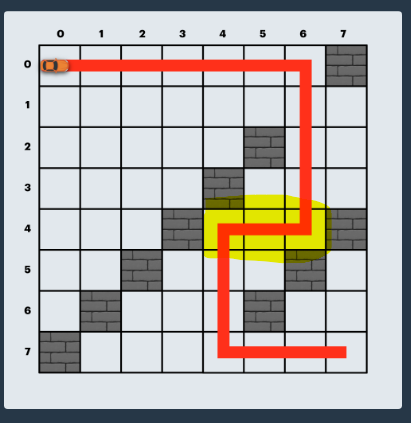

# 키패드 누르기 (30)

##### 배워갈 점

1. 좌표로 보자 !!!
2. 한 줄에 3개니까 `num//3, num%3` 을 좌표로 보자 !
3. 이 때 1부터 시작하면 같은 행임에도 `[0,1],[0,2],[1,0]` 이 되므로, `num-1` 로 좌표를 구성한다.


```python
def get_coordinates(num):
    num -= 1
    return num//3, num%3

def solution(numbers, hand):
    answer = ''
    location = [10,12]
    hand = 'L' if hand == 'left' else 'R'
    
    for num in numbers:
        num = num if num != 0 else 11
        if num in [1,4,7]:
            location[0] = num
            answer += 'L'
        elif num in [3,6,9]:
            location[1] = num
            answer += 'R'
        else:
            lx,ly = get_coordinates(location[0])
            rx,ry = get_coordinates(location[1])
            qx,qy = get_coordinates(num)
            
            dist_left = abs(lx-qx) + abs(ly-qy)
            dist_right = abs(rx-qx) + abs(ry-qy)
            
            if dist_left == dist_right:
                answer += hand
                location[hand == 'R'] = num
            elif dist_left > dist_right:
                answer += 'R'
                location[1] = num
            else:
                answer += 'L'
                location[0] = num
    
    return answer
```


# 수식 최대화 (30)

### 역시 구현 문제는 시간 복잡도따위 빠이빠이

##### 배워갈 점

1. `re.split(capture)` !!!! : 
2. loop돌 때 `len` 이 변하는 경우에, 
   1. for문은 신경쓸 필요 없지만
   2. **while문은 그 때 그 때 검사**하므로 고정시킬 필요가 있다 !!!!


내가 원하는 연산자를 만나면 현재 연산자 값, 다음에 나올 숫자, 이전에 나온 숫자를 다 빼서 더해준 후 다시 str으로 append해준다.

```python
from itertools import permutations
import re
from collections import deque

def solution(expression):
    answer = 0
    ops = set(re.findall("\D", expression))
    exps = deque(re.split('(\D)',expression))

    for priority in permutations(ops, len(ops)):
        stack = exps.copy()
        for target_op in priority:
            i = 0
            ######################################
            length = len(stack) # 꼭 저장해놔야함 !!
            while i < length:
            ######################################
                if stack[0] != target_op:
                    stack.append(stack.popleft())
                    i += 1
                    continue
                num1 = stack.pop()
                ops = stack.popleft()
                num2 = stack.popleft()

                stack.append(str(eval(num1+ops+num2)))
                i += 2

                if len(stack) == 1:
                    answer = max(abs(int(stack[0])), answer)
                    break

    return answer

print(solution("100-200*300-500+20"))
print(solution("50*6-3*2"))
```


# 보석 쇼핑 (20/)

#### 그냥 처음 아이디어대로 하면 되는거구나? 헤헤

##### 배워갈 점

1. 예외 case!!!!!

   ```
   print(solution(['A', "C", "C",'C','B','A']))
   ```


###### 참고

https://blog.naver.com/kks227/220795165570


##### 효율성 실패한 풀이쓰,,,

* while 을 p로 바꿔줬지만 초과해따

```python
def solution(gems):
    count = {gem:0 for gem in set(gems)}

    for i in range(len(set(gems))):
        count[gems[i]] += 1

    answer = [1,len(gems)]
    start, end = 0, len(set(gems))-1

    p = [i for i in range(len(gems))]
    for i in range(2,len(gems)+1):
        if gems[-i] == gems[-i+1]:
            p[-i] = p[-i+1]

    while True:
        for i in count.values():
            if i == 0:
                break
        else:
            if answer[1]-answer[0] > end-start:
                answer = [start+1, end+1]

        if end+1 < len(gems):
            count[gems[end + 1]] += 1
            end += 1
        else:
            break

        while count[gems[start]] > 1:
            if start == p[start]:
                count[gems[start]] -= 1
                start += 1
            else:
                ###################################### [6,6,6,6,6,6,6] 인데 보석은 2가지인 경우 end가 더 작으니까
                count[gems[start]] -= min(p[start],end) - start
                start = min(p[start],end)
                #######################################

    return answer
```


##### 와아아아아악 for문 때문이었다니 ㅎㅅㅎ ,,,,

굳이굳이 귀찮게 `del` 을 해야한다니 ,,, `len`이 낫다니 ,,, 아이디어 싸움이 아니었다니 ,,,

```python
def solution(gems):
    count = {}
    N = len(set(gems))

    for i in range(N):
        if count.get(gems[i]) is None:
            count[gems[i]] = 1
        else:
            count[gems[i]] += 1

    answer = [1,len(gems)]
    start, end = 0, N-1

    p = [i for i in range(len(gems))]
    for i in range(2,len(gems)+1):
        if gems[-i] == gems[-i+1]:
            p[-i] = p[-i+1]

    while True:
        if len(count) == N:
            if answer[1]-answer[0] > end-start:
                answer = [start+1, end+1]
            count[gems[start]] -= 1
            if count[gems[start]] == 0:
                del count[gems[start]]
            start += 1

        end += 1
        if end >= len(gems):break
        if count.get(gems[end]) is None:
            count[gems[end]] = 1
        else:
            count[gems[end]] += 1

        while count[gems[start]] > 1:
            if start == p[start]:
                count[gems[start]] -= 1
                start += 1
            else:
                count[gems[start]] -= min(p[start],end) - start
                start = min(p[start],end)

    return answer
```

##### 경로압축 O

| 테스트 1 〉  | 통과 (4.85ms, 9.92MB)  |
| ------------ | ---------------------- |
| 테스트 2 〉  | 통과 (7.82ms, 10.5MB)  |
| 테스트 3 〉  | 통과 (14.24ms, 11MB)   |
| 테스트 4 〉  | 통과 (12.77ms, 11.8MB) |
| 테스트 5 〉  | 통과 (21.93ms, 12MB)   |
| 테스트 6 〉  | 통과 (27.15ms, 12.7MB) |
| 테스트 7 〉  | 통과 (30.78ms, 13.3MB) |
| 테스트 8 〉  | 통과 (35.14ms, 13.5MB) |
| 테스트 9 〉  | 통과 (42.00ms, 14.2MB) |
| 테스트 10 〉 | 통과 (44.89ms, 14.8MB) |
| 테스트 11 〉 | 통과 (52.80ms, 16MB)   |
| 테스트 12 〉 | 통과 (48.03ms, 17.5MB) |
| 테스트 13 〉 | 통과 (57.32ms, 18.7MB) |
| 테스트 14 〉 | 통과 (79.87ms, 19.1MB) |
| 테스트 15 〉 | 통과 (85.18ms, 20.6MB) |


##### [더 빠르다니 ㅠㅠ] 경로압축 X

```python
def solution(gems):
    count = {}
    N = len(set(gems))

    for i in range(N):
        if count.get(gems[i]) is None:
            count[gems[i]] = 1
        else:
            count[gems[i]] += 1

    answer = [1,len(gems)]
    start, end = 0, N-1

    while True:
        if len(count) == N:
            if answer[1]-answer[0] > end-start:
                answer = [start+1, end+1]
            count[gems[start]] -= 1
            if count[gems[start]] == 0:
                del count[gems[start]]
            start += 1

        end += 1
        if end >= len(gems):break
        if count.get(gems[end]) is None:
            count[gems[end]] = 1
        else:
            count[gems[end]] += 1

        while count[gems[start]] > 1:
            count[gems[start]] -= 1
            start += 1

    return answer
```


| 테스트 1 〉  | 통과 (3.58ms, 9.89MB)  |
| ------------ | ---------------------- |
| 테스트 2 〉  | 통과 (5.62ms, 10.2MB)  |
| 테스트 3 〉  | 통과 (9.65ms, 10.5MB)  |
| 테스트 4 〉  | 통과 (9.08ms, 11.4MB)  |
| 테스트 5 〉  | 통과 (16.31ms, 11.3MB) |
| 테스트 6 〉  | 통과 (19.38ms, 11.7MB) |
| 테스트 7 〉  | 통과 (22.78ms, 12.1MB) |
| 테스트 8 〉  | 통과 (25.99ms, 12.4MB) |
| 테스트 9 〉  | 통과 (28.75ms, 12.9MB) |
| 테스트 10 〉 | 통과 (32.77ms, 13.2MB) |
| 테스트 11 〉 | 통과 (38.91ms, 13.9MB) |
| 테스트 12 〉 | 통과 (33.43ms, 14.9MB) |
| 테스트 13 〉 | 통과 (42.26ms, 15.7MB) |
| 테스트 14 〉 | 통과 (58.76ms, 16.3MB) |
| 테스트 15 〉 | 통과 (63.19ms, 17MB)   |


# 경주로 건설 ( k시간 ●●●●●●●● )

### ==:honey_pot: 이 문제는 그냥 BFS/DFS인데 이전 state만 기억하면 되는 문제였다 !!!!! :honey_pot:==

### 뒤로 가야할 수도 있따 !

#### 완탐을 막히다니 자존심이 상하는구만 ,,,


##### 배워갈 점

1. 난 완탐도 못하는 바보야 ~
2. 한 쪽 좌표를 저장하자는 아이디어도 좋지만 ,,,,,, 여기는 한발한발 가는 것으로 생각하는게 더 낫다 ,,,,,
3. 그냥 DFSP/BFS인데 이전 상태를 저장하는 문제다. 역시 ... 꼬아서 생각할 필요 없다.


#### 내가 놓쳤던 부분

1. **back 할 필요가 없다 (왼쪽 or 위)**

2. 위쪽으로 갈 필요가 없다.

3. **왼쪽**으로 갈 필요가 없다.

   * 왼쪽으로 가야한다 !

   


2. `[(x,y),(x,y+1)]` 에서 이동은, `(x,y+1)` 한 점만 생각하고 고려하면 된다.

   * `[(4,4), (4,5)]` 에서 `[(4,4), (5,4)]` 를 건설할 수 없다 !!!!

3. 무조건 벽을 만나기 전까지 갈까?

   * 아래 경우처럼 막혀있을 수도 있다. 다시 나오는 등 대책이 필요하다.


     


```python
from collections import deque

def solution(board):

    N = len(board)
    prices = [[[float('inf'),float('inf')] for _ in range(N)] for _ in range(N)]
    answer = float('inf')

    stack = deque()
    if board[0][1] == 0:
        stack.append((100,(0,1),0))
    if board[1][0] == 0:
        stack.append((100,(1,0),1))

    while stack:
        price, (x,y), direction = stack.popleft()

        if x == N-1 and y == N-1:
            answer = min(answer, price)

        if prices[x][y][direction] <= price:
            continue
        prices[x][y][direction] = price

        for dx,dy,d in [(-1,0,1),(1,0,1),(0,-1,0),(0,1,0)]:
            a,b,p = x+dx, y+dy, 100 if direction == d else 600
            if a<0 or a>=N or b<0 or b>=N or board[a][b] or prices[a][b][d] <= price + p:
                continue
            stack.append((price + p, (a,b), d))

    return answer
```


# 동굴 탐험 (1.09)

##### 당연히 실패할 줄 알았는데 효율성 통과해따 두둥... 하지만 정석 풀이는 아니었음 흠

`while + for` 더라도 !!!! 일단 정확성을 노리기 위해 제출해보자


##### 배워갈 점

1. 트리 순회하기

   * cycle이 없고
   * 어떤 두 점을 선택하더라도 이어져있으며
   * 그 경로는 유일하다

   덕분에 쉽게 짤 수 있었음 !

2. 방문할 수 없는 경우 처리하기

   * 방문할 수 없는 경우에는 `[1,7] => [7,1] => [1,7], ... ` 무한루프 !
   * `while` 안에 `R = len(stack) ; for _ range(R)` 넣어주고, `denied_rooms == R` 이면 `False` return하도록 만든다.

```python
from collections import deque

def solution(n, path, order):
    answer = True
    arr = [[] for _ in range(n)]
    for a,b in path:
        arr[a].append(b)
        arr[b].append(a)

    visit = [False]*n
    denied = [*range(n)]
    for f,s in order:
        denied[s] = -1
        denied[f] = s

    stack = deque([0])
    # 거절당한 방의 갯수 == 남은 방의 갯수면
    while stack:
        R = len(stack)
        denied_rooms = 0
        for _ in range(R):
            room = stack.popleft()

            if denied[room] < 0:
                stack.append(room)
                denied_rooms +=1
                continue

            if visit[room]:continue
            visit[room] = True

            denied[denied[room]] = denied[room]

            for next_room in arr[room]:
                if not visit[next_room]:
                    stack.appendleft(next_room)

        if R == denied_rooms:
            return False

    return answer

# print(solution(9,	[[0,1],[0,3],[0,7],[8,1],[3,6],[1,2],[4,7],[7,5]],	[[8,5],[6,7],[4,1]]))
print(solution(10,	[[0,1],[0,3],[0,7],[8,1],[3,6],[1,2],[4,7],[7,5],[5,9]],	[[8,7],[4,1],[6,9]]))
# print(solution(	9, [[0, 1], [0, 3], [0, 7], [8, 1], [3, 6], [1, 2], [4, 7], [7, 5]], [[4, 1], [8, 7], [6, 5]]))
```


