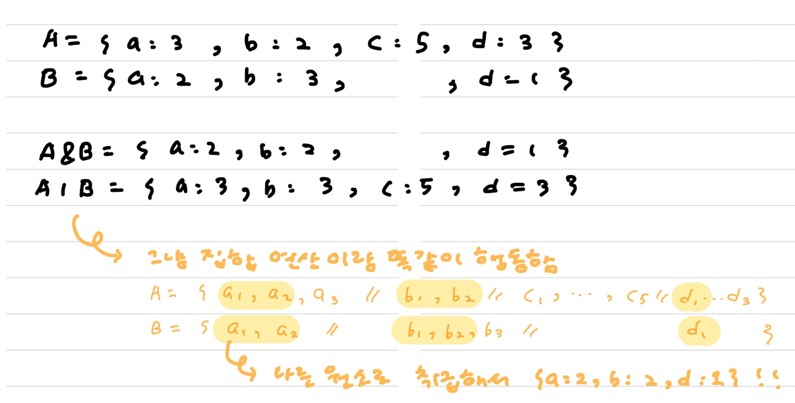
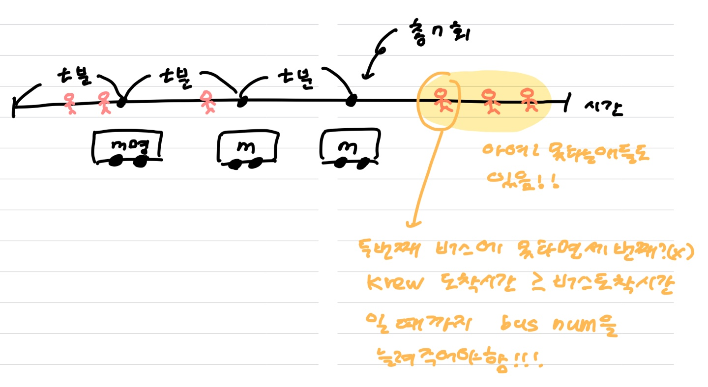
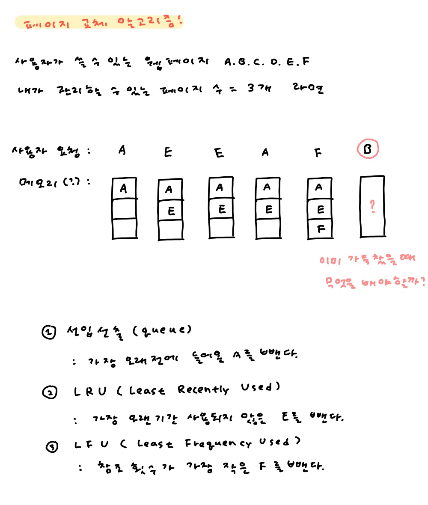

[:100: 총평](#-100----)  
[:newspaper: 뉴스 클러스터링](#-newspaper----------)   
[:bomb: 블록 터뜨리기](#-bomb---------)  
[:bus: 셔틀 버스~엉젱가다시풀어보기~](#-bus---------60------------)    
[:bar_chart: 캐시](#-bar-chart----)  
> [캐시 교체 알고리즘 LRU (Least Recently Used)](#-----------lru--least-recently-used-)  
  
[:world_map: 비밀지도](#-world-map------)  
[:dart: 다트 게임](#-dart-------)  
[:notes: 방금 그 곡](#-notes--------)  
> [:honey_pot: C#등은 사용되지 않는 문자인 X,Y,Z로 치환한다 !](#-honey-pot--c----------------x-y-z--------)  
    
[:light_rail: 자동완성](#-light-rail------)  
  * [1. trie 이용](#1-trie---)  
  * [2. 정렬 이용](#2------)  
  
[:building_construction: 압축](#-building-construction----)  
    + [:deciduous_tree: 이걸 trie로도 풀 수 있따!](#-deciduous-tree-----trie----------)  
    
[:file_folder: 파일명 정렬](#-file-folder--------)  
[:two: n진수 게임](#-two--n-----)  
> [n(<=16) 진수는 재귀로 구현한다.](#n---16--------------)  
  
    
# :100: 총평

* 나의 취약 부분은 셔틀 버스, 압축과 같은 index 다루는 문제 ! ㅠㅅㅠ
* 구현문제는 시간 신경쓰지 말고 일단 로직을 짜자. 다 성공하면 그 때 최적화하자 !


# :newspaper: 뉴스 클러스터링

#### dict의 value를 비교해서 min or max를 취하고 싶다면?

##### Counter 연산은 집합의 연산처럼 행동한다 ( ~ v ~ ) /

`Counter`에서 `& or |` 를 이용하면 된다 !



```python
from collections import Counter

def solution(str1, str2):
    str1 = [str1[i:i+2] for i in range(len(str1)-1)]
    str2 = [str2[i:i+2] for i in range(len(str2)-1)]

    A = Counter()
    for s in str1:
        if s.isalpha():
            A[s.lower()] += 1

    B = Counter()
    for s in str2:
        if s.isalpha():
            B[s.lower()] += 1

    if sum(A.values()) == 0 and sum(B.values()) == 0:
        return 65536

    ####################
    intersection = A&B
    union = A|B
    ####################

    return int(65536*sum(intersection.values())/sum(union.values()))
```


# :bomb: 블록 터뜨리기

##### 배워갈 점

한 번 훑고 지나가는 것을 한 게임으로 생각해서

1. while 이 시작될 때마다 `score` 초기화가 필요하고
2. 터뜨리면서 0을 만드는게 아니라 일단 다 훑은 다음 한꺼번에 0으로
3. 다 터뜨린 후에는 한쪽으로 밀어주기

```python
def solution(m, n, board):
    answer = 0

    new_board = [[] for _ in range(n)]
    for i in range(m):
        for j in range(n):
            new_board[n-j-1].append(board[i][j])
    board = new_board

    while True:
        bomb = []
        ################################### 매 게임마다 초기화
        score = [[1] * m for _ in range(n)]
        ###################################

        for i in range(n-1):
            for j in range(m-1):
                if board[i][j] != '*':
                    if set(board[i+dx][j+dy] for dx,dy in [(0,1),(1,0),(1,1)]) == set(board[i][j]):
                        for dx,dy in [(0,0),(0,1),(1,0),(1,1)]:
                            answer += score[i+dx][j+dy]
                            ### 값은 나중에 바꾼다 ####
                            bomb.append((i+dx,j+dy))
                            ########################
                            
                            ### 한 번 지나갔으면 점수 주지마 !
                            score[i+dx][j+dy] = 0
                            #############################
                            
                            
		############ 아무것도 터뜨리지 못했다면 break
        if not bomb:
            break
        ############

        for x,y in bomb:
            board[x][y] = ''

        for i in range(n):
            board[i] = list("".join(board[i]).rjust(m,"*"))

    return answer
```


# :bus: 셔틀 버스~엉젱가다시풀어보기~

#### :curly_loop: 채우다가 넘치는 경우엔 버린다면, krew가 아니라 bus 배열을 loop시키는게 낫다.

#### :bell: 9:00부터 도착하므로, 시작 시간을 ==9:00 - k== 로 두자 !

#### :no_bell: ​==k번째 버스가 안되면 바로 k+1번째 버스로 넘겨야 하는게 아니다 !!!==

무조건 다음 버스를 타는 문제가 있고, 그렇지 않은 경우가 있다.

이 문제는 k번째 버스도, k+1번째도, 마지막 버스까지도 못타는 경우가 존재한다 !!!

굳이 `krew`를 다 도는 것보다, 그냥 `bus` 만 도는게 낫다.




```python
def solution(n, t, m, timetable):

    timetable = [60*int(t[:2]) + int(t[3:]) for t in timetable]
    timetable.sort()
    
    arrival_time = 9*60 - t
    krew = 0
    riding = 0

    for bus in range(n):
        arrival_time += t
        riding = 0
        
        while krew < len(timetable) and arrival_time >= timetable[krew] and riding < m:
            riding += 1
            krew += 1

    if riding < m:
        arrival_time = 9 * 60 + (n - 1) * t
    else:
        arrival_time = timetable[krew-1]-1
        
    return f'{arrival_time//60:0>2}:{arrival_time%60:0>2}'
```


```python
def solution(n, t, m, timetable):

    timetable = [60*int(t[:2]) + int(t[3:]) for t in timetable]
    timetable.sort()
    
    ####################### 시작 시간을 9:00 - t분으로 둔다 !! ★★★★★★★
    arrival_time = 9*60 - t
    ####################### ★★★★★★★★★★★★★★★★★★★★★★★★★★
    
    krew = 0
    riding = 0

    for bus in range(n):
        arrival_time += t
        riding = 0
        
        # 모든 크루가 탑승했거나, 도착 시간보다 늦게왔거나, 정원이 꽉 찼으면 중지한다.      
        while krew < len(timetable) and arrival_time >= timetable[krew] and riding < m:
            # 그렇지 않으면 탑승 인원을 늘려주고, 다음에 검사할 krew index를 지정해준다.
            riding += 1
            krew += 1

    # 마지막까지 다 돌았는데도 정원이 차지 않았다면 가장 마지막 차에 배정시킨다.
    if riding < m:
        arrival_time = 9 * 60 + (n - 1) * t

    # 마지막차까지 꽉 차버렸다면, 가장 마지막에 탑승한 krew보다 1분 일찍 도착한다.
    else:
        arrival_time = timetable[krew-1]-1
        
    # 결과를 string 형태로 반환하고 return한다.
    return f'{arrival_time//60:0>2}:{arrival_time%60:0>2}'
```


##### 배워갈 점

1. 위에서 언급했듯이, **못타는데도 바로 다음차에 배정**시켜서 계속 틀렸음
2. 9시부터 차가 도착하므로, `9:00-k` 를 시작 시간으로 두자.
3. `krew`를 돌지, `bus`를 돌지 잘 생각하자.
4. 어느 순간엔 마지막 time이고 어느 순간엔 이전 krew보다 1분 일찍인지 잘 생각하자 !


# :bar_chart: 캐시


## 캐시 교체 알고리즘 LRU (Least Recently Used)

가장 오랜 기간 사용되지 않은 page를 삭제한다.

`cache hit` : 찾으려는 데이터가 이미 캐시되어있는 경우

`cache miss` : 없는 경우




##### defaultdict 풀이

```python
from collections import Counter

def solution(cacheSize, cities):
    if cacheSize == 0:
        return len(cities)*5

    cities = [c.lower() for c in cities]
    answer = 0
    cached = Counter()

    for i,city in enumerate(cities):
        if cached[city]:
            cached[city] = -i-1
            answer += 1
            continue

        if len(cached) == cacheSize:
            city_del, _ = cached.most_common(1)[0]
            del cached[city_del]

        cached[city] = -i-1
        answer += 5

    return answer
```


##### append / remove 풀이 => ==더 빠름==

```python
def solution(cacheSize, cities):
    if cacheSize == 0:
        return len(cities)*5
    
    cities = [c.lower() for c in cities]
    answer = 0
    cached = []

    for i,city in enumerate(cities):
        if city in cached:
            cached.remove(city)
            cached.append(city)
            answer += 1
            continue

        if len(cached) == cacheSize:
            cached.pop(0)

        cached.append(city)
        answer += 5

    return answer
```


# :world_map: 비밀지도

##### loop안돌고 replace 써도 깔끔할듯 !

```python
def solution(n, arr1, arr2):
    answer = []

    for a,b in zip(arr1, arr2):
        temp = ''
        for s in bin(a|b)[2:]:
            temp += "#" if s == "1" else " "
        answer.append(temp.rjust(n," "))

    return answer
```


###### replace후 다시 선언하는거 잊지말기잉

```python
def solution(n, arr1, arr2):
    answer = []

    for a,b in zip(arr1, arr2):
        temp = bin(a|b)[2:]
        temp = temp.replace("1","#").replace("0"," ")
        answer.append(temp.rjust(n," "))

    return answer
```


# :dart: 다트 게임

```python
import re

def solution(dartResult):
    answer = [0]
    dartResult = re.findall("(\d+)(\w)([*#]?)",dartResult)
    power = {'S':1,'D':2,'T':3}

    for score, kind, bonus in dartResult:
        score = int(score)
        score **= power[kind]
        if bonus == '*':
            answer[-1] *= 2
            score *= 2
        elif bonus == '#':
            score *= -1
        answer.append(score)

    return sum(answer)
```


# :notes: 방금 그 곡

### :honey_pot: C#등은 사용되지 않는 문자인 X,Y,Z로 치환한다 !

##### 뭘 늘려야 할지 몰라서 좀 헤맸다 ㅠ.ㅠ

길이가 짧으므로 그대로 구현하면 된다.

```python
import re

def solution(m, musicinfos):

    p = re.compile("\w#?")
    m = "/".join(p.findall(m)) + '/'

    def convert(time):
        hour,minute = time.split(":")
        return int(hour)*60+int(minute)

    candidates = []
    for i, info in enumerate(musicinfos):
        start, end, title, notes = info.split(",")
        start, end = convert(start), convert(end)
        time = end-start
        notes = p.findall(notes)
        length = len(notes)

        notes = notes*(time//length) + notes[:time%length]
        notes = "/".join(notes) + '/'

        if m in notes:
            candidates.append((-time,i,title))

    if candidates:
        candidates.sort()
        return candidates[0][-1]
    return '(None)'
```


# :light_rail: 자동완성


## 1. trie 이용

```python
class Node:
    def __init__(self, key):
        self.key = key
        self.words = 0
        self.child = {}


class Trie:
    def __init__(self):
        self.head = Node(None)

    def insert(self, query):
        curr_node = self.head

        for q in query:
            curr_node.words += 1
            if curr_node.child.get(q) is None:
                curr_node.child[q] = Node(q)
            curr_node = curr_node.child[q]

        curr_node.words += 1

    def search(self, query):
        curr_node = self.head

        for i,q in enumerate(query):
            if curr_node.words == 1:
                return i
            curr_node = curr_node.child[q]

        return len(query)

def solution(words):
    answer = 0

    trie = Trie()
    for w in words:
        trie.insert(w)

    for w in words:
        answer += trie.search(w)

    return answer
```


## 2. 정렬 이용

#### :honey_pot: 정렬하고 나면, 나와 가장 많이 겹치는 단어는 앞 혹은 뒤에 위치한다.


# :building_construction: 압축

쪼오꼼 조건문이 헷갈렸지만 잘 풀었다 ..

```python
def solution(msg):
    answer = []
    compressed = {chr(i):i-64 for i in range(65,91)}

    s = 0
    new = len(compressed) + 1
    while True:
        i = 1
        while s+i <= len(msg) and compressed.get(msg[s:s+i]) is not None:
            i += 1
        answer.append(compressed[msg[s:s+i-1]])
        if s+i-1 == len(msg):
            break
        compressed[msg[s:s+i]] = new

        new += 1
        s += i-1

    return answer
```


| 테스트 1 〉  | 통과 (0.02ms, 9.7MB)  |
| ------------ | --------------------- |
| 테스트 2 〉  | 통과 (0.04ms, 9.69MB) |
| 테스트 3 〉  | 통과 (0.03ms, 9.61MB) |
| 테스트 4 〉  | 통과 (0.44ms, 9.73MB) |
| 테스트 5 〉  | 통과 (0.05ms, 9.69MB) |
| 테스트 6 〉  | 통과 (0.71ms, 9.63MB) |
| 테스트 7 〉  | 통과 (0.55ms, 9.66MB) |
| 테스트 8 〉  | 통과 (0.62ms, 9.68MB) |
| 테스트 9 〉  | 통과 (0.01ms, 9.68MB) |
| 테스트 10 〉 | 통과 (0.64ms, 9.69MB) |
| 테스트 11 〉 | 통과 (0.48ms, 9.69MB) |
| 테스트 12 〉 | 통과 (0.70ms, 9.69MB) |
| 테스트 13 〉 | 통과 (1.03ms, 9.69MB) |
| 테스트 14 〉 | 통과 (1.01ms, 9.64MB) |
| 테스트 15 〉 | 통과 (1.07ms, 9.64MB) |
| 테스트 16 〉 | 통과 (0.80ms, 9.71MB) |
| 테스트 17 〉 | 통과 (0.61ms, 9.72MB) |
| 테스트 18 〉 | 통과 (0.23ms, 9.66MB) |
| 테스트 19 〉 | 통과 (0.30ms, 9.65MB) |
| 테스트 20 〉 | 통과 (0.60ms, 9.65MB) |


### :deciduous_tree: 이걸 trie로도 풀 수 있따!

##### 배워갈 점

1. `for q in query`를 **다 돌고 나서 남은 애들** 처리해줘야함 !!!!!
2. 일단 가서 생각하는게 아니라, 가기 전에 생각한다.
   * `temp` 에서 한 발 `q`를 가봐도 `dict`에 있는 단어일까?

```python
class Node:
    def __init__(self, key, num):
        self.key = key
        self.num = num
        self.children = {}

class Trie:
    def __init__(self):
        self.head = Node(None,0)
        self.new_num = 1

        # A~Z를 미리 insert한다.
        for i in range(65,91):
            self.head.children[chr(i)] = Node(chr(i),self.new_num)
            self.new_num += 1

    def search_and_insert(self,query):
        answer = []
        curr_node = self.head

        temp = ''
        for q in query:
            # 없으면 추가, 있으면 answer에 append하고 temp 초기화
            if curr_node.children.get(q) is None:

                # 없으면, 이전까지의 결과를 answer에 append하고
                answer.append(curr_node.num)

                # 새롭게 추가해주자.
                curr_node.children[q] = Node(q, self.new_num)
                self.new_num += 1

                # 그리고 temp를 초기화 할건데, 마지막 q는 가져온다.
                temp = q
				#★★★★★★★★★★★★★★★★★★★★★★★ curr_node.child로 가는게 아니라 처음으로 가야함에 주의
                curr_node = self.head.children[q]
                continue
                #★★★★★★★★★★★★★★★★★★★★★★★

            temp += q
            curr_node = curr_node.children[q]

        ############################ 마지막 남은 글자 처리하는거 잊지말기이잉
        answer.append(curr_node.num)
        ############################

        return answer

def solution(msg):
    trie = Trie()
    answer = trie.search_and_insert(msg)
    return answer

print(solution("KAKA"))
print(solution("KAKAO"))
print(solution("TOBEORNOTTOBEORTOBEORNOT"))
```

테케 크기가 커지면 더 효율적이게찌 ..?

| 테스트 1 〉  | 통과 (0.04ms, 9.73MB) |
| ------------ | --------------------- |
| 테스트 2 〉  | 통과 (0.06ms, 9.71MB) |
| 테스트 3 〉  | 통과 (0.04ms, 9.8MB)  |
| 테스트 4 〉  | 통과 (0.48ms, 9.71MB) |
| 테스트 5 〉  | 통과 (0.06ms, 9.71MB) |
| 테스트 6 〉  | 통과 (0.60ms, 9.67MB) |
| 테스트 7 〉  | 통과 (0.41ms, 9.63MB) |
| 테스트 8 〉  | 통과 (0.46ms, 9.7MB)  |
| 테스트 9 〉  | 통과 (0.05ms, 9.83MB) |
| 테스트 10 〉 | 통과 (0.51ms, 9.73MB) |
| 테스트 11 〉 | 통과 (0.46ms, 9.7MB)  |
| 테스트 12 〉 | 통과 (0.53ms, 9.77MB) |
| 테스트 13 〉 | 통과 (0.97ms, 9.84MB) |
| 테스트 14 〉 | 통과 (1.05ms, 9.8MB)  |
| 테스트 15 〉 | 통과 (0.93ms, 9.84MB) |
| 테스트 16 〉 | 통과 (0.71ms, 9.69MB) |
| 테스트 17 〉 | 통과 (0.31ms, 9.64MB) |
| 테스트 18 〉 | 통과 (0.25ms, 9.64MB) |
| 테스트 19 〉 | 통과 (0.31ms, 9.68MB) |
| 테스트 20 〉 | 통과 (0.50ms, 9.84MB) |


# :file_folder: 파일명 정렬

### sort by key를 할 때 우선순위가 같다면 들어온 순서를 유지한다!

### ==정렬할 때만 잠시== lower / int로 바꾸고, 원래 list는 그대로 두자.


```python
import re

def solution(files):
    p = re.compile('(\D+)(\d{1,5})(.*)')
    file_tuples = [p.findall(file)[0] for file in files]
    file_tuples.sort(key = lambda x: (x[0].lower(),int(x[1])))

    return [head+num+tail for head, num, tail in file_tuples]
```


# :two: n진수 게임

### n(<=16) 진수는 재귀로 구현한다.

```python
notation = '0123456789ABCDEF'

def convert(num, base):
    q,r = divmod(num, base)
    n = notation[r]
    return convert(q,base) + n if q else n

def solution(n,t,m,p):
    answer = ''
    result = ''
    for i in range(m*t):
        result += convert(i,n)

    for i in range(p-1,m*t,m):
        answer += result[i]

    return answer
```


