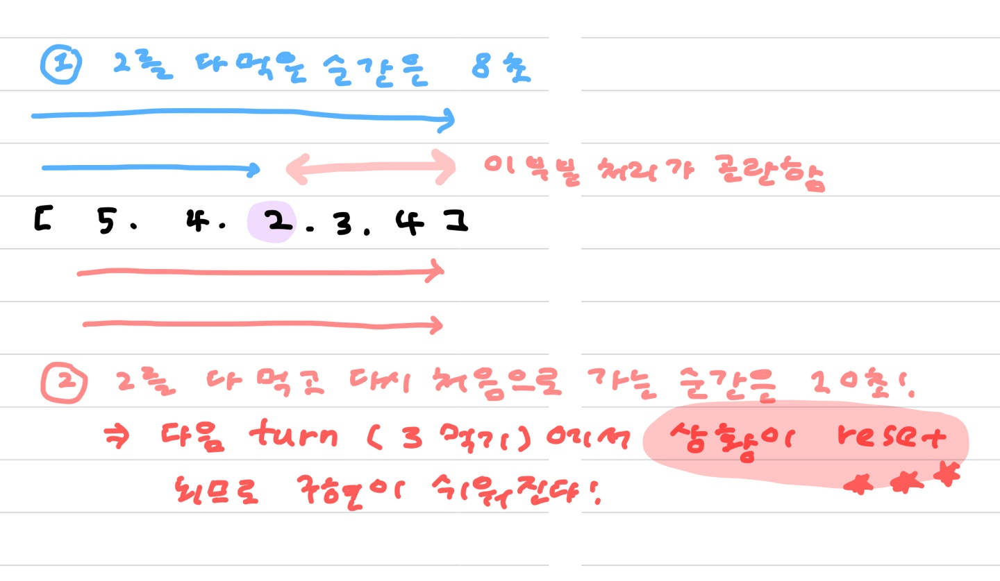
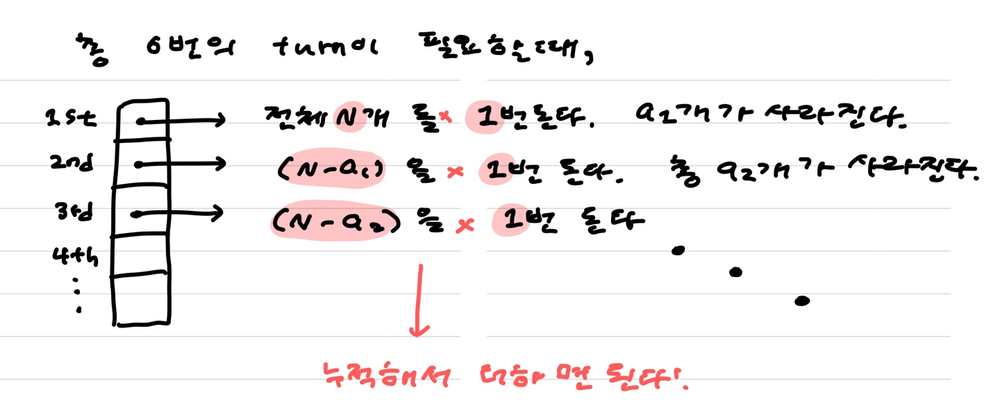
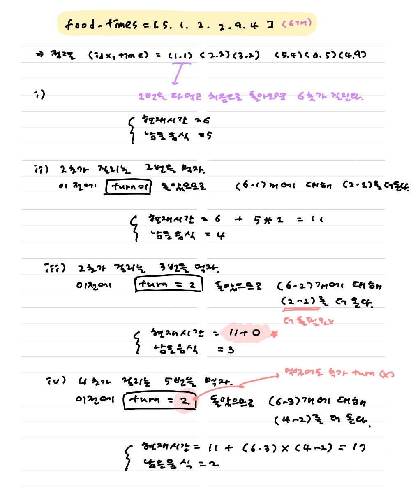
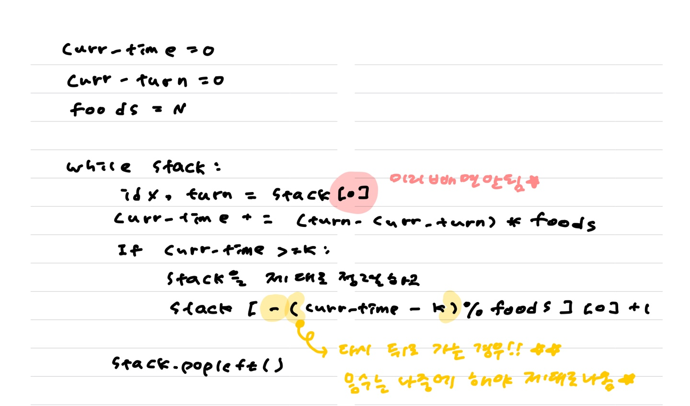
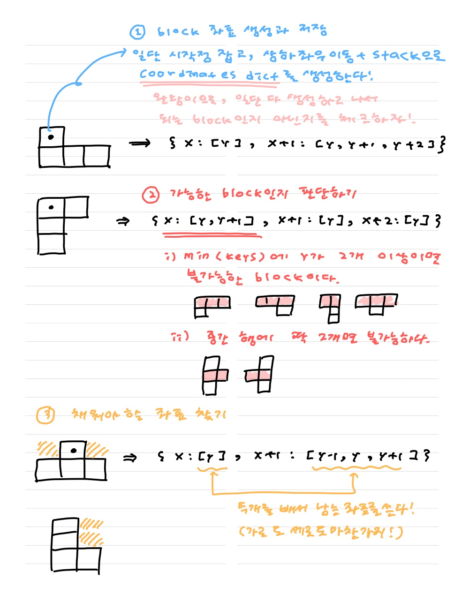
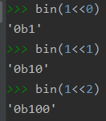
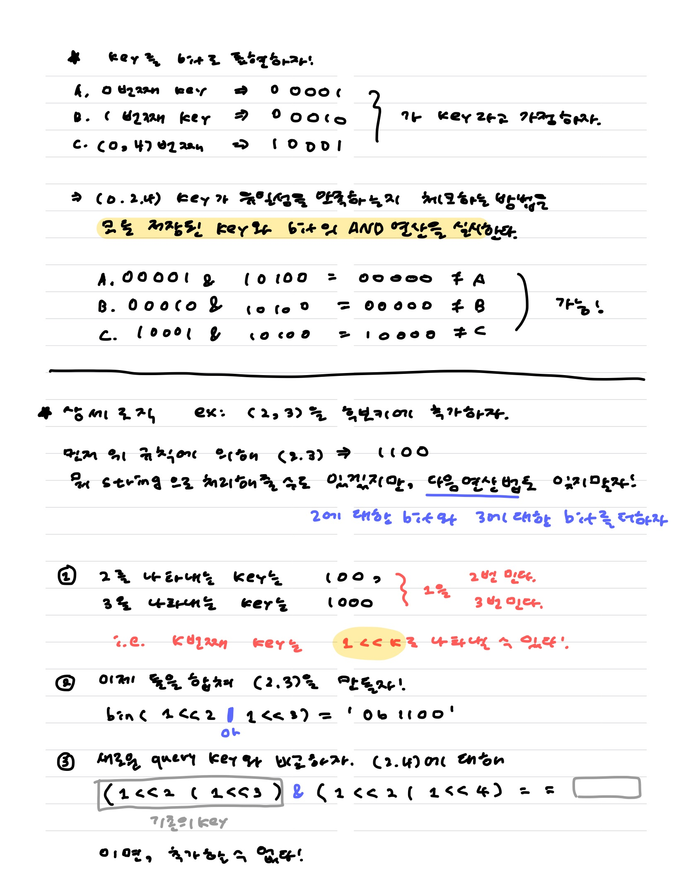

[TOC]


# :shallow_pan_of_food: 무지의 먹방 라이브


## :ocean: 효율성 통과 안되는 풀이

for문으로 아주 간단하게 구현할 수 있음 !!!

```python
from collections import deque

def solution(food_times,k):
    stack = deque([*enumerate(food_times)])
    for _ in range(k):
        if not stack:
            break
        idx, time = stack.popleft()
        if time == 1:
            continue
        stack.append((idx, time-1))
    return stack[0][0]+1 if stack else -1
```


## :fire: 효율성 풀이

이해하느라 죽는줄 알았네 ...


### :honey_pot: 정렬해서 먼저 먹는 방법의 꿀팁 !

##### 매번 <u>==상황을 reset==</u>할 수 있도록 처음으로 돌아가자 !!!!!



1. 해당 음식을 **다 먹는 순간!** 을 찾으려고 하지 말고, 해당 음식을 다 먹고 다시 **<u>처음으로 돌아오는 시간이 언제인지</u>** 를 찾아라.

2. `food_times = [1,4,2]`  를 다 먹는 :alarm_clock: **시간** :alarm_clock: 이라고 생각하지 말고 !<font color='red'>:curly_loop: **바퀴** :curly_loop: </font> 로 생각하자 !!!

   * 두번째 음식(4바퀴) 짜리를 다 먹기 위해서는 4바퀴를 돌아야 한다 !

   * 그러나 **==각 바퀴마다 음식의 갯수가 바뀜==**에 주목하자 !!

     다음처럼 누적해서 구해야한다.
     

3. 일단 먹어보고, **==안되면 거꾸로 돌아가자.==**

   * **:fire: 만약 현재 음식을 먹지 못해 거꾸로 돌아간다면, 지금의 음식도 포함해야 한다.** 
   * 일단 `pop`하고 생각하는게 아니라, 확정이 되면 그 때 뽑자

   

##### :red_circle: 음수 나머지를 이용할 때 `-(  (a-b)%c  )` 로 써야한다아

```python
from collections import deque

def solution(food_times,k):
    ######################## 만약 시간이 충분하다면, 다 먹을 수 있다. 미리 처리
    if k >= sum(food_times):
        return -1
    ########################

    stack = deque(sorted(enumerate(food_times), key = lambda x:x[-1]))

    curr_time = 0 # 현재 시간이 몇 초인지
    ##########################################
    curr_turn = 0 # 이전에 몇바퀴를 돌았는지 !!!!!
    ##########################################
    foods = len(food_times)

    while stack:
        # 1. 이번 음식을 다 먹고 돌아오기 위한 초를 계산하자.
        #    이 때, 다 먹고 돌아가지 못하는 경우에 거꾸로 돌아가야 하는데
        #    거꾸로 갈 때 오늘 먹은 음식도 포함되어야하므로 pop하면 안된다.
        idx, turn = stack[0]
        
        # 2. 이번 음식을 다 먹기 위해 """추가적으로 필요한 시간"""을 계산한다.
        #######################################
        curr_time += (turn - curr_turn) * foods
        #######################################
        print(f"{idx}먹으려면 {curr_time}까지 가용")
        
        # 3.1. 만약 다 먹기까지 시간이 더 필요하다면, 거꾸로 돌아가자.
        #      현재 stack은 turn 기준으로 정렬되어있으므로 다시 돌려주자
        if curr_time > k:
            s = sorted(stack, key = lambda x:x[0])
            ############# 나머지 계산시 음수는 마지막에 붙이자 !
            return s[-((curr_time-k)%foods)][0]+1
        	##############################################
        
        # 3.2. 먹을 수 있다면 먹어서 없애버리고 다음 음식으로 넘어가자
        stack.popleft()
        foods -= 1
        curr_turn = turn
        print(f"{idx}먹으니까 {curr_time}이에용")

print(solution([3,1,2],5))
print(solution([5, 1, 2, 7, 1, 2], 10))
```


## :fire: 이해가 안될 땐 손으로 풀어보자






##### 코드만 있는 ver ~

```python
from collections import deque

def solution(food_times,k):
    if k >= sum(food_times):
        return -1

    stack = deque(sorted(enumerate(food_times), key = lambda x:x[-1]))

    curr_time = 0 # 현재 시간이 몇 초인지
    curr_turn = 0 # 이전에 몇바퀴를 돌았는지 !!!!!
    foods = len(food_times)

    while stack:
        idx, turn = stack[0]
        
        curr_time += (turn - curr_turn) * foods

        if curr_time > k:
            s = sorted(stack, key = lambda x:x[0])
            return s[-((curr_time-k)%foods)][0]+1

        stack.popleft()
        foods -= 1
        curr_turn = turn

print(solution([3,1,2],5))
print(solution([5, 1, 2, 7, 1, 2], 10))
```


# :game_die: 블록게임

#### :honeybee: 한 블록이 터지는 것이 다른 블록에 영향을 준다면, while문을 통해 여러번 터뜨리면 된다 ! 한꺼번에 하지말자

여러 turn을 진행한다고 생각하고 while문을 돌자아 ~

#### :honey_pot: 가로블럭? 세로블럭? 그 중에서 어떤 형태?를 파악하기 위해 다음 `dict`를 활용하였다.




#### :red_circle: ==터졌어도 -1이 되지 못하는 경우==가 존재함에 주의하자


이를 고려하지 않은 아래 풀이는 80점

```python
from collections import defaultdict

def solution(board):
    answer = 0
    N = len(board)

    def show():
        for b in board:
            print(*[i if i >= 0 else "*" for i in b])

    def fill():
        for j in range(N):
            for i in range(N):
                if board[i][j] > 0:
                    break
                board[i][j] = -1

    fill()

    print("초기값")
    show()

    while True:
        bomb = False
        check = defaultdict(lambda: False) # 이미 확인한 block num인지

        for i in range(N):
            for j in range(N):
                if board[i][j] <= 0 or check[board[i][j]]:
                    continue
                target = board[i][j]
                check[board[i][j]] = True

                # 좌표들 찾기
                coor = defaultdict(set)
                visit = [[False]*N for _ in range(N)]
                stack = [(i,j)]
                while stack:
                    x,y = stack.pop()
                    if visit[x][y]:
                        continue
                    visit[x][y] = True
                    coor[x].add(y)
                    for dx,dy in [(0,1),(1,0),(0,-1)]:
                        if x+dx<0 or x+dx>=N or y+dy<0 or y+dy>=N or visit[x+dx][y+dy]:
                            continue
                        if board[x+dx][y+dy] == target:
                            stack.append((x+dx,y+dy))

                print(f"target : {target}, coor : {coor.items()}")

                # 만약 불가능한 형태면 : 가장 윗부분에 y가 두 개 이상이거나, 세로면서 중간에 뾱 나와있는 경우
                sorted_x = sorted(coor.keys())
                if len(coor[sorted_x[0]]) >= 2 or len(coor[sorted_x[1]]) == 2:
                    continue

                # 가능한 형태라면 값을 넣어야 할 좌표 찾기
                query_y = coor[sorted_x[-1]] - coor[sorted_x[0]]

                break_flag = False
                for x,y_list in coor.items():
                    if len(y_list) == 1: # 채워야 할 칸이다 !!
                        for qy in query_y:
                            if board[x][qy] >= 0: # 이 때 터뜨릴 수 없다면
                                break_flag = True
                                break
                        if break_flag:
                            break
                else:
                    # 다시 돌면서 터뜨려준다.
                    for x, y_list in coor.items():
                        for y in y_list:
                            #################
                            board[x][y] = -1
                            #################

                    answer += 1
                    bomb = True

                    # 아래부분에 또 터뜨릴게 있는지 체크하고 역시 다시 터뜨린다
                    fill()

                    print("\n한번 터졌어용")
                    show()

        if not bomb:
            break

    return answer
```


##### 위 풀이에서 주석으로 강조된 부분만 바꾸면 된다.

```python
from collections import defaultdict

def solution(board):
    answer = 0
    N = len(board)

    def show():
        for b in board:
            print(*[i if i >= 0 else "*" for i in b])

    def fill():
        for j in range(N):
            for i in range(N):
                if board[i][j] > 0:
                    break
                board[i][j] = -1

    fill()

    print("초기값")
    show()

    while True:
        bomb = False
        check = defaultdict(lambda: False) # 이미 확인한 block num인지

        for i in range(N):
            for j in range(N):
                if board[i][j] <= 0 or check[board[i][j]]:
                    continue
                target = board[i][j]
                check[board[i][j]] = True

                # 좌표들 찾기
                coor = defaultdict(set)
                visit = [[False]*N for _ in range(N)]
                stack = [(i,j)]
                while stack:
                    x,y = stack.pop()
                    if visit[x][y]:
                        continue
                    visit[x][y] = True
                    coor[x].add(y)
                    for dx,dy in [(0,1),(1,0),(0,-1)]:
                        if x+dx<0 or x+dx>=N or y+dy<0 or y+dy>=N or visit[x+dx][y+dy]:
                            continue
                        if board[x+dx][y+dy] == target:
                            stack.append((x+dx,y+dy))

                print(f"target : {target}, coor : {coor.items()}")

                # 만약 불가능한 형태면 : 가장 윗부분에 y가 두 개 이상이거나, 세로면서 중간에 뾱 나와있는 경우
                sorted_x = sorted(coor.keys())
                if len(coor[sorted_x[0]]) >= 2 or len(coor[sorted_x[1]]) == 2:
                    continue

                # 가능한 형태라면 값을 넣어야 할 좌표 찾기
                query_y = coor[sorted_x[-1]] - coor[sorted_x[0]]

                break_flag = False
                for x,y_list in coor.items():
                    if len(y_list) == 1: # 채워야 할 칸이다 !!
                        for qy in query_y:
                            if board[x][qy] >= 0: # 이 때 터뜨릴 수 없다면
                                break_flag = True
                                break
                        if break_flag:
                            break
                else:
                    # 다시 돌면서 터뜨려준다.
                    for x, y_list in coor.items():
                        for y in y_list:
                            ################# 일단 후보군으로 두고
                            board[x][y] = 0
                            ################# fill()에서 결정한다 !!

                    answer += 1
                    bomb = True

                    # 아래부분에 또 터뜨릴게 있는지 체크하고 역시 다시 터뜨린다
                    fill()

                    print("\n한번 터졌어용")
                    show()

        if not bomb:
            break

    return answer
```


# :key: 후보키

### :honey_pot: 포함관계를 비교하는 방법 ! 비트연산 !!!!!!!!!!!!!!!!!






```python
from itertools import combinations

def solution(relation):
    R = len(relation[0])
    N = len(relation)

    keys = []
    answer = 0
    relation = [*zip(*relation)]

    for r in range(1,R+1):
        # R개에서 1쌍씩, 두쌍씩, 세쌍씩 각각 combi를 만들어서 얘네가 유일한지 확인해보자.
        for comb in set(combinations(range(R),r)):
            if len(set(zip(*[relation[c] for c in comb]))) == N: # 유일하다면
                key = 0
                for c in comb:
                    key |= 1<<c # int
                if any(key&k == k for k in keys):continue
                keys.append(key)
                answer += 1

    return answer
```


```python
from itertools import combinations

def solution(relation):
    R = len(relation[0])
    N = len(relation)
    key = set()
    answer = 0
    relation = [*zip(*relation)]

    for r in range(1,R+1):
        for comb in set(combinations(range(R),r)) - key:
            if len(set(zip(*[relation[c] for c in comb]))) == N:
                key.add(comb)
                answer += 1

        # key update
        key = set([tuple(sorted(k+(i,))) for k in key for i in range(R) if i not in k])

    return answer
```


# :100: 매칭 점수

못해먹겠다 ㅠㅠ 다음 코드 참고해서 다시 짜보자

[출처](https://geonlee.tistory.com/84)

[C지만 아이디어 얻어가기](https://m.blog.naver.com/PostView.nhn?blogId=withham1&logNo=221371132676&proxyReferer=https:%2F%2Fwww.google.com%2F)

```python
import re

def solution(word, pages):
    answer = 0
    meta_parser = re.compile('<meta(.+?)/>')
    a_parser = re.compile('<a(.+?)>')
    page_infos = []
    for page in pages:
        page_dict = dict()
        a_tags = a_parser.findall(page)
        outer_url = []
        for a_tag in a_tags:
            first_idx = end_idx = -1
            for idx, char in enumerate(a_tag):
                if char == '"':
                    if first_idx == -1:
                        first_idx = idx
                    elif end_idx == -1:
                        end_idx = idx
            outer_url.append(a_tag[first_idx+1:end_idx])
        meta_tag = meta_parser.search(page).group()
        content_prop = meta_tag.split(' ')[2]
        first_idx = end_idx = -1
        for idx, char in enumerate(content_prop):
            if char == '"':
                if first_idx == -1:
                    first_idx = idx
                elif end_idx == -1:
                    end_idx = idx
        url = content_prop[first_idx+1: end_idx]
        page_dict['outer_url_list'] = outer_url
        page_dict['url'] = url
        page_dict['keyword_point'] = re.sub('[^a-z]+', '.', page.lower()).split('.').count(word.lower())
        page_dict['link_point'] = 0
        page_infos.append(page_dict)
    for page_info in page_infos:
        for outer_url in page_info['outer_url_list']:
            for outer_url_page_candidate in page_infos:
                if outer_url == outer_url_page_candidate['url']:
                    outer_url_page_candidate['link_point'] += page_info['keyword_point']/len(page_info['outer_url_list'])
    point_lst = [page_info['keyword_point'] + page_info['link_point'] for page_info in page_infos]
    print(point_lst)
    return point_lst.index(max(point_lst))
```


# :world_map: 길찾기 게임

```python
import sys
sys.setrecursionlimit(10**6)
from operator import itemgetter

class Node:
    def __init__(self,num,x,y):
        self.num = num
        self.x, self.y = x,y
        self.left, self.right = None, None

class BST:
    def __init__(self):
        self.root = None

    def insert(self,num,x,y):
        self.root = self._insert_( self.root , num , x , y)

    def _insert_(self , node , num , x , y ):
        if not node:
            return Node(num,x,y)
        if x < node.x:
            node.left = self._insert_(node.left,num,x,y)
        else:
            node.right = self._insert_(node.right,num,x,y)
        return node

    def pre(self):
        result = []
        
        def _pre_(node):
            if not node:
                return
            
            result.append(node.num)
            
            _pre_(node.left)
            _pre_(node.right)

        _pre_(self.root)
        return result

    def post(self):
        result = []

        def _post_(node):
            if not node:
                return
            
            _post_(node.left)
            _post_(node.right)
            
            result.append(node.num)

        _post_(self.root)
        return result

def solution(nodeinfo):
    nodeinfo = [nodeinfo[i]+[i+1] for i in range(len(nodeinfo))]
    nodeinfo.sort(key=itemgetter(1), reverse = True)

    myBST = BST()
    for x,y,num in nodeinfo:
        myBST.insert(num,x,y)

    return [myBST.pre(),myBST.post()]
```

