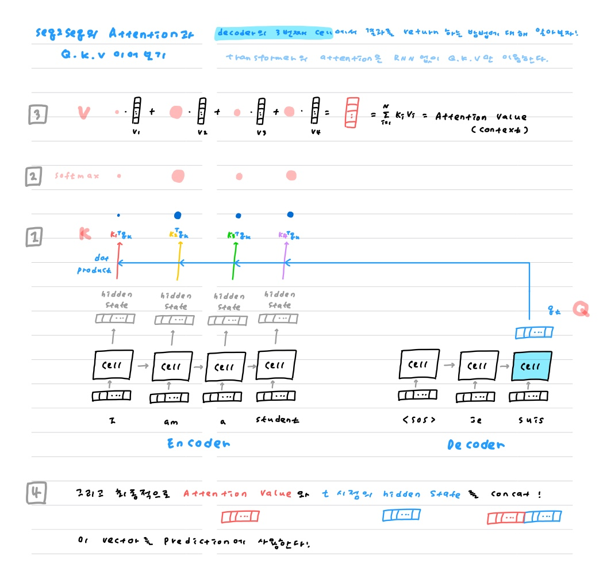
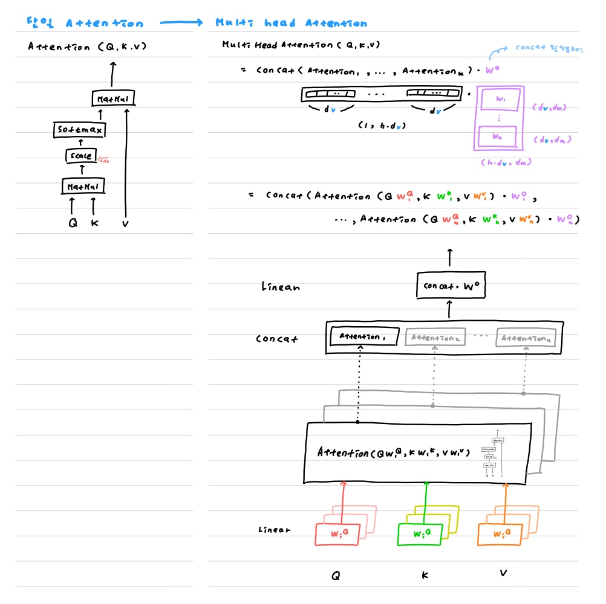
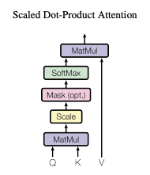

#### Introduction

Youtube에서는, 자동으로 재생목록을 늘려주는 기능이 있다. 내가 플레이 리스트에 몇 곡을 미리 넣어두면 내 목록에 맞는 노래를 찾아 무한 확장시킬 수 있다!

이 기능 덕분에 내 취향에 맞는 노래를 많이 발견했기 때문에, 직접 구현해보고 싶어졌다 ㅎㅎ

[Consistency-Aware Recommendation for User-Generated Item List Continuation](https://arxiv.org/pdf/1912.13031.pdf) 논문을 구현해서 나만의 "플레이 리스트 무한 확장 기능"을 만들어보려고 한다.

Attention을 이용해 1 ) 플레이 리스트의 전반적인 특성 2 ) 최근 담긴 item의 특성을 파악해서 continuation을 진행한다.

즉 Attention이 핵심 포인트!

고로 Attention부터 차근차근 구현해보려고 한다.

이전에 [Seq2Seq부터 Transfomer까지의 큰그림 이해하기 : hhhaeuuu.tistory.com/121](https://hhhaeuuu.tistory.com/121) 에서 Attention의 개념을 이해하기는 했지만, 직접 구현해보지는 않았다.

이번 공부에는 구현을 위한 세세한 포인트까지 짚어가보기로 했다!


## 1 ) Seq2Seq에서의 attention

아래 나올 Attention의 구조를 공부하다보면, **"이해는 하겠는데, 그래서 Query, Key, Value의 역할이 대체 뭐야?"** 하는 의문이 들 수 있다. 나는 들었다 ...

이를 Seq2Seq의 Attention에 적용해서 생각해보면 감이 오는데, 구현해보면서 혹시 틀렸으면 고쳐야겠다 헤헤


decoder의 3번째 cell에서 단어를 예측하는 과정을 그려보았다.

step 1부터 4까지 회색 네모로 적어놓았다! 간단하게 서술해보자면,

1. decoder에서 t시점의 vector를 가져온다. encoder의 모든 시점 hidden state와 내적한다.
2. softmax에 통과시킨다.
3. 이를 이용해서 weighted sum을 한다.
4. 3번에서 나온 vector와, 1번에서 가져온 t시점의 vector를 concat한다. 이를 이용해서 prediction을 진행한다.



* Decoder에서 t 시점의 hidden state 역할을 하는 것이 `Query`
* Encoder에서 모든 시점의 hidden state 역할을 하는 것이 `Key`
* 각 단어에 대한 score를 이용해서 최종 vector를 내보내는 역할을 하는 것이 `Value`


## 2 ) Attention is all you need

"너가 필요한 건 attention뿐이야! attention만으로 encoder와 decoder를 만드는건 어때?"

Attention을 아예 처음 본다면, [Seq2Seq부터 Transfomer까지의 큰그림 이해하기 : hhhaeuuu.tistory.com/121](https://hhhaeuuu.tistory.com/121)를 읽어보는 것을 추천! 물론 나보다 더 정리를 잘한 사람도 많다 ㅎㅅㅎ,,,


#### :swimming_man: 한 번 스윽 훑고 가자!




### `A. Scaled Dot-Product Attention`



Attention value를 계산하는 방법은 다양하지만, Transformer는 `Scaled Dot-Product Attention`을 사용한다.

(내적을 한 후에 key의 차원으로 나눠주기 때문에 scaled! 별거 없음. 그냥 이름 그대로임.)

1. `Query`와 `Key`를 `MatMul`한다.

2. 내적 결과를 `Scale` (그냥 `key`의 차원 `root(d_k) := r_d_k`로 나눠주는 것 뿐.)

3. `softmax`를 적용한다. (중요한 정보에 더 관심을 두게 된다.)

4. `Attention Value`를 구한다. (3번의 결과를 이용해 `Value`를 weighted sum)

   이 과정을 정리하면 사실 다음과 같다.

   ```python
   Attention(Q,K,V) = softmax(QKt/r_d_k)*V
   ```


```python
class ScaledDotProductAttention(nn.Module):
    def __init__(self, d_head):
        super().__init__()
        self.d_head = d_head

    def forward(self , Q , K , V , mask):
        # 1. Q*Kt MatMul
        scores = torch.matmul(Q,K.transpose(-1,-2)) # (batchsize, -, -) 형태이므로 -1,-2만 transpose
        
        # 2. Scale
        scaled_scores = scores/self.d_head**0.5
        
        # 3. Mask(opt.)
        scaled_scores = scaled_scores.masked_fill(mask, -1e9)

        # 4. Softmax
        prob = torch.softmax(QKt, dim = -1)

        # 5. MatMul
        context = torch.matmul(prob, V)

        return context, prob
```


### `B.Multi-Head Attention`

단일 Attention이 아니라, h번의 Attention을 병렬적으로 수행하는 것! 각각의 Attention을 Head라고 부른다.

=> 동일한 `Q,K,V`에 서로 다른 h개의 `W_i`를 곱해주자.

```python
MultiHead(Q,K,V)
= ( 1번째 Attention + 2번째 Attention + ... + h번째 Attention )*W_o # concat
= Attention( Q * W_q_1 , K * W_k_1 , V * W_v_1 ) * W_o_1 +
												... + Attention( Q * W_h_q , K * W_h_k , V * W_h_v ) * W_o_h # concat
```


**몇 개의 W가 필요할까?**

* 이 때 W는 Q,K,V별로 다르다. 먼저 총 h*3개의 W가 필요
* 각 Attention의 output에도 W_o_i를 곱해줄 것이므로 다시 h개의 W가 필요
* 결국 **총 4*h개의 W가 필요!**


하지만 구현할 때는 하나의 커다란 w_q를 만들어서 잘라 쓰면 된다. 즉 `w_q = [w_q_0 | w_q_1 | ... ]`

```python
# Reference : https://pytorch.org/docs/stable/_modules/torch/nn/modules/activation.html#MultiheadAttention
# Reference : https://github.com/pytorch/pytorch/blob/master/torch/nn/functional.py

class MultiheadAttention(nn.Module):
    def __init__(self, num_heads, d_hidden, d_key = None, d_value = None):
        super().__init__()
        self.num_heads = num_heads
        self.d_hidden = d_hidden
        assert self.d_hidden%self.num_heads == 0, "d_hidden must be divisible by num_heads."
        self.d_head = self.d_hidden//self.num_heads

        # self.d_key = d_hidden if d_key is None else d_key
        # self.d_value = d_hidden if d_value is None else d_value

        self.w_query = nn.Parameter(torch.randn(self.d_hidden, self.num_heads * self.d_head))
        self.w_key = nn.Parameter(torch.randn(self.d_hidden, self.num_heads * self.d_head))
        self.w_value = nn.Parameter(torch.randn(self.d_hidden, self.num_heads * self.d_head))

        self.scaled_dot_attention = ScaledDotProductAttention(d_head = self.num_heads * self.d_head)

        self.last_linear = nn.Linear(self.num_heads * self.d_head, self.d_hidden) # nn.Linear ?

    def linear(self, A, x, b = None):
        """
        Shape :
            - x : (N, *, in_features) * ; additional dimensions
            - A : (out_features, in_features)
            - b : (out_features,)
            - Outputs : (N, *, out_feautures)

        return : x*AT + b
        """

        if b is None:
            b = torch.zeros(A.shape[0])

        return torch.matmul(x,A.transpose(-1,-2)) + b

    def forward(self, Q, K, V, mask):
        """
        Inputs
            - query : (batch size, target sequence length, embedding dimension)
            - key : (batch size, source sequence length, embedding dimension)
            - value : (batch size, source sequence length, embedding dimension)

        Outputs
            - outputs : (batch size, target sequence length, embedding dimension
            - weights : (batch size, target sequence length, source sequence length)
        """
        q = self.linear(A = self.w_query, x = Q, b = None)
        k = self.linear(A = self.w_key, x = K, b = None)
        v = self.linear(A = self.w_value, x = V, b = None)

        # mask = mask.unsqueeze(dim = 1).repeat(1,self.num_heads,1,1)

        context, prob = self.scaled_dot_attention(Q = q, K = k, V = v, mask = mask)

        output = self.last_linear(context)

        return output, prob
```


##### Reference

* [Attention is All you need 논문 리뷰](https://catsirup.github.io/ai/2020/04/07/transformer.html)
* [Transformer 구현](https://paul-hyun.github.io/transformer-01/)
* Pytorch
  * [class MultiheadAttention](https://pytorch.org/docs/stable/_modules/torch/nn/modules/activation.html#MultiheadAttention)
  * [def multi_head_attention](https://github.com/pytorch/pytorch/blob/master/torch/nn/functional.py)

