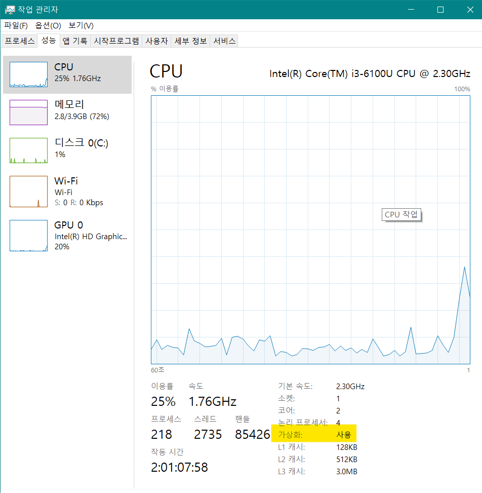
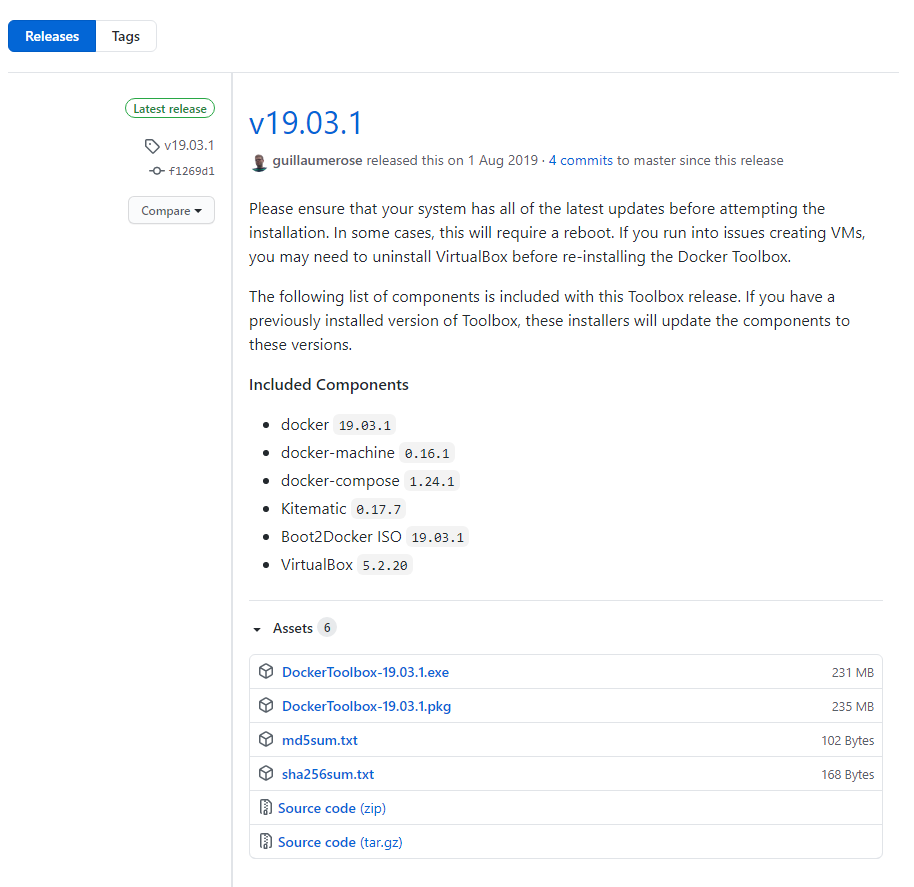
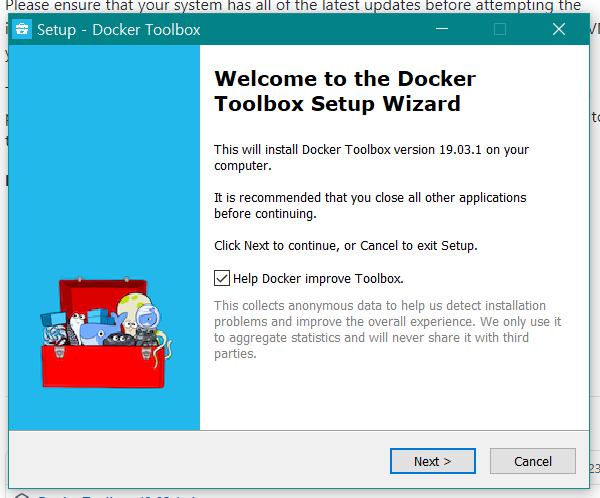
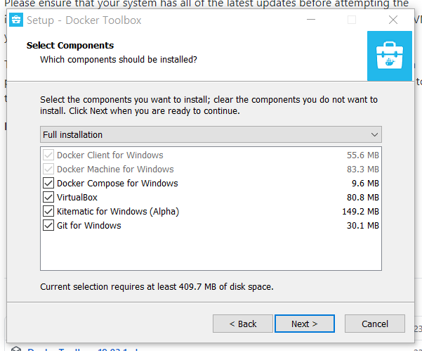
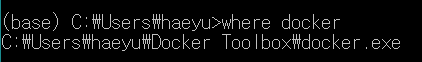
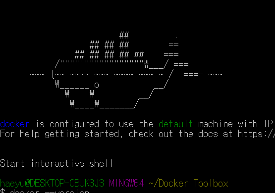
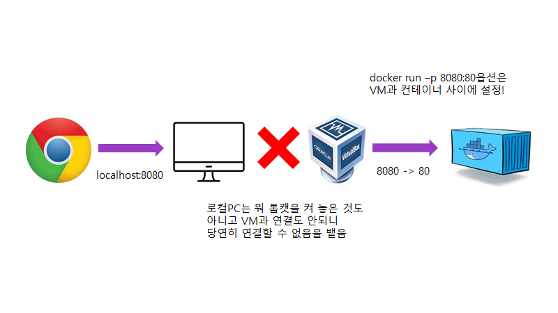
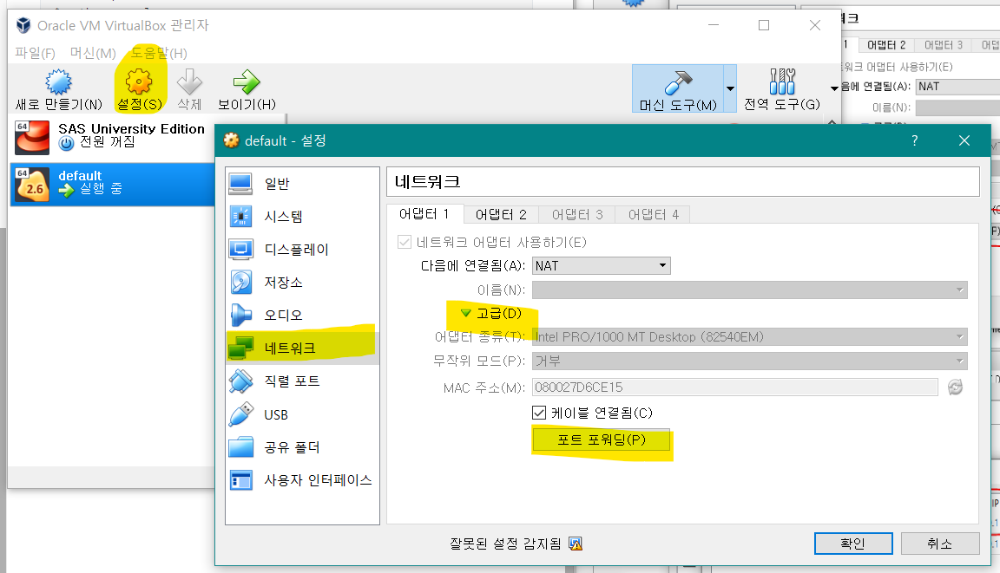
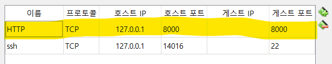
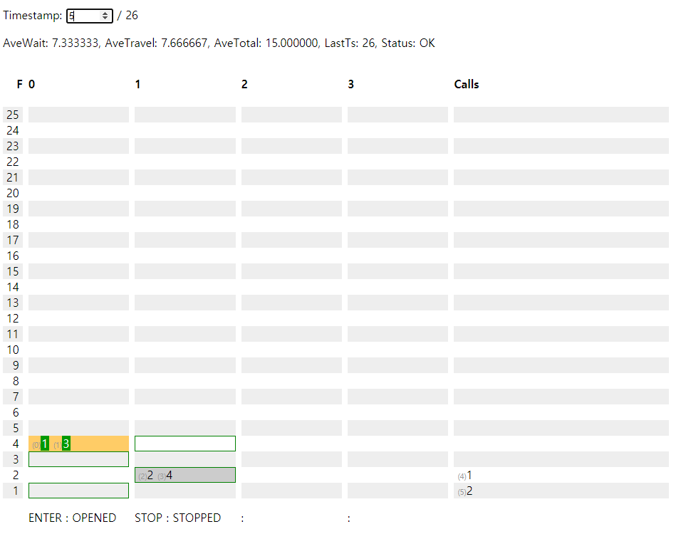

# :whale: Windows 10 Home에 Docker 설치하기

카카오 블라인드 코딩테스트 2차를 준비하기 위해 2019년도 기출인 엘리베이터를 풀어보려던 중에 Go나 Docker가 필요함을 깨달았다.

전에 khaiii를 돌려보려고 docker를 설치했다가 에러를 해결 못해서 그냥 코랩에서 돌렸었는데, 이번 기회에 다시 도전해봐야겠다 !


Docker 설치 방법과 설치시 만날 수 있는 에러, 그리고 잘 설치 되었는지 확인하기 위해 카카오 블라인드 2019 엘리베이터 문제를 실행시켜보자.


## 일러두기 : API 연습용이라면, window 사용자는 go로 !

docker를 이용하면 api 응답 하나에 2초씩 걸린다. 그럼 call만으로도 token 유효시간 10분을 훌쩍 넘는다.

anaconda나 기본 command에서 하지 말고 git bash에서 돌리면 아~무 error없이 바로 돌아간다. (go get ./에서 약간 시간이 걸린다.)


## Docker란?

>  [깊게 궁금하다면 더 읽어보기, Docker란 무엇인가?](https://subicura.com/2017/01/19/docker-guide-for-beginners-1.html)

* **컨테이너 기반**의 오픈소스 가상화 플랫폼
* 기존의 Virtual Machine (VirtualBox 등) 은 OS 자체를 가상화하였다(ex :  윈도우에서 리눅스 돌리기). 그러나 무겁고 느리다.
  * Host OS - HyperVisor - Guest OS 여러개
* Docker는 OS를 가상화하는 것이 아니라 프로세스를 격리한다. 가볍다.
  * 독립적으로 분리된 Guest OS를 갖는 것이 아니라 Host OS - Docker Engine위에서 바로 동작한다.
  * 가상 머신을 생성하는 것이 아니라 Host OS가 사용하는 자원을 나누어 사용하게 된다.
* 다양한 프로그램이나 실행 환경을 `컨테이너`로 추상화 하여 독립적인 관리를 가능하게 한다.


## windows에서 Docker 설치하기

* Windows 10 Home의 경우 Hyper-V를 지원하지 않기 때문에 바로 Docker를 사용할 수 없다.
  * `Hyper-V` : MS에서 만든 HyperVisor 기반의 가상화 SW. VirturalBox없이 Docker를 바로 돌아갈 수 있도록 해준다.
* Docker Desktop for Windows는 Windows 자체에서 제공하는 Hyper-V라는 가상화 기술을 이용하여 컨테이너를 생성하게 되지만, Hyper-V가 없는 10 Home 등의 버전에서는 Docker Desktop 을 사용할 수 없다.
* 고로 VirtualBox 등을 통해 linux OS를 생성한 다음 이 위에서 Docker를 설치해야하는데, Docker ToolBox를 통해 쉽게 뚝딱 해결할 수 있다!   [참고1](https://gwonsungjun.github.io/articles/2018-01/DockerInstall)  :woman_teacher: [참고2](https://gwonsungjun.github.io/articles/2018-01/DockerInstall)


##### 0. 설치 전 확인사항, 작업관리자 > CPU > "가상화" 가 사용 상태인가?




##### 1. [GitHub link](https://github.com/docker/toolbox/releases)에서 가장 최신 ver의 `DockerToolbox-xx.xx.x.exe`를 다운받는다.




##### 2. Full installation하자. 나는 이미 Oracle VM VitrualBox가 있어서 따로 설치하지 않았다.

> 이미 있는 사람은 설치 위치를 체크하자. 위치가 다르면 에러가 난다 ㅠㅠ






##### `3. Docker QuickStart Terminal`을 실행시키면 알아서 환경을 만들어준다. 그런데 ...

```
Docker Machine is not installed. Please re-run the Toolbox Installer and try again.
Looks like something went wrong in step ´Looking for vboxmanage.exe´... Press any key to continue...
```


##### :thinking: 의심되는 원인

1. **VirtualBox와 Docker의 설치 위치가 다르다.**
2. Admin user로 로그인/설치하지 않았다.


Docker가 깔린 폴더에 접근할 수 없어서 not installed라고 인식하는걸까? 싶어서 현재 ID에 관리자 권한을 줬지만 달라지지 않았다.

에러 원인은 1번으로 보인다. VirtualBox나 Git 등을 처음 설치한다면 이런 error는 없을 것이다.

나는 이전에 SAS 사용을 위해서 VirtualBox를 깐적이 있었는데 이 위치와 Git이 깔린 위치가 달랐다! 새로 깔면 문제는 해결된다.


1. 현재 User에 Administrator 권한을 준다. ()

2. Toolbox 설치 경로를 C드라이브 하위가 아니라 `C > User > 현재 User` 에 설치한다. (Git, VB 등 모두)

   


해결 !




잘 설치되었는지 확인해보기 !

```python
# docker terminal에서
docker --version
docker run hello-world
```


##### 추가 메모

* Windows 10 Home에서 Hyper-V를 활성화시킨 후 version을 우회해서 바로 Docker for Desktop을 사용하는 방법,
  * https://forbes.tistory.com/542
* 도커 기초 명령어
  * https://subicura.com/2017/01/19/docker-guide-for-beginners-2.html


## 2019 Elevator 돌려보기

공식 repository에서 설명한 대로 다음을 실행시키면 !!!!! **아무 화면도 만날 수 없다 !** 당연하다 !

```
$ git clone https://github.com/kakao-recruit/2019-blind-2nd-elevator.git 
$ cd 2019-blind-2nd-elevator
$ docker build . -t elevator
$ docker run -p 8000:8000 elevator
```

```
$ cd 2019-blind-2nd-elevator
$ cd example
$ python example.py
```


[이 블로그](https://sleepyeyes.tistory.com/71)에서 가져온 그림이 그 이유에 대한 명확한 설명을 해주고 있다.

local과 내 window도 연결이 되어있고, VM과 docker 역시 `docker run -p 8000:8000`을 통해 연결시켰지만 window와 VM 사이에 연결이 아직 되어있지 않다 !

고로 **포트포워딩**을 통해 window와 VM을 연결해주어야 한다.








위에서 `8000 => 8000`으로 생성했으므로 Host와 Guest 포트 모두 8000으로 추가해주면 된다 ! 호스트 IP는 원래 있던 `ssh` 와 똑같이 입력해준다.


이제 다시 docker에서 `python example.py`를 실행시켜보자.

 `Token for tester is (현재 run에 대한 token)`라는 메세지가 뜨면 잘 돌아간 것이다.

실행을 중지한 후 다시 http://localhost:8000/viewer 로 접속해보자.

각 실행에 대한 token 목록이 뜨게 된다. token들을 클릭하면 그에 맞는 simulation 결과를 확인할 수 있다 !




##### 1. docker에서 container list확인

```
$ docker container ls

CONTAINER ID        IMAGE               COMMAND                  CREATED             STATUS              PORTS                    NAMES
20c74eac544f        elevator            "/bin/sh -c ./elevat…"   21 hours ago        Up 21 hours         0.0.0.0:8000->8000/tcp   eloquent_heyrovsky
```


##### 2. container id를 이용해서 stop해주기

```
$ docker stop 20c74eac544f
```


##### 3. 재시작

```
$ docker run -p 8000:8000 elevator
```


