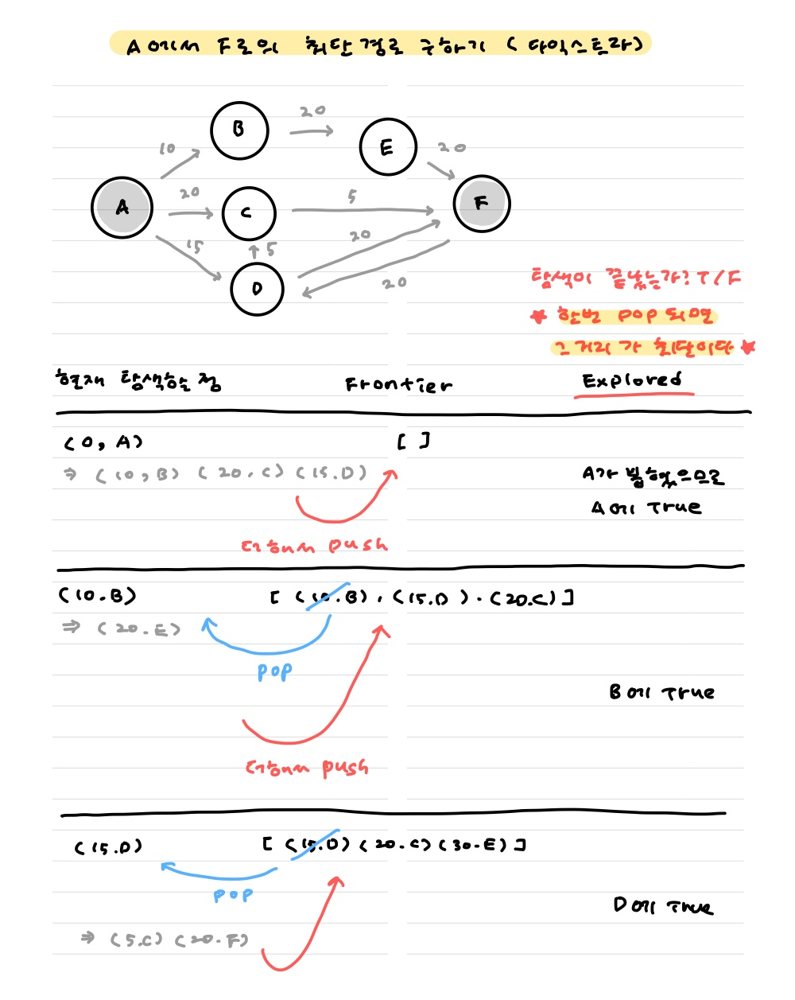
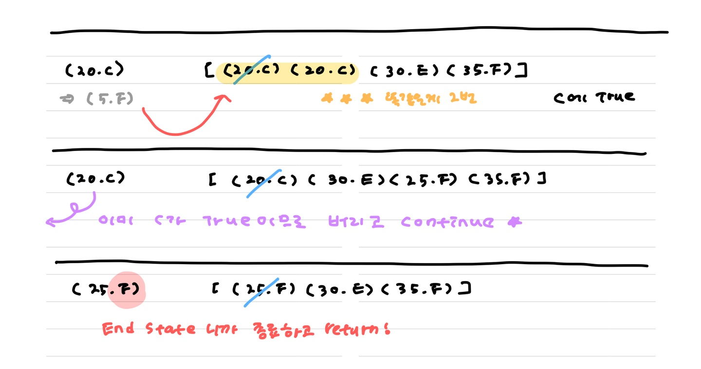
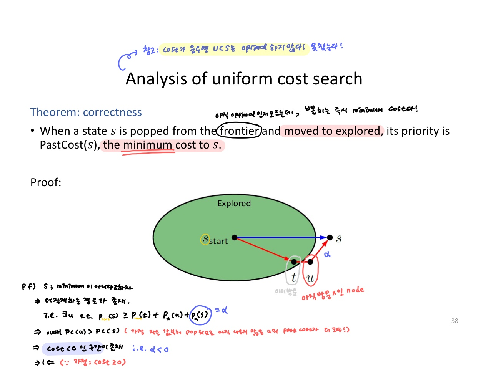
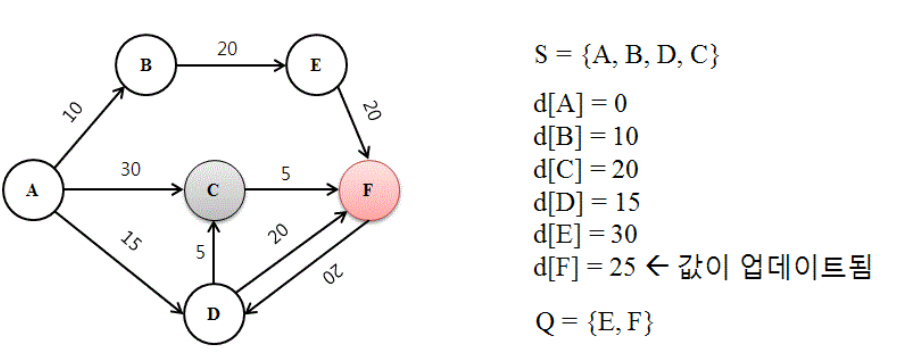

# 다익스트라

#### :raising_hand: 내가 원하는 두 점 사이의 최단 경로/최단 비용을 알고싶어요 !

> [Reference 1](https://namu.wiki/w/%EB%8B%A4%EC%9D%B5%EC%8A%A4%ED%8A%B8%EB%9D%BC%20%EC%95%8C%EA%B3%A0%EB%A6%AC%EC%A6%98), [Reference 2](https://matice.tistory.com/57?category=664756)

> **==방향, 무방향 상관 없다.==** https://solved.ac/problems/algorithms/22


A부터 F까지 가는 길 중에서 최단 거리가 궁금하면

1. 모든 경우의 수를 검사한다. : 시간 복잡도! 언제 다해?
2. 갱신되는 순간 순간 짧은 길을 선택한다 !
   * 어느정도 그리디스러운 알고리즘 !
   * 그러나 **순간순간 선택한 정점들이 모여서 가장 짧은 경로가 되는건 아님**. 일단 가능성을 선택할 때에 그리디로 선택하고, loop를 돌면서 계속 확인해주어야 한다.


##### :warning: pop한 후에는 값이 확정된다. 

##### :warning: 힙에 여러번 들어갈 수 있으며, 거리 또한 같을 수 있다.

* 그러므로 `Explored `체크를 잊지 말자 !


두 가지 방법을 이용해서 구현해보았는데 개인적으로는 3번 방법이 훨씬 직관적이고 코드도 깔끔한 것같다. 가장 마음에 든 방법 + 풀이에는 :blue_heart: 가 붙어있다 ~


#### Algorithm

1. 값 확정하고
2. 그 값에서 갈 수 있는 노드들 구경하면서 거리 갱신하고
3. 갱신된 것들의 누적에서 가장 짧은거 선택하고
4. 얘를 다음 loop의 start로 둔다.

모두 방문할 때까지 반복







##### Pop되자마자 거리를 확정해버리는 이유는?

* cost가 모두 양수라면, Explored로 옮겨짐과 동시에 minimum cost를 보장할 수 있다.




#### 시간복잡도는 어때?

* 4번에서 가장 짧은 정점을 찾기 위해 매번 O(V) 연산이 필요함.

  만약 길이 끊기지 않았다면 visit 체크를 위해 V번 while을 도니까 총 `O(V^2^)`

* 4번을 위해 **==우선순위큐를 이용==**하면 총 `O((V+E)logV)`

  왜냐묜 ~ 4번 연산 `logV` 를 총 V번 해야하고 (모든 visit이 True일때까지)

  A[start]의 모든 엣지 E개를 확인하면서, 매번 힙에서 최단 거리를 갱신하니까 logV => `ElogV`


#### 가중치가 음수면 왜 안될까? (0은 가능)

> 음수 가중치를 이용하려면 벨만-포드 알고리즘을 써야한다.

" 다익스트라 알고리즘에서 "지금까지 탐색하지 않은 정점 중 거리 값이 가장 낮은 정점"을 뽑는 이유는 ==더 이상 그 정점의 거리 값을 더 낮은 값으로 갱신할 일이 없기 때문==입니다. "

* 설명만 봐도 그리디스러움 !!! 하지만 음수가 있다면, 그리디로 발견해낼 수 없음.

  * 어떤 노드의 거리를 확정한다는 것은, 그것보다 더 짧은 길이 없음을 뜻한다.
  * 그런데 음수 가중치가 존재한다면 ? 값은 확정되었음에도 더 작아질 여지가 생긴다 ! 그러므로 제대로 작동하지 않는다.


## :blue_heart: 1 ) Frontier, Explored로 생각하기

```python
# Unexplored(탐험하지 않음), Frontier(아직 고려중인 값), Explored(탐험 끝. 확정된 값)

A = [인접 list]
Frontier = [(거리 = 0, 시작점 = 0)]
Explored = [False]*N

while Frontier:
    d, curr = heappop(Frontier)
    
    if curr == EndState:
        print("최단거리는 :", d)
        break
        
    Explored[curr] = True # 값 고정 ! pop되었다는건 이미 최단거리가 결정되었다는 뜻 !
    
    if Explored[curr]:continue # 이미 갱신된 점이라면 pass (아래 예제처럼 (20,c)가 두 번 들어가게 되면 같은 일을 여러번 하게 된다. 이를 대비해 하나를 버려주자 !)

    for next in A[curr]:
        heappush(Frontier, (d + A[next][curr] , next)) # PastCost + FutureCost
```




```python
# [0, 10, 20, 15, 30, 25]

N = 6

A = [[1,2,3],[4],[5],[2,5],[5],[3]] # 그래프

adj = [[0,10,30,15,0,0],
       [0,0,0,0,20,0],
       [0,0,0,0,0,5],
       [0,0,5,0,0,20],S
       [0,0,0,0,0,20],
       [0,0,0,20,0,0]] # 가중치
```


## 2 ) dist arr 사용하기

##### 1. i는 같고 dist는 다른 게 힙에 여러번 들어갈 수 있다. (시간 초과 원인)

##### 2. 힙에 넣을때는 갱신한 것만 넣어라. (==메모리 초과==의 원인)

```python
start = 0
h = [[0,start]] # 거리와 index !
dist[start] = 0

while h:
    d,start = heapq.heappop(h)
    
    # point 1 : 큐에 여러번 들어갈 수 있음을 인지한다.
    ############################################################
    if dist[start] != d:
        continue
    #######  pop되기 전에 더 작은 값으로 갱신된 경우 아무것도 하지 말자 !

    for i in A[start]:
        # point 2 : q에 넣을때는 갱신한 경우만 넣는다.
        ######################################## min 쓰지마
        if dist[i] > adj[start][i] + dist[start]:
            dist[i] = adj[start][i] + dist[start]
            ##############################
            heapq.heappush(h, [dist[i],i])
	        ############ 갱신한 경우만 push할꺼니까 min 쓰면 시간초과

print(dist)
```


## 3 ) 매번 min을 통해 찾기

```python
# 1. 시작점 설정 ################################################
start = 0
dist[start] = 0
###############################################################

while True:
    # 2. 값 확정하기 ############################################
    visit[start] = True
    print("visit : ",visit)

    # 3. 시작점으로 방문할 수 있는 곳 모두 방문하며 갱신 #############
    for i in A[start]:
        if not visit[i]:
            dist[i] = min(dist[i], adj[start][i] + dist[start])

    print("dist : ",dist)

    # 4. 갱신 후 1로부터 가장 짧은 정점 찾기 ######################
    start, temp = -1, float('inf')
    for i, j in enumerate(dist):
        if temp > j and not visit[i]:
            start = i
            temp = j

    print("next_start : ",start)

    # 5. 모두 값을 확정한 경우 중지 ##############################
    if start < 0:
        break

print(dist)
```


## 1753 최단경로 ★★★★

###### 주의사항

* 같은 간선인데 가중치가 다른게 여러번 들어올 수도 있음.
* 시간초과를 해결하려면 어떻게 해야하는가 !


##### :blue_heart: 7월 31일 / 8월 31일에 다시 풀어봄 ! : 강화학습 수업 들을 때 썼던 로직으로 만들어따

```python
import sys
from heapq import *
f = lambda:map(int,sys.stdin.readline().split())

V,E = f()
S = int(input())-1
A = [[] for _ in range(V)]

for _ in range(E):
    a,b,c = f()
    A[a-1].append((b-1,c))

Frontier = [(0,S)]
Explored = ['INF']*V

while Frontier:
    d,node = heappop(Frontier)

    if Explored[node] != 'INF':continue
    Explored[node] = d

    for next_node,cost in A[node]:
        heappush(Frontier,(d+cost,next_node))

for c in Explored:print(c)
```


##### 첫 풀이

```python
import sys
from heapq import *

f = lambda:map(int,sys.stdin.readline().split())

V,E = f()
K = int(input())-1

A = [[] for _ in range(V)]
for _ in range(E):
    a,b,c = f()
    A[a-1].append((c,b-1)) # 여기서 덮어쓸 필요 없이 다 넣어버려!

dist = [float('inf')]*V
dist[K] = 0
h = [(0,K)]

while h:
    d,curr = heappop(h)

    if dist[curr] != d:
        continue

    for d,idx in A[curr]:
        if dist[idx] > dist[curr] + d:
            dist[idx] = dist[curr] + d
            heappush(h,(dist[idx],idx))

for i in dist:
    print(i if i<float('inf') else "INF")
```


## 3 ) 경로 복원/역추적 : 최단거리로 가는 경로는?

* 거리를 저장할 때, ==직전 경로를 저장한다==


##### union-find처럼 재귀로 경로를 찾는다.

```python
def find(x):
    print(x)
    if x == K:
        return
    if x < 0:
        print("못간다!")
        return
    find(path[x])
```

##### while문으로 짜도 오키~

```python
res = [E]
while S!=E:
    E = path[E]
    res.append(E)
```


## 11779 최소비용 구하기 2

* A번째 도시에서 B번째 도시까지 가는데 드는 최소 비용과 경로를 출력해라.
  1. 주어진 출발, 도착으로 가는 최소 비용
  2. 거쳐야 하는 도시의 갯수(출발 도착 포함)
  3. 방문하는 도시 순서대로 출력


##### :blue_heart: ​0831

* 아래 코드 시간이 4000ms로 나오길래 왜 전의 20배가 되어버렸지 ㅠㅠ 알고리즘이 이상한가 ㅠㅠ 했는데 readline 때문이었다 ㅎ `sys.stdin.readline()`으로 받자,,
* **직전 경로는 pop했을 때 저장해야한다 !!!**

```python
import sys;from heapq import *
f = lambda:map(int,sys.stdin.readline().split())

N,M = int(input()), int(input())
A = [[] for _ in range(N+1)]

for _ in range(M):
    a,b,c = f()
    A[a].append((b,c))

S,E = f()
Frontier = [(0,S,S)]
Explored = [None]*(N+1)

while Frontier:
    d,node, prev_node = heappop(Frontier)
    if Explored[node]:continue
    Explored[node] = prev_node

    if node == E:break

    for next_node,cost in A[node]:
        heappush(Frontier,(d+cost,next_node, node))

answer = [E]
while E != S:
    E = Explored[E]
    answer.append(E)

print(d)
print(len(answer))
print(*answer[::-1])
```


##### 옛날 풀이

```python
import sys;from heapq import *

f = lambda:map(int,sys.stdin.readline().split())

N = int(input())
M = int(input())

A = [[] for _ in range(N+1)]
for _ in range(M):
    a,b,c = f()
    A[a].append((c,b))

S,E = f()

dist = [float('inf') for _ in range(N+1)]
path = [-1]*(N+1)
dist[S],path[S] = 0,S
h = [(0,S)]

while h:
    d,curr = heappop(h)

    if dist[curr] != d:
        continue

    for d,i in A[curr]:
        if dist[i] > dist[curr] + d:
            dist[i] = dist[curr] + d
            path[i] = curr
            heappush(h,(dist[i],i))

            
##################### sol1
def find(x):
    res.append(x)
    if x == S:return
    find(path[x])
res = []
find(E)
print(len(res))
print(*res[::-1])

##################### sol2
print(dist[E])
res = [E]
while S!=E:
    E = path[E]
    res.append(E)
print(len(res))
print(*res[::-1])
```
