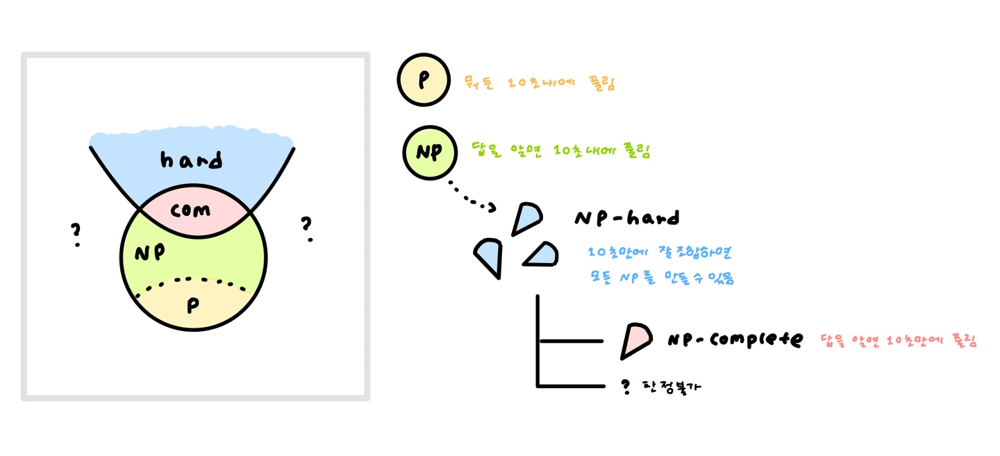

# P-NP 문제

> [Reference 1](https://ratsgo.github.io/data%20structure&algorithm/2017/11/30/NP/)
>
> [Reference 2](https://inverse90.tistory.com/entry/PNP-NP-Hard-NP-Complete)

:milky_way: O(2^n^) n = 10이면 고작 1024지만, n = 100만 되어도 우주의 나이보다 길다.

**결정문제 deterministic**

YES, No가 답이 되는 문제

### [ P ] Polynomial :다항시간 안에 풀 수 있다 !

> 다항 시간 내에 풀 수 있는 알고리즘이 알려진 문제들

크루스칼, 프림 등등 ... O(n), (n^2^) (n^3^) 다항 알고리즘을 찾을 수 있으면 P문제이다.

근데 ! 어떤 어려워보이는 문제가 있는데 ! 다항 알고리즘은 아직 못찾았는데 ! 알고보니 있으면? 있는지 없는지는 어떻게 판단하지 ?

### [ NP ] Non deterministic Polynomial : 주어진 답이 YES인지 다항시간안에 풀 수 있는 문제들

> 답을 알기만 한다면, 그것을 증명하는 데에는 다항 시간만 소요되는 문제

알고리즘을 알긴 아는데 다항 시간이 아닌 경우가 있다.

근데 만약 내가 이 문제의 답을 알고있다면? 그것이 진짜 답인지 확인하고 YES라고 답하는 데에는 다항 시간만 걸릴 수도 있다.

**NP인지 아닌지는 어떻게 알아요?**

> 운이 좋아서 P가 되거나, 힌트가 있으면 P가 되는 문제들

어떤 미로에 탈출구가 있는지 없는지를 판단하는 문제가 있다고 하자.

누군가가 힌트를 줬다. 이 힌트를 기반으로 **다항 시간 내에** 힌트를 따라가면 **탈출구가 있는지 없는지**는 찾아낼 수 있다면 ! 이는 NP이다.

어쩌면 운이 좋아서 다항 시간 안에 한 번에 풀어낼 수 있거나, 또는 힌트가 있다면 다항 시간안에 풀 수 있는 문제들이 바로 NP이다.

**모든 P는 NP이다.**

운이 좋으면, 답을 알고 있으면 다항 시간 만에 풀리는 문제가 NP라고 했다.

그런데 P문제는 답을 모르더라도, 임의의 입력에 대해서도 다항 시간만에 풀린다. 이미 완벽한 방법이 있으니까!

즉 P는 NP이다.

그럼 NP도 P일까?

**대표적인 NP 문제들**

:tomato: 크기 n의 부분집합에서 원소의 합이 0이 되는 집합이 **존재하는가**?

* 1부터 n까지의 부분 집합을 만들고, 모두 더해보아야 함 => 부분 집합 갯수만 **2^n^** 이므로 이 방법으로는 다항시간 내에 풀 수 없음

  > 아직 P임이 증명되지 않았다.

* 그러나 주어진 집합 중에서 0이되는 집합을 하나 알려줬다면 `{6,1,-7}` **존재한다** 는 다항시간 안에 풀림.

  1. `{6,1,-7}` 이 주어진 집합 S의 부분집합임을 보인다.
  2. 이 부분집합의 합이 0임을 보인다
  3. S는 원소의 합이 0이 되는 부분집합을 갖는다.

:tomato: 해밀턴 경로/cycle이 존재하는가?

* 만약 누군가가 미리 찾아놓은 해밀턴 경로/cycle을 알려준다면, 이것이 모든 점을 지나는지/출발로 돌아오는지 보이는 것은 P문제이다.

:tomato: 주어진 n자리 자연수 x를 인수분해하라.

* 1도 x도 아니면서 x를 나누는 수가 있을까?
* 어떤 수 y가 그렇다면, x%y == 0을 보이는 것은 쉽다.
* 그러나 최악의 경우 2부터 n자리의 수까지 모두 검사해야하니 10^n^ -1 번이 필요하다.

### NP-hard와 NP-complete

**[reduction] B를 풀기위해 A를 건너서/A로 바꿔서 풀어보자 **

문제 B : n개 숫자의 중간값을 구하라

=> 문제 A : n개 숫자를 정렬하라 로 환원한다면, 정렬 후 가운데 값을 뽑기만 하면 된다 !

문제 A를 풀 수 있다면 문제 B를 풀 수 있다. 즉 문제 B의 난이도는 문제 A보다 어려울 수 없다.

또는 3 곱하기 5 문제를 3 더하기 3을 다섯번 하는 것으로 바꾸어 풀 수도 있다.

그렇다면, 주어진 NP문제를 다항 시간내에 잘 쪼개서 P문제로 바꿔놓는다면? 이 NP문제는 P가 된다.

**[NP-Hard] 다항 시간 내에 쪼개서 도달한 어떤 NP문제**

> NP-hard라고 해서 NP(답을 알면 다항 시간 내에 풀 수 있음이 증명됨)는 아님에 주의하자.

마법의 P집합 `{p1, p2, ... , Pn}`이 있어서, 어떤 NP문제를 가져오더라도 이 집합에서 몇개를 가져와 붙이면 만들 수 있다면?

심지어 `Pi`들을 조합하는데에 다항시간밖에 걸리지 않는다면 !

이런 P집합을 NP-hard라고 한다.

즉 임의의 NP문제를 다항 시간내에 쪼개서 도달한 문제들의 집합을 NP-hard라고 한다.

이 NP-hard 집합만 있다면 이세상의 모든 NP문제들을 다항시간 안에 만들어낼 수 있다.

그럼 NP-hard가 모두 P이면? NP=P가 된다.

**NP-hard라고 해서 모두 NP인 것은 아니다.**

> 헷갈리지 말자. NP가 아니면 P이고 P가 아니면 NP인 것이 아니다.
>
> 아직 다항 알고리즘을 발견하지는 못했지만, 답을 안다면 다항 시간내에 증명할 수 있는 문제가 NP이다.
>
> NP가 아닌 문제라면, 답을 알아도 다항 시간 내에 판정할 수 없는 문제 ! 라고 생각하자.

NP-hard지만 NP는 아닌 문제들 : 정지문제(어떤 함수가 영원히 돌아갈지 아니면 멈출지를 추측), 최적화 문제

**[NP-완전] 더이상 쪼갤 수 없는데 NP인 문제**

그런데, 이 NP-hard문제가 NP라면? 더 이상 쪼갤 수도 없는데 여전히 NP라면?

TSP를 풀기 위한 해밀턴 cylcle 찾기 역시 NP-완전이다.
