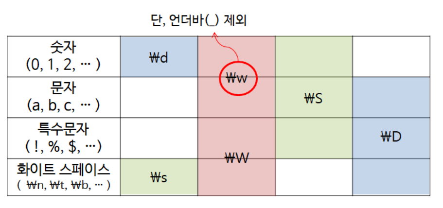

# 정규 표현식

1. 하나의 string에서 반복된 패턴을 잡아내서 분리할 때
   ex : 다트 게임 점수와 등급 분리
2. 하나의 string에서 서로 다른 특성을 분리할 때
   ex : 이름과 전화번호 분리


* 호출시마다 compile을 다시 하므로, 여러번 쓸거면 미리 re.compile로 저장해놓자

* 백슬래쉬 + 단어를 하나의 세트로 보려면, `\\\\`를 써야한다.

  그러므로 raw string을 명시해주자.

  ```python
  s = "\section"
  print(s)							# \\section
  
  re.findall("\\section", s)			# []
  re.findall("\\\\section", s)		# ["\\section"]
  re.findall(r"\section", s)			# ["\section"]
  ```

## 문법

#### 약속된 축약형

1. 한글

   * 모음 : `ㅏ-ㅣ`
   * 자음 : `ㄱ-ㅎ`
   * 글 : `가-힣`
   * 전부 : `ㄱ-힣`

   ```python
   a = "꺄아랄ㄹㄹㄹ라ㅏㅏㅣㅣㅣ뷁"
   re.findall(a, "[가-힣]+")				# ['꺄아랄','라','뷁']
   re.findall(a, "[ㄱ-ㅎ가-힣]+")		   # ['꺄아랄ㄹㄹㄹ라','뷁']
   re.findall(a, "[ㄱ-ㅎ가-힣ㅏ-ㅣ]+")	  # ['꺄아랄ㄹㄹ라ㅏㅏㅣㅣㅣ뷁']
   ```

2. 영어

   * 대문자 : `a-z` 
   * 소문자 : `A-Z`
   * 전체 : `a-zA-Z`

3. 숫자

   * `\d`

|                                      |          |                |
| ------------------------------------ | -------- | -------------- |
| 숫자                                 | `\d`     | `[0-9]`        |
| 영어나 한글                          | ★★`\D`★★ | `[A-zㄱ-힣]`   |
| 숫자, 영어, 한글                     | `\w`     | `[0-9a-zA-Z]`  |
| 숫,영,한 이외의 문자 == **특수문자** | `\W`     | `[^0-9a-zA-Z]` |
| white space                          | `\s`     |                |
|                                      |          |                |
|                                      |          |                |

* `\n`은 `.*`에 포함되지 않는다 !!!! 이런 것도 포함해서 아무거나를 말하고 싶다면 `[\w\W]*`로 써야하는듯



> https://whatisthenext.tistory.com/116


#### 메타 문자

| 메타문자 | 활용       |                                                              |      |
| -------- | ---------- | ------------------------------------------------------------ | ---- |
| `[  ]`   | `[abc]`    | abc중 한개 매치가 한 그룹                                    |      |
|          | `[abc]+`   | abc중 한개 이상 매치가 한 그룹                               |      |
|          | `[a-c]`    | a~b 사이에서 한개 매치가 한 그룹                             |      |
|          | `[^abc]`   | abc가 아닌 한글자가 한 그룹                                  |      |
| `( )`    | `(abc)+`   | abcabcabc처럼 그룹 반복을 캐치하고 싶을 때                   |      |
| `.`      | `a.b`      | a와 b사이에 아무 문자가 들어가 있는 경우가 한 그룹           |      |
|          |            | ab 는 False, acb는 True                                      |      |
| `*`      | `a.*b`     | ab사이에 0개 이상의 아무 문자                                |      |
| `+`      |            | 1개 이상                                                     |      |
| `{m,n}`  | `a{1,3}`   | a가 1번 이상 3번 이하 반복이 한그룹                          |      |
|          | `a{3,}`    | a가 3번 이상 반복이 한 그룹                                  |      |
|          | `a{,4}`    | a가 0번 ~ 4번 반복이 한 그룹                                 |      |
| `{n}`    | `a{2}`     | a가 **반드시 2번** 반복이 한 그룹                            |      |
| `?`      | `[#@]?`    | #이나 @중에 하나가 0번 또는 1번이 한 그룹                    |      |
| `^`      | `^abc`     | abc로 시작하는게 한 그룹                                     |      |
| `$`      | `abc$`     | abc로 끝나는게 한 그룹                                       |      |
|          |            |                                                              |      |
| `\b`     | `\b \w \b` | "Hello python"  =>  []"Hello", "Python"]    **단어 사이의 경계** |      |

```python
re.findall("a.*b","aegbdc")  # ['aegb']
re.findall("a{3}","aaegbdc")  # [] 아무것도 없음.
```

* \b와 \A, \Z 사용 예시
* 처음 끝은 pattern의 <u>맨 마지막에 붙여주기만 하면</u> 되는듯. 역참조처럼

```python
print(re.findall(r"\b\w+\b", "Hello Python Haeyu")) # 셋다
print(re.findall(r"\b\w+\b\A", "Hello Python Haeyu")) # Hello
print(re.findall(r"\b\w+\b\Z", "Hello Python Haeyu")) # Haeyu
```


#### 게으른 수량자, 탐욕 수량자 greedy v.s. non-greedy

non-greedy : 최소한의 매치만 찾음

greedy : 최대로 매치시킴

* *대신 ` *?`
* +대신 `+?`
* {n,} 대신 `{n,}`


* < html > 만 출력하려면 non-greedy를 써야한다.

  ```python
  s = '<html><head><title>Title</title>'
  re.match(r"<.*>",s) # <html><head><title>Title</title>
  re.match(r"<.*?>",s) # <html>
  ```

  


#### 이스케이프 코드

* `is printable = False`

`\n` `\t`  : 엔터, 탭

`\\` : 백슬래쉬

`\'` `\"` : 따옴표 문자

`\000` : NULL 문자


### ★ 대소문자 구분 없이 탐색하기

`re. compile`이나 `re.method` 사용시 `re.I (re.IGNORECASE)` 를 이용하면
대소문자 관계 없이 매치를 시킬 수 있다.

```python
re.findall('apple',"Apple APplE apPLE", re.I) # ['Apple', 'APplE', 'apPLE']
```


### ★ 라인별로 탐색하기

`re.M` ; Multiline

* 지정된 regex를 라인별로 실행함
* 이때 빈라인에 대해서는 알아서 실행하지 않음.

```python
txt = """
Hello python 까꿍

Hello 까꿍 Haeyu
Bye
"""

re.findall("까꿍", txt, re.M) # ['까꿍', '까꿍']
```


### 정규 표현식 부정하기(시작과 끝만..)

* 부정을 의미하기 위해 =을 !로 수정하면 된다.

| `( ?= 문자열 )`  | 시작하는      |
| ---------------- | ------------- |
| `( ?! 문자열 )`  | 시작하지 않는 |
| `( ?<= 문자열 )` | 끝나는        |
| `( ?<! 문자열 )` | 끝나지 않는   |


##### 1. 주어진 문장에서, 유로 끝나는 단어, 끝나지 않는 단어를 각각 출력하라 

```python
link = "해유 우유 사과 바나나 두유"
print(re.findall(r"\w+(?<!유)\b",link)) # 사과 바나나
print(re.findall(r"\w+(?<=유)\b",link)) # 해유 우유 두유
```


## METHOD

> * search, match는 한개만 찾아주니까 별로 안쓸 듯 ..
> * 문자 자체가 필요한 경우 findall
> * start, end가 필요한 경우 finditer해서 method 쓰기.


* search, match는 **모두 match 객체를 return**한다.

|      | method      |                                                              |
| ---- | ----------- | ------------------------------------------------------------ |
|      | `findall`   | 일치하는 모든 문자를 list로                                  |
|      | `find iter` | `findall` + `match`<br />**iterable**한 **match** 객체<br />`[match1, match1, match3 ...]` |
|      |             |                                                              |
|      | `search`    | 일치하는 **최초**의 패턴 **한개**                            |
|      |             | `re.match().group()`                                         |
|      | `match`     | **0번부터** 일치하는 **최초** 패턴 **한개**                  |
|      |             | `re.match().group()`                                         |
|      | `escape`    | 특수문자 앞에 모두 백슬래쉬 붙여줌                           |

| match 객체 method | 모두 group 입력 가능 |                      |
| ----------------- | -------------------- | -------------------- |
|                   | `group()`            | 매치된 문자열        |
|                   | `start()`            | 시작점               |
|                   | `end()`              | 끝점 (-1해야 끝위치) |
|                   | `span()`             | (start, end)         |
|                   | `string`             | 원본 문자열          |


#### FINDALL : 규칙에 맞는 모든 문자열 return

일치하는 글자를 list로 return

* 글자만 찾기

  ```python
  re.findall("\D","1S2T*3D")		# ['S', 'T', '*' ,'D'] 
  re.findall("(\D)()","1S2T3D")	#[('S', ''), ('T', ''), ('D', '')]   무조건 빈칸이 포함되도록 꼼수를 쓸 수 있다.
  ```

* 다음처럼 불규칙한 일정 형식이 반복될 경우 **길이를 맞춰줄 수 있다.**

  ```python
  re.findall("(\d)([STD])([*#]?)","1S2T*3D")
  # [('1', 'S', ''), ('2', 'T', '*'), ('3', 'D', '')]
  ```

  

* () 를 이용하면 여러가지 정규식을 한번에 적용시킬 수 있다.

  ```python
  re.findall("(\d{4})(\d{2})(\d{2})(\w*)","20010331Rainy")
  # [('2001', '03', '31', 'Rainy')]
  ```


#### SEARCH : 객체 return

일치하는 **==최초의 패턴 하나==**만 출력한다.

* group을 통해 값을 확인할 수 있다.
* 일치하는게 없으면 `None` return

```python
re.search("(\d)(\D)([*#]?)","####1S2T*3D")		  # class
re.search("(\d)(\D)([*#]?)","####1S2T*3D").group() # '1S'

re.search("안녕","####1S2T*3D")		  # None
```


#### MATCH : 0번부터 맞아야 객체 return

search는 어디든 있다면 return, match는 0번부터 맞아야함.

```python
re.search("(\d)(\D)([*#]?)","####1S2T*3D")		  # None
```


* `"aa" in myStr` 의 regex 버전을 다음과 같이 사용할 수 있다.

  ```python
  if re.match("(\d)(\D)([*#]?)","1S2T*3D"): # 하나라도 있으면 !
      print("있다.")
  else:
      print("없다")
  ```


#### ESCAPE :  모든 특수문자 앞에 백슬래쉬

* **임의의 문자열을 정규식 패턴으로** 쓰고자 한다면

  문자 앞에는 모두 백슬래쉬를 붙여줘야 함

  그 작업을 대신 해주는게 escape !

```python
txt = "*사과*"
txt2 = "오늘 먹은 과일은 *사과*와 배와 맛있는 *사과*였다."
p = re.escape(txt) # \*사과\*

print(re.sub(p, "사과", txt2))
```


---


### ★★ SUB : 문자열 바꾸기 ==만능 replace !!!!==

* `subn`을 이용하면 몇번 바꿨는지도 return한다.


##### 1. blue나 red나 orange를 모두 yellow로 바꿔라

```python
re.sub('blue|red','yellow','blue socks and red shoes')
```

```python
re.subn('yellow','blue socks and red shoes') # (바꿔진 문자열,2)
```


##### ★ 2. 사용자 지정 함수 : 숫자 뒤에 전부 "해유"를 달아라.

* ###### **==re를 쓸 수 있는 map==**이라고 생각하면 될듯 ㅎㅎ

* 바꿀 문자열이 아닌 `함수`를 지정할 수 있다 !

  * 단 각각의 match는 `match `객체를 return함으로

    연산시에` .group() `을 붙여주는 것을 잊지 말자.

```python
def myf(s):
    return s.group() + "해유"

re.sub("\w",myf,"1234") # 1해유2해유3해유4해유
```


##### ★ 3. 전화번호 양식을 바꿔라

* 아래의 그룹 참조를 이해한 후 보자
* 그룹으로 덩어리를 만든 후, **새롭게 짜맞출 수 있다 !**

```python
txt = '''
313-555-1234
248-555-9999
810-555-9000
'''

print(re.findall(r"(\d{3})-(\d{3})-(\d{4})", txt))
# [('313', '555', '1234'), ('248', '555', '9999'), 


										##############
print(re.sub(r"(\d{3})-(\d{3})-(\d{4})", r"(\1) \2-\3" ,txt))
										##############

# (313) 555-1234
# (248) 555-9999
# (810) 555-9000
```


### ★★ SPLIT 만능 split ! 

split 기준이 여러개이거나, 특정 패턴이 있을 때 사용하자.

* **빈칸**이 나오는 경우도 있으므로 걸러서 사용하자.

  ```python
  [i for i in re.split(p, t) if i > '']
  map(lambda x: x.strip(), result)
  filter(lambda x: x != '', result)
  ```

  

##### 1. 단어 사이에 잘못 찍은 구분자가 존재한다. 과일을 분리해라.

```python
s = "apple,banana orange:tomato"

re.split(r"[ ,:]",s) # ['apple', 'banana', 'orange', 'tomato']
```


##### 2. 분리는 하되, 딱 1번만 분리하고, <u>구분자를 버리지 말아라</u>

* 구분자를 버리지 않으려면 <u>capture</u>해주면 된다.

```python
s = "apple,banana orange:tomato"

re.split(r"([ ,:])",s,1) # ['apple',",",'banana orange:tomato']
```


#### ★ 전방 탐색, 후방 탐색 `?=` , `?>`

* 조건을 만나기 직전까지 탐색한다.

  조건은 출력하지 않는다.

  ```python
  s = "http://www.google.com"
  
  print(re.search(".+:" , s).group())			# http:
  print(re.search(".+(?=:)" , s).group())		# http
  ```

* bat과 exe가 아닌 확장자를 가진 파일명만 추출하라.

  * 일단 전체 출력해보기

  ```python
  s = "foo.bar autoexec.bat sendmail.cf files.exe"
  
  print(re.findall("\w+?[.]\w+",s)) # ['foo.bar', 'autoexec.bat', 'sendmail.cf', 'files.exe']
  ```

  * bat, exe가 아닌 것만 출력

  ```python
  # ?!는 뒤에서부터 탐색을 시작하고, 통과하면 앞의 regex를 검사한다.
  
  print(re.findall("\w+?[.](?!bat|exe)\w+",s))
  ```

  


# * grouping 활용하기

> https://wikidocs.net/4309
>
> [https://greeksharifa.github.io/%EC%A0%95%EA%B7%9C%ED%91%9C%ED%98%84%EC%8B%9D(re)/2018/07/28/regex-usage-04-intermediate/](https://greeksharifa.github.io/정규표현식(re)/2018/07/28/regex-usage-04-intermediate/)


#### grouping, 캡쳐의 개념

어떤 문자열에 지정한 패턴을 입혀서, 특정 패턴만 뽑아오고 싶을 수 있다.

( 그냥 특정 패턴만 입력하면 원하는 결과가 나오지 않는다면 )

이 경우 grouping, capture를 이용하여 **특정 패턴만 뽑아오도록** 만들 수 있다.


* 캡쳐를 하면 **해당 부분만 return**한다.

  1. `match `, `search `

     group에서는 전부 return. <u>`groups`에서는 캡쳐만</u>

     **튜플** 형태 `(group1 캡쳐 결과, group2 캡쳐 결과, ... )`

  2. `findall`

     오직 캡쳐만 return

     **튜플**들의 **list** 형태` [ (group1, group2),  (group1, group2), .. ]`

     

* **한번만 읽으면서** 이름, 전체 전화번호, 뒷자리 를 모두 뽑고자 할 때 유용 !

  전체 패턴을 입력해준 후, 전화번호만 캡쳐한다.

```python
m = re.search('\w+\s(\d+[-]\d+[-]\d+)', 'park 010-1234-1234')

print(m.group()) # 형식에 맞는 것 return	     park 010-1234-1234
print(m.groups()) # 그 중에서 그룹인 것 return	('010-1234-1234',)
```

* 그룹화가 필요해서 ()는 쓰지만, 캡쳐는 하고 싶지 않을 때  `(?: regex)`

  대신 이렇게 하면 역참조는 못함.


#### group지정하기

* `(  )`를 중첩하면 **찾고 또 찾는다**  ( 중복 반환 )

* group(0) 는 0번째 소괄호가 아니라, **전체 일치부**를 뜻한다.

  그룹이 없더라도 언제나 return한다.

  match, search의 경우 일단 전체를 return할 수 있지만, findall은 못한다.

* cannot refer ... 가 나온다면 참조 group numbering이 잘못되지는 않았는지 생각해보자.

  > https://stackoverflow.com/questions/11511083/kodos-cannot-refer-to-open-group

  

* group과 groups의 차이

```python
# group : () 와는 상관 없이, 일치한 패턴을 출력
re.match(r"(\d(\w))", "1a2b3c4d5e").group() # 1a

# groups : grouping 결과를 출력
re.match(r"(\d(\w))", "1a2b3c4d5e").groups() # ('1a', 'a')
```


##### 1. match 객체

```python
			      # 1번		 # 2번
p = re.compile(r"( \w+ ) \s+ ( (\d+) [-] ( \d+[-]\d+) )")
								# 3번	 # 4번 group

m = re.match(p, "park 010-1234-1234")

print(m.group())  # 0번 : 전체 일치부 park 010-1234-1234
print(m.group(1)) # park
print(m.group(2)) # 010-1234-1234
print(m.group(3)) # 010
print(m.group(4)) # 1234-1234
print(m.groups())
```


##### 2. findall

```python
			      # 1번		 # 2번
p = re.compile(r"( \w+ ) \s+ ( (\d+) [-] ( \d+[-]\d+) )")
								# 3번	 # 4번

m = re.findall(p, "park 010-1234-1234")

print(m) # [('park', '010-1234-1234', '010', '1234-1234')]
```

* match처럼 전체 값도 출력하고 싶다면, 전체에 괄호를 하나 더 해준다.

```python
			    # 0,1		  # 2번
p = re.compile(r"(( \w+ ) \s+ ( (\d+) [-] ( \d+[-]\d+) ))")
								# 3번	 # 4번

m = re.findall(p, "park 010-1234-1234")

print(m) # [('park 010-1234-1234', 'park', '010-1234-1234', '010', '1234-1234')]
```

* findall에서 group이 하나면, <u>길이 1짜리 튜플이 아니라 그냥 원소</u>만 return

```python
re.findall(r"\d(\w)", "1a2b3c4d5e") # ["a","b","c", ...]
re.findall(r"(\d)(\w)", "1a2b3c4d5e")
		# [('1', 'a'), ('2', 'b'), ('3', 'c'), ...]
```


#### ★ group에 이름 주기

* `groupdict()`를 통해 딕셔너리로 만들 수 있음 !!!!
* `(?P<그룹 이름> regex)`

```python
p = re.compile(r"(?P<name>\w+)\s+\d+[-](?P<num1>\d+)[-](?P<num2>\d+)")

m = re.match(p, "park 010-1234-1234")
print(m.groupdict())

# {'name': 'park', 'num1': '1234', 'num2': '1234'}
```


#### ★ group 참조 : 이전 값과 일치하는 값 뽑아내기

> **==참조할 때는 raw string==을 써야함을 잊지 말자**

##### 1. 문장에서, 이전에 반복된 단어를 추출해보자.

`"Paris in the the spring"` 에서 반복된 `"the"` 룰 지우려고 한다.

1. split을 해서 이전 값과 같으면 더하지 않는다.
2. group 참조를 통해 해결한다.

```python
p = re.compile(r'[ ]?(\w+)[ ]?\1')
m = re.findall(p, "Paris in the the spring")
print(m) # the
```


##### 2. html에서, header가 일치하는 곳의 문장만 뽑아보자.

> http://minsone.github.io/regex/regexp-backreference

```python
txt ='''
<BODY>
<H1>Welcome to my homepage</H1>
Content is divided into four sections:<BR>
<H2>C/C++</H2>
<H3>C#, Python, Lua</H3>
<H4>MSSQL, MySQL, SQLite</H3>
<H5>Unreal Engine3</H5>
1.4 years career for UE3
</BODY>
'''

print(  re.findall(r"(<(H\d)>.*?</\2>)" , txt)  )

# [('<H1>Welcome to my homepage</H1>', 'H1'), ('<H2>C/C++</H2>', 'H2'), ('<H3>C#, Python, Lua</H3>', 'H3'), ('<H5>Unreal Engine3</H5>', 'H5')]
```


##### ★★ 3. 치환해보자 !

**010-1234-1234**로 주어진 전화번호를 **(010) 1234-1234** 로 치환하고자 한다.

sub에는 <u>1. 사용자 지정 함수 2. 정규 표현식(**역참조** 포함)</u> 모두 가능하다 !!!!

* sub에 들어가는 regex의 경우, 백슬래쉬 없이 써도 알아서 문자로 인식한다.

```python
txt = '''
313-555-1234
248-555-9999
810-555-9000
'''

print(re.findall(r"(\d{3})-(\d{3})-(\d{4})", txt))
# [('313', '555', '1234'), ('248', '555', '9999'), 


										##############
print(re.sub(r"(\d{3})-(\d{3})-(\d{4})", r"(\1) \2-\3" ,txt))
										##############

# (313) 555-1234
# (248) 555-9999
# (810) 555-9000
```


##### ★★ 4. 일부분만 빼와서, 얘만 바꾸고, 나머지는 그대로 두고 싶다.

`\g<0>`를 이용한다.

findall에 의해 return된 각각의 list 원소를 뜻한다.

얘만 **잠깐 빼와서** repl에 의한 연산을 실시하고, **다시 전체 string**을 return한다.

```python
link = "http://www.google.com and https://www.naver.com"
print(re.findall(r"https?://\S+",link))
print(re.sub(r"https?://\S+",'링크는 \g<0>',link))
```

