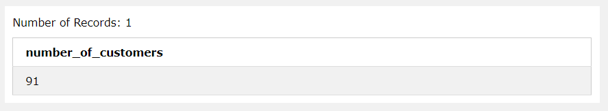
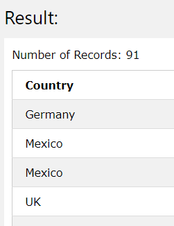
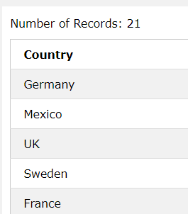
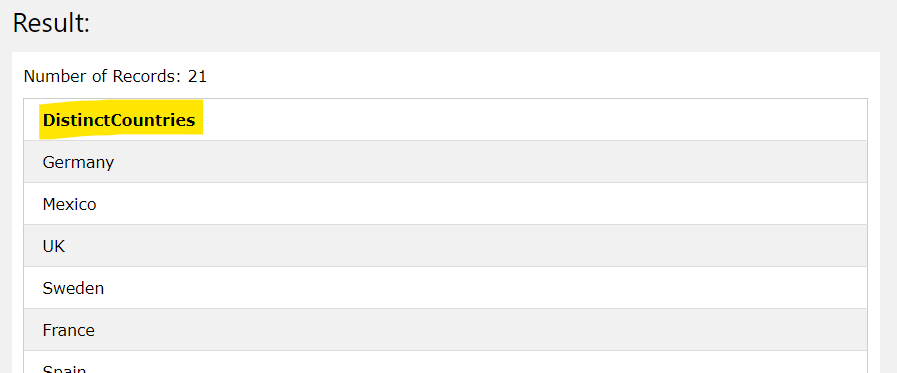
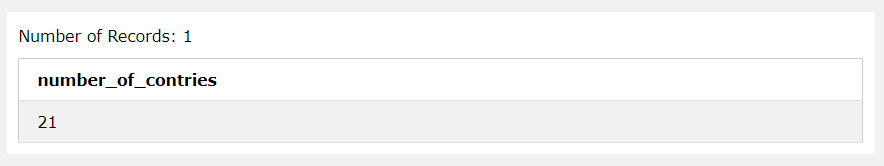

[TOC]

# What is SQL?

[:woman_teacher: SQL 기본 개념 공부하기](https://www.w3schools.com/sql/sql_intro.asp) [:100: 기본 연습문제 풀어보기](https://www.w3schools.com/sql/exercise.asp?filename=exercise_functions1) [:computer: 실습하기](https://www.w3schools.com/sql/trysql.asp?filename=trysql_select_where_number)

* Structured Query Language
* DB를 조작하고 접근할 수 있게 한다.
* SELECT, UPDATE, DELETE, INSERT, WHERE
* RDBMS는 관계형 DB. table이라고 불리는 객체에 데이터를 저장한다. table은 related data entity의 모음이다.


**field**

​	모든 table은 field라고 불리는 작은 entity들로 쪼개질 수 있다. 

​	columns/attribute라고 생각하면 될듯. 고객의 이름, 전화번호, id 등은 모두 field이다.


**record**

​	row/하나의 instance라고 생각하면 된다.


# Commands 미리보기

> 명령어와 table name, colums 등 모두 대소문자 구분 없이 인식


**data**

SELECT : data 가져오기

UPDATE : data 갱신하기

DELETE : data 삭제하기

INSERT INTO : 새로운 data 삽입하기


**table**

CREATE TABLE : 새로운 table 만들기

ALTER TABLE : table 수정하기

DROP TABLE : table 지우기


**index**

CREATE INDEX : 새로운 index 즉 search key 생성하기

DROP INDEX : index 지우기


**DB**

CREATE DATABASE : 새로운 DB 만들기

ALTER DATABASE : DB 수정하기


**Customers 로 실습해보자 !**

| CustomerID | CustomerName                       | ContactName        | Address                       | City        | PostalCode | Country |
| :--------- | :--------------------------------- | :----------------- | :---------------------------- | :---------- | :--------- | :------ |
| 1          | Alfreds Futterkiste                | Maria Anders       | Obere Str. 57                 | Berlin      | 12209      | Germany |
| 2          | Ana Trujillo Emparedados y helados | Ana Trujillo       | Avda. de la Constitución 2222 | México D.F. | 05021      | Mexico  |
| 3          | Antonio Moreno Taquería            | Antonio Moreno     | Mataderos 2312                | México D.F. | 05023      | Mexico  |
| 4          | Around the Horn                    | Thomas Hardy       | 120 Hanover Sq.               | London      | WA1 1DP    | UK      |
| 5          | Berglunds snabbköp                 | Christina Berglund | Berguvsvägen 8                | Luleå       | S-958 22   | Sweden  |


# :cookie: SELECT

>  조건에 맞게 가져오자


## **[*]** 모든 column 가져오기

```sql
SELECT * FROM Customers;
```


## 일부 column 가져오기

```sql
SELECT column1, column2, ... FROM table_name;
```

```sql
SELECT CustomerName, City FROM Customers;
```


## **[AS]** 특정 이름으로 가져오기

1. SELECT로 가져올 정보를 명시하고
2. AS로 이름 지정

```sql
SELECT column1, column2, ... AS new_name FROM table_name;
```


**Cutomers가 몇개의 record를 가지고 있는지 찾고 `number_of_customers`에 저장하라**

```sql
SELECT COUNT(*) AS number_of_customers FROM Customers;
```




## **[DISTINCT]** unique한 값만 가져오기

```SQL
SELECT DISTINCT column1, column2, ... FROM table_name;
```

| 그냥 실행 => 91개 전체가 나온다.                            | UNIQUE한 DATA만 => 21개                                     |
| ----------------------------------------------------------- | ----------------------------------------------------------- |
|  |  |


**Country의 unique한 값만 뽑아서 UniqueCountries로 저장해보자.**

```sql
SELECT Country AS UniqueCountries
FROM (SELECT DISTINCT Country FROM Customers);
```




## **[COUNT]** 현재 table의 record는 몇개?

```sql
SELECT COUNT(params) FROM table_name;
```

* `(*)` 전부
* `(columns)` 특정 columns (`DISTINCT`와 같이 쓸 때 유의미할듯)


**Unique한 Country가 몇개인지 출력하라**

```sql
SELECT COUNT(DISTINCT column) FROM table_name;
```

| Count(DISTINCT Country) |
| :---------------------- |
| 21                      |


**Unique한 country의 갯수를 세어 `number_of_contries`에 저장하라**

```sql
SELECT COUNT(DISTINCT Country) AS number_of_contries FROM Customers;
```

```sql
SELECT COUNT(*) AS number_of_contries
FROM (SELECT DISTINCT Country) FROM Customers;
```




## **[WHERE]** 조건에 맞는 data 가져오기

> 여러개의 조건은 and/or로 연결

```sql
SELECT * FROM Customers
WHERE Country = 'Mexico' or Country = 'berlin'
```

```sql
SELECT * FROM Customers
WHERE CustomerID = 1;
```

> 괄호로 조건 구분

```sql
SELECT * FROM Customers
WHERE Country='Germany' AND (City='Berlin' OR City='München');
```

```sql
SELECT * FROM Customers
WHERE NOT (Country='Germany' or Country='USA');
```


* not equal : `<>` 또는 `not column = value`
* `BETWEEN`
* `LIKE`
* `IN`


**참고 ) SELECT보다 WHERE이 우선이다.**

```sql
SELECT Country FROM Customers
where CustomerID = 1;
```


**city가 berlin이 아닌 경우만 선택하라**

```sql
SELECT * FROM Customers
WHERE NOT city = 'Berlin' 또는 WHERE citi <> 'Berlin'
```


**city는 berlin이고 postalcode는 12209인 모든 record를 조회하라**

```sql
SELECT * FROM Customers
WHERE city = 'berlin' and postalcode = 12209
```


#### IS NULL / IS <u>NOT</u> NULL

> **=** 대신 `IS` , `IS NOT` 을 이용

```sql
WHERE City IS NULL;
```


## **[ORDER BY]** 정렬하기

> default는 ASC 오름차순 ~
>
> column1에서 같은 우선순위 => column로 정렬 => ...
>
> **쉼표 까먹지 말자 ㅎㅎ,,**

```sql
SELECT column1, column2, ...
FROM table_name
ORDER BY column1, column2, ... ASC|DESC
```


**각각 다르게 차순을 설정해줄 수도 있다**

```sql
ORDER BY col1 ASC, col2 DESC;
```


## **[TOP]** topk개를 고른다 [link](https://www.w3schools.com/sql/sql_top.asp)


# [:milk_glass:](https://www.w3schools.com/sql/sql_insert.asp) INSERT INTO

> 모든 field를 지정할 필요는 없다. 나머지는 `NULL`로 채워진다.

```sql
INSERT INTO Customers
(CustomerName, ContactName, Address, City, PostalCode, Country) # customerID는 지정하지 않았음! 자동 생성?

VALUES
('Cardinal', 'Tom B. Erichsen', 'Skagen 21', 'Stavanger', '4006', 'Norway');
```

> 웹 실습시에는  `INSERT INTO` 후에 다시 SELECT를 통해 전체 table을 조회하면 추가된 table을 확인할 수 있다.


`INSERT INTO Customers (CustomerID) values (999) ` 실행 후 위 코드를 실행한 결과.

CustomerID는 이전에 추가된 값을 참고하여 자동으로 붙이는듯?


# [:strawberry:](https://www.w3schools.com/sql/sql_update.asp) UPDATE

> 기존에 존재하는 data를 수정하는 명령어.
>
> 어떤 조건의 데이터를 `WHERE` 어떻게 설정할 것인지 `SET` 명시해주어야 한다.
>
> **WHERE이 없으면 모든 record가 변경되니 주의 !**

```sql
UPDATE table_name
SET column1 = value1, colum2 = value2, ...
WHERE condition;
```


**CustomerID가 1인 사람의 ContactName, City를 Alfred, Frankfurt로 변경하라**

```sql
UPDATE Customers
SET ContactName = Alfred, City = Frankfrut
WHERE CustomerID = 1;
```


**Country가 Mexico인 record의 ContactName을 Juan으로 변경하라**

```sql
UPDATE Customers
SET ContactName = 'juan'
WHERE Country = 'Mexico';
```


# [:cookie:](https://www.w3schools.com/sql/sql_delete.asp) DELETE

```sql
DELETE FROM table_name WHERE condition;
```


**CustomerName이 Alfreds인 record 삭제하기**

```sql
DELETE FROM Customers
WHERE CustomerName = 'Alfreds';
```


**모든 record 삭제하기. 즉 속성, index, 구조 등을 모두 지운다**

```sql
DELETE FROM table_name;
```


# [:cookie:](https://www.w3schools.com/sql/sql_join.asp) JOIN

`INNER JOIN` : 교집합. 조건에 맞으면서 두 테이블에 모두 있는 데이터만 가져온다.

`OUTER JOIN` : 합집합. 조건에 맞지 않더라도 포함한다.

* `FULL OUTER JOIN` : 진짜 그냥 합집합 !

* `LEFT OUTER JOIN` : 왼쪽 테이블의 데이터를 무조건 확보하고 오른쪽은 교집합만.

  만약 오른쪽 테이블에서 가져올 값이 없다면 NULL으로 처리한다.

`SELF JOIN` : 자기 자신을 조인

`CROSS JOIN` : join시에 특정 조건을 걸어주지 않고 모든 경우를 다 결합하는 방법


# DBMS 차이점

> 면접 빈출 질문 !


## Oracle

* 대규모 DB 지원
* 고성능 트랜잭션 처리를 제공하므로 속ㄴ도가 빠르다.
* SQL을 실행하는 가장 효율적인 방법을 선택한다.
* 돈을 지불해야 함!


## MySQL

> 간단한 동작을 행할 때 good

* 오픈소스. 무료

* top n의 레코드를 가져오는데에 특화되어있다.

* Nested Loop join만 지원한다.

  > `Nested Loop join`이란?
  >
  > 2중 for문처럼 테이블 범위를 바깥부터 하나씩 순차적으로 접근하여 join해나가는 방식.

* 문자열 비교시 대소문자를 구분하지 않는다.

* 복잡한 쿼리는 성능이 저하된다.

* update 성능은 postgreSQL보다 좋다.


## PostgreSQL

> 복잡한 query 사용, insert 위주의 대규모 서비스인 경우에 good

* 오픈소스

* join방법이 다양하다. nested loop, hash join, sort merge join

  * 결합할 데이터가 많을 때는 hash 나 sort merge join

  * 특히 이미 정렬되어 있는 경우에는 sort merge join을, 그렇지 않으면 hash가 좋다.

    > `sort merge join`이란?
    >
    > join의 대상 범위가 넓을 경우에 발생하는 Random Access를 줄이기 위해서 혹은 연결시킬 마땅한 index가 존재하지 않는 경우에 사용한다.
    >
    > 두 테이블의 처리 범위를 각자 Access하여 정렬한 결과를 scan하면서 merge한다.

  * update가 느리다. 과거 행을 삭제하고 다시 새로운 행을 추가하는 방식이므로

  * 여러 cpu를 사용하여 쿼리를 처리한다.

  * 효율적인 동시성 처리 가능

  * DB의 클러스터 백업 기능을 제공한다.

    > `cluster`?
    >
    > 자주 사용되는 table의 데이터를 디스크의 같은 위치에 저장시켜서, 디스크로부터 데이터를 읽어오는 시간을 줄인다.


# Reference

* [DBMS 차이점](https://velog.io/@jisoo1170/Oracle-MySQL-PostgreSQL-%EC%B0%A8%EC%9D%B4%EC%A0%90%EC%9D%80)
* [JOIN](https://velog.io/@jisoo1170/SQL-JOIN%EC%9D%84-%EC%95%8C%EC%95%84%EB%B3%B4%EC%9E%90)
