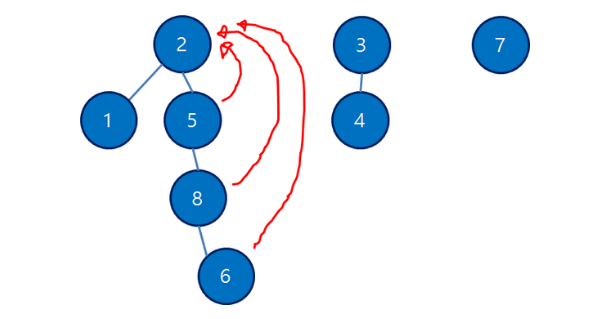

# Union - Find

##### 참고한 설명

> http://blog.naver.com/kks227/220791837179
>
> http://blog.naver.com/kks227/220791837179


##### 문제 풀어보기

>백준에서 분리 집합/Disjoint set 태그 찾아서 공부 !
>
>Disjoint https://www.acmicpc.net/problem/tag/Disjoint-set
>
>https://www.acmicpc.net/workbook/view/900 ~~다 해결~~
>
>http://blog.naver.com/kks227/220791837179  방 청소 빼고 ~~나머지는 pass~~

## :green_book: 구현할 때 몇 가지 팁

#### 그래프 연결

1을 썼다면 앞으로는 1 이상이면서 최소의 값을 써야할 때, 1과 2를 이어 미래에 2를 쓰도록 유도한다.

#### p[a]가 부모 노드만 갖게 할 것인지, 집합 원소의 음수를 줄 것인지 결정하자


#### union 함수에 부모 노드의 대소비교는 해주면 좋다.

특수한 상황에서는 대소비교후 swap해서 부모 ,자식을 결정해야함. 경로 압축이 제대로 되게 만들기 위해서 + 시간을 줄이기 위해서는 해주자.


* 그래프나 집합 원소가 계속 늘어나는 상황이고, 갯수가 필요할 때(친구 네트웤)

* A를 이미 썼다면, A+1을 써야하고, A+1도 썼다면 A+2를 써야하고 ... 에서

  시간 복잡도를 줄이고자 할 때

* 크루스칼 최소 스패닝 트리

* 가장 큰 집합 추적

* 과반수 출현 시점 확인


> **==두 개의 노드==가 ==같은 그래프==에 속하는가?  ==즉 부모 노드==가 같은가?**

* `union`과 `find `연산만 있는 그래프 자료구조 중 하나 !

  `union`으로 여러 집합을 합쳐 나가고, 두 노드가 같은 집합인지 `find`를 통해 확인할 수 있다.

* **상호 배타적인 자료를 표현한다.**

  전체 node들은 K개 집합으로 나누어져 있으며, 모두 교집합이 없고 합집합은 전체 집합이다.


* 합집합을 찾을 때 쓴다. **그래프를 뭉쳐가면서 풀 때** 쓴다.

* 다음에 똑같은 값이 들어오면, 다른 값을 주기 위해 사용할 수 있다.

  (카카오 인턴. 공항. 등등)


* strongly connected component등과 같은 고급 알고리즘에서도 적용되는 원리

  단독으로 쓰이는 경우는 잘 없지만, 최소 스패닝 트리를 구하는 크루스칼 알고리즘에서 필수적으로 쓰인다 !!!!!


##### 다음 두가지 연산으로 이루어져 있다.

* `Find `: x가 어떤 집합에 포함되어 있는지 찾는 연산.

* `Union `: x,y가 포함되어있는 집합을 합치는 연산

  이를 위해 find 연산이 필요하며, 결국 두 함수의 시간 복잡도는 **Find의 시간 복잡도에 의존**한다. 둘다 `O(log*N) ~~ O(1)`


노드 번호 i와, 그 노드의 부모 번호인 p[i] 로 표를 구성한다.

1. 아무와도 연결되지 않은 상태

   `p[i] == i `

   

2. `Union(1,2) `; 1과 2가 포함되어있는 그래프를 합쳐라
   `Union(3,4)`

   * 일반적으로, **더 작은 값을 부모 노드로** 둔다.

   


3. 여러개가 함께 연결되어 있는 경우에는

   * 자신의 직전 노드값을 갖는다.

   * 그렇다면, 1과 3의 연결 여부를 어떻게 판단할 것인가?

     * 재귀적 연산을 통해 파악한다.

       3 -> 2-> 1-> 1 이므로 3 -> 1

   

4. 재귀적 연산을 수행하여 가장 위쪽 부모노드로 값을 바꾸고 나면

   

5. 이는 사실, 그래프를 재 구조화 하는 것과 같다. 이를 **==경로 압축==**이라고 말한다.

   * 재구조화를 통해, 다음번에 다시 3의 부모 노드를 찾기 위해 2번의 재귀연산을 할 필요가 없게 된다.
   * 경로 압축을 하지 않으면, 매번 다시 재귀 연산을 해야한다 ! 경로 압축을 이용하면 시간 복잡도를 크게 줄일 수 있다.

   | 재구조화 전                                                  | 후                                                           |
   | ------------------------------------------------------------ | ------------------------------------------------------------ |
   |  | <br /> |

   

이제 unionfind 구조를 구현해보자.

이 때 세가지 함수의 정의가 필요한데, <u>각각은 `경로압축` 또는 `집합의 크기 비교`를 통해 최적화</u>를 할 수 있다.


### find 연산의 시간복잡도는 ==상수 시간에 수렴==한다. O(1)

> 한 번의 find 연산에 대한 amortized 시간 복잡도는 `O(1)`<` O(log*N)` <`O(logN)`

* 정점이 N개인 유니온 파인드 구조에 M번의 find 연산을 수행하면, 시간 복잡도는 O(NM)

  (운이 없게도 모든 원소가 일렬로 늘어져있어, 재구조화를 위해서 M번 연산이 필요할 경우. 즉 최악의 시간)

* 그러나` amortized O(M log*N)`이라는 시간 복잡도를 가진다.

  * amortized란? 분할 상환 분석

    > https://zeddios.tistory.com/60
    >
    > https://hcn1519.github.io/articles/2017-05/amortized_analysis

    가끔 일어나는 비싼 연산(맨날 O(1)이다가 어쩌다 운없이 O(N)이 나오는 경우)을 분산시켜서, 연산의 **평균 비용**을 구한다.

    최악의 경우에도 각 연산의 평균 수행 성능을 보장한다.

    **어떤 연산을 할때, ==미리 비용을 조금 더 지불==해놨다가 ( O(1)보다 조금 더 지불해놓음. ) 다음에 비용이 큰 연산이 왔을 때 앞에 지불한**

    **비용에서 ==빌려다 쓸== 수 있고, 최악의 연산이 오더라도 모두 ==이 비용 내에서 커버가 가능==하다 ! 는 것!**

* `log*` 로그 스타 ;  "아크만 함수"의 역함수

  미칠듯이 느리게 증가해서, 겨우 5가 되는 데에도 2^65536^ 이 필요함.

  왠만해서는 1~2라고 봐도 좋고, 그래서 **선형시간과 동급으로 취급**된다.


#### find 연산이 전체 수행 시간을 좌우한다.

* 일단 모두 재구조화(**경로 압축**)를 해놓으면 , 그 후부터는 부모노도를 찾는데 걸리는 시간은 O(1)


### 1. 부모 노드 찾기

* 경로 압축을 추가하여 추후에 재귀 연산을 적게 하도록 만든다.

```python
parent # 노드와 부모가 담긴 arr
def getParent(curr_node):
    if parent[curr_node] == curr_node:
        return curr_node
    ################################################ 경로 압축 과정
    parent[curr_node] = getParent(parent[curr_node])
    ################################################
    return parent[curr_node]
    # 3의 부모         =                  parent[3] == 2의 부모
```


### 2. node1, node2 집합 합치기 == 부모노드 같게하기

* 방법 1 ) 합치고자 하는 부모 노드를 입력받고, 더 작은 쪽이 새로운 부모 노드가 되도록 합쳐준다.

* 방법 2 ) 두 집합의 크기를 비교하여, 더 작은 쪽이 큰 쪽의 부모 노드를 갖도록 합쳐준다

  * 왜? : 주렁주렁 트리(길이가 3)가 달린 집합과 조그만 집합(깊이가 1)을 생각해보자.

    주렁주렁한 집합을 작은 집합의 부모노드에 붙이게 되면, 가장 끝 노드의 부모를 찾기 위해 4번의 find 연산이 필요하다.

    그러나 반대의 경우에는 **2번의 연산만** 하면 된다 !! (이 방법은 아래서 구현해보자.)


```python
def unionParent(node1, node2):
    p1,p2 = getParent(parent,node1), getParent(parent,node2)
    if p1,p2: return
    if p1 < p2:
        parent[p2] = p1 # node2의 부모!의 부모!를 수정해줘야 한다.
        				# 그냥 node2의 부모가 아니라.
    else:
        parent[p1] = p2
```


### 3. 같은 부모를 가지는지 확인

```python
def findParent(node1, node2):
    return getParent(node1) == getParent(node2)
```


### 4. 실습


```python
class myGraph():
    def __init__(self, N):
        self.parent = [i for i in range(N+1)]

    def getParent(self,curr_node):
        if self.parent[curr_node] == curr_node:
            return curr_node
        self.parent[curr_node] = self.getParent(self.parent[curr_node])
        return self.parent[curr_node]

    def unionParent(self,node1, node2):
        p1, p2 = self.getParent(node1), self.getParent(node2)
        if p1,p2: return
        if p1 < p2:
            self.parent[p2] = p1
        else:
            self.parent[p1] = p2


    def findParent(self,node1, node2):
        return self.getParent(node1) == self.getParent(node2)

# 초기 그래프 생성하기
g = myGraph(8)

# 노드 합쳐보기
g.unionParent(2, 3)
g.unionParent(1, 2)
g.unionParent(6 ,7)
g.unionParent(3, 4)
g.unionParent(5, 6)
g.unionParent(7 ,8)

print(g.parent)

print("4의 부모노드는 :", g.getParent(4))
print("7의 부모노드는 :", g.getParent(7))
print("1과 5는 연결되어 있는가? :", g.findParent(1, 5))
print("1과 3는 연결되어 있는가? :", g.findParent(1, 3))

g.unionParent(1,4)
print("1과 8은 연결되어 있는가? :", g.findParent(1,8))

g.unionParent(1,5)
print("1과 8은 연결되어 있는가? :", g.findParent(1,8)) # 모두 연결됨
```


### 함수를 조금 수정해서, ==집합의 크기==를 측정할 수 있도록 해보자.

> 백준의 4195 친구 네트워크 문제 풀어보기.

* 방금까지는, 부모노드들은 모두 자기 자신을 값으로 가졌다, 즉 `parent[i] = i`

* 이제는 부모노드들은 모두 음수의 값을 가지게 만들되, 이 값의 절댓값이 자식 노드의 갯수가 되도록 만들어보자 !!!

  만약` parent[3] = -5`라면, `3`은 5개의 자식노드를 가진, 즉 집합 크기 6?의 부모노드가 된다.

* 또한 union시 집합의 대소 비교를 통해 find 연산 횟수를 줄여주자.

##### 수정 사항

* `getParent`에서는 `parent[i] == i`를 `parent[i]<0`로 수정해주면 되고

  `unionParent`에서는 부모 노드를 합칠 때, 집합 크기 역시 합쳐지도록 수정해주면 된다.

* union시 부모노드의 크기가 아니라 집합의 크기를 비교하도록 한다.

* 처음에는 모두 자기 자신만을 집합으로 가지므로, 초깃값을 -1로 수정해주자.

```python
class myGraph():
    def __init__(self, N):
        self.parent = [-1 for i in range(N + 1)]

    def getParent(self, curr_node):
        if self.parent[curr_node] < 0:
            return curr_node
        self.parent[curr_node] = self.getParent(self.parent[curr_node])
        return self.parent[curr_node]

    def unionParent(self, node1, node2):
        p1, p2 = self.getParent(node1), self.getParent(node2)
        if p1 == p2: return
        s1, s2 = self.getSize(p1), self.getSize(p2)
        if s1 < s2: # s1집합이 더 크다면(음수니까)
            self.parent[p1] += self.parent[p2]  # 새로운 부모노드에 이전 값을 연결해준다.
            self.parent[p2] = p1
        else:
            self.parent[p2] += self.parent[p1]  # 새로운 부모노드에 이전 값을 연결해준다.
            self.parent[p1] = p2

    def findParent(self, node1, node2):
        return self.getParent(node1) == self.getParent(node2)

    def getSize(self, node):
        return -self.parent[self.getParent(node)]


# 초기 그래프 생성하기
g = myGraph(8)

# 노드 합쳐보기
g.unionParent(2, 3)
g.unionParent(1, 2)
g.unionParent(6, 7)
g.unionParent(3, 4)
g.unionParent(5, 6)
g.unionParent(7, 8)

print(g.parent)

print("부모노드 1에 대한 집합의 크기는 : ", g.getSize(1))
print("노드 2가 속한 집합의 크기는 : ", g.getSize(2))
```


# 1717 집합의 표현

* sys로 해야 시간초과 안남.

```python
import sys

N, M = map(int, sys.stdin.readline().split())
p = [i for i in range(N + 1)]

def find(a):
    if p[a] == a: return a
    p[a] = find(p[a])
    return p[a]

def union(a, b):
    x,y = find(a),find(b)
    if x==y: return
    if x < y:
        p[y] = x
    else:
        p[x] = y

def solution(a, b):
    return ["no", "yes"][find(a) == find(b)]

for _ in range(M):
    command, a, b = map(int, sys.stdin.readline().split())
    if command:
        print(solution(a, b))
    else:
        union(a,b)
```


# 1976 여행 가자

### BFS, DFS가 아니라 union find로 풀 수 있음을 인지하자.

* **==우회 하더라도==**, 갈 수 있기만 하면 연결된 것으로 간주할 때

  즉 부모 노드가 같으면 갈 수 있는 것으로 간주한다 !


#### 문제

동혁이는 친구들과 함께 여행을 가려고 한다. 한국에는 도시가 N개 있고 임의의 두 도시 사이에 길이 있을 수도, 없을 수도 있다. 동혁이의 여행 일정이 주어졌을 때, 이 여행 경로가 가능한 것인지 알아보자. 물론 중간에 다른 도시를 경유해서 여행을 할 수도 있다. 예를 들어 도시가 5개 있고, A-B, B-C, A-D, B-D, E-A의 길이 있고, 동혁이의 여행 계획이 E C B C D 라면 E-A-B-C-B-C-B-D라는 여행경로를 통해 목적을 달성할 수 있다.

도시들의 개수와 도시들 간의 연결 여부가 주어져 있고, 동혁이의 여행 계획에 속한 도시들이 순서대로 주어졌을 때(중복 가능) 가능한지 여부를 판별하는 프로그램을 작성하시오.


* 괜히 reduce 썼다가 시간만 늘어났네 .. set 쓰자...

```python
import sys
from functools import reduce

N = int(input())
M = int(input())
p = [*range(N+1)]

def find(a):
    if p[a] == a: return a
    p[a] = find(p[a])
    return p[a]

def union(a,b):
    p1,p2 = find(a), find(b)
    if p1==p2: return
    if p1<p2:
        p1,p2 = p2,p1
    p[p1] = p2

for i in range(1,N+1):
    [union(i,a+1) for a,b in enumerate(sys.stdin.readline().split()) if b == "1"]

print("YES" if reduce(lambda x,y : x==y,map(find,map(int,sys.stdin.readline().split()))) else "NO")
# 위에 len(Set) == 1로 고치기
```


# 4195 친구 네트워크 ★★

* 합쳐나가는거니까 유니온 파인드 !

### 문제

민혁이는 소셜 네트워크 사이트에서 친구를 만드는 것을 좋아하는 친구이다. 우표를 모으는 취미가 있듯이, 민혁이는 소셜 네트워크 사이트에서 친구를 모으는 것이 취미이다.

어떤 사이트의 친구 관계가 생긴 순서대로 주어졌을 때, 두 사람의 친구 네트워크에 몇 명이 있는지 구하는 프로그램을 작성하시오.

친구 네트워크란 친구 관계만으로 이동할 수 있는 사이를 말한다.

### 입력

첫째 줄에 테스트 케이스의 개수가 주어진다. 각 테스트 케이스의 첫째 줄에는 친구 관계의 수 F가 주어지며, 이 값은 100,000을 넘지 않는다. 다음 F개의 줄에는 친구 관계가 생긴 순서대로 주어진다. 친구 관계는 두 사용자의 아이디로 이루어져 있으며, 알파벳 대문자 또는 소문자로만 이루어진 길이 20 이하의 문자열이다.

### 출력

친구 관계가 생길 때마다, 두 사람의 친구 네트워크에 몇 명이 있는지 구하는 프로그램을 작성하시오.


### 알고리즘 분류 : 호애앵...?

- [해싱](https://www.acmicpc.net/problem/tag/해싱)
- [최소 스패닝 트리](https://www.acmicpc.net/problem/tag/최소 스패닝 트리)
- [강한 연결 요소](https://www.acmicpc.net/problem/tag/강한 연결 요소)
- [Disjoint-set](https://www.acmicpc.net/problem/tag/Disjoint-set)
- [최대 독립 집합](https://www.acmicpc.net/problem/tag/최대 독립 집합)


#### 풀이 방법

* 친구 네트워크에 몇 명이 있는지를 구하라?

  각각의 a,b가 들어올 때마다 a,b가 속한 **친구 네트워크의 전체 인원수**를 구하라 !


* 먼저 **==defaultdict==**를 이용하여 기본 값을 1로 갖는 dictionary를 만든다

* 위 패키지는 p[a] 로 호출하였을 때, 키가 없다면 a:1을 추가하고

  key가 있다면 value를 return한다. (여기서는 print하지 않았으므로 상관 x!)

  > **==없으면 default 값으로 추가하고, 있으면 넘어가고 싶을 때 써보자.==**

* 그 다음 두 노드를 `union`을 이용하여 합친다.

* 이때, **==부모노드==**는 자기 자신 즉 p["haeu"] = "haeu" 가 아닌

  **==자식들의 수==**를 가지게 만든다 !

* a와 b가 속한 네트워크에 몇 명의 친구가 들어있는지를 return 하면 되는데

  어짜피 a,b는 union하므로 둘의 부모 노드는 같다.

  아무거나 하나만 골라서 return하면 된당.

```python
from collections import defaultdict
import sys

def find(a):
    if type(p[a]) == int :return a # 정수형이면, 즉 최상위 노드면
    p[a] = find(p[a])
    return p[a]

def union(a,b):
    x,y = find(a),find(b)
    if x==y:return
    if x>y:
        x,y = y,x
    p[x] += p[y] # 부모노드가 가지고 있던 집합의 크기를 더해주고
    p[y] = x     # 더 상위 노드로 변경

for _ in range(int(input())):
    p = defaultdict(lambda :1)
    for _ in range(int(input())):
        a,b = sys.stdin.readline().split()
        p[a],p[b]
        union(a,b)
        print(p[find(a)]) # a,b가 속한 네트워크의 총 친구수
```


# 10775 공항 ★★★★★★★★★★

* 그리디 + 유니온 파인드

1~G까지의 공간이 있다.

여기에 K개의 비행기를 도킹시킬 것이다.

각 비행기는 도킹하길 원하는 번호g를 가지고 있다.

만약 원하는 번호g에 **이미 도킹이 되어있다면**, **1~g까지의 게이트 중 하나에 도킹**한다.

(즉 자기 자신보다 **더 작은 번호**에 도킹한다. 한번 도킹하면 뺄 수 없다.)

**==최대한 많은 비행기==를 도킹**시키고 싶다. 몇대의 비행기까지 도킹시킬 수 있는가?


* x x x x x 6 인 상태에서 또 6이 들어온다고 해보자.

  그러면 1,2,3,4,5 중 하나에 넣을 수 있는데,

  1. 5에 넣는 경우, 즉 max

     그 다음에 1,5가 들어오면 둘 다 들어갈 수 있는 자리가 있다(1과 4)

  2. 1에 넣는 경우, 즉 min

     그 다음에 1,5가 들어오면 5는 되지만 1은 들어갈 수 없다.

  즉 ~! **가장 많은 비행기를 도킹**시키자 == ==**순간 순간 가능성의 최대**==에 넣자 !

  가 된다.

> 카카오 2019 인턴 문제의 호텔방 문제가 바로 이 아이디어였음 !
>
> 순간 순간 가능성의 **최소**에 넣는 문제였음 !


* `union( 현재 노드, 다음에 이 노드가 들어오면 사용할 값 )`


```python
import sys
input = sys.stdin.readline

def find(a):
    if G[a] == a : return a
    G[a] = find(G[a])
    return G[a]

def union(a,b): # 원랜 여기서 x==y 검사도 하고 swap도 해야하지만
    			# 이 문제에선 필요치 않았음. 언제나 r,r-1이 들어오니까.
    x,y = find(a), find(b)
    G[x] = y

G = [i for i in range(int(input())+1)]
N = int(input())
answer = 0

for i in range(N):
    request = int(input())
    result = find(request)
    if not result : break
    ####################### 미래에 result가 또 들어오면, re-1을 주자.
    union(result,result-1) 
    #######################
    answer += 1
    
print(answer)
```

* **여기선 잘해놓고 인턴 모의때는 실수했는데,==연속적인 값==만 들어온다고 해서**

  **`p[x] = x+1` 처럼 짜면 안된다.**

  왜냐 ! 위 식은 `x+1`이 루트라는 가정 하에 짠건데, 얘도 하위 노드일 수 있음.

  고로 result-1 에 대해서도 꼭 `find`연산을 해야함.


# ★★★ 14868 문명

#### 0807 / 내가 문제 이해를 잘못한거였다 ,,,,,

##### 1 ) 전파했는데 누가 있으면 합쳐진다? (x) 내 주변에 누가 있으면 합쳐진다 (o)

* 일단 간 다음 union하는게 아님 !!!!!!!!!! 죠심 ,,,

##### 2 ) ==전파가 아니라 주변 탐색을 먼저 해야한다== :warning:  :warning:  :warning:  :warning:  :warning:  :warning:

* 이건 다른 데에서도 실수할거같아서 무서운데 !!!!

* **==초깃값이 어떤 상태인지== 꼭 파악하자**

  * 초기에 주어진 문명도시 좌표는, **이미 이전에 누군가에 의해 전파된 것**으로 봐야한다.

  * 그러니까 `1. 전파 ` `2. 주변보기` 가 아니라

    `1.주변보기` ` 2. 전파 `가 되어야 한다 !


* `(x,y)`와 `(a,b)`가 인접해있다?

  ```python
  x==a and abs(y-b) == 1
  or
  y==b and abs(x-a) == 1
  ```

   놀리는거 아님 ..? ㅠㅠ

  오옹 근데 맞아떠 ㅎㅎ

* 이렇게 풀면

  * 2 0 3 인 경우에서 2 3 3 으로 갈때 , 인접해있는지 모름.
  * 만약  2 3 3이 되면서 모든 문명이 연결되면 지금의 answer를 return해야함
  * 근데 이 코드는 다음날 **2 3** 3 에서 2 3 을 비교하면서 asnwer +1을 출력

* 그래서 해결책은 !

  * 전염 시키기 **따로**
  * 얘네의 주변 보기 **따로**

  > https://akim9905.tistory.com/25 참고 코드(C++)

```python
import sys
from collections import deque
input = sys.stdin.readline

def find(a):
    if p[a] <0 : return a
    p[a] = find(p[a])
    return p[a]

def union(a,b):
    x,y = find(a),find(b)
    if x == y : return
    if x > y : x,y = y,x
    p[y] += p[x]
    p[x] = y

def merge():
    while q: # 오늘 전파한 애들의 인접지역을 확인하고 합칠 수 있으면 합친다.
        x,y = q.popleft()
        q2.append([x,y]) # 내일 써야하니까 넣어놓는다.

        for dx,dy in [[x-1,y],[x,y-1],[x+1,y],[x,y+1]]:
            if 1<= dx <= N and 1<= dy <= N:
                if M[dx][dy]: # 내 인접지역에 누군가 있다면
                    union(M[x][y], M[dx][dy]) # 합친다.
def prop():
    while q2: # 전파
        x,y = q2.popleft()
        for dx,dy in [[x-1,y],[x,y-1],[x+1,y],[x,y+1]]:
            if 1<= dx <= N and 1<= dy <= N:
                if not M[dx][dy]:
                    q.append([dx,dy])
                    M[dx][dy] = M[x][y]

N,T = map(int,input().split())
M = [[0 for _ in range(N+1)] for _ in range(N+1)]
p = [-1 for i in range(T+1)]

q = deque()
q2 = deque()
for i in range(T):
    a,b = map(int,input().split())
    q.append([a,b])
    M[a][b] = i+1

answer = 0
while True:
    merge()
    if p[find(1)] == -T:
        print(answer)
        break
    prop()
    answer += 1
```


##### 전파 했는데 누군가 있으면 합쳐라 ! 에 대한 코드는 아마도 이렇게 될 듯

```python
from collections import deque

N,K = map(int, input().split())
A = [[0]*N for _ in range(N)]

q = deque()

for i in range(K): # 문명 번호
    a,b = map(int, input().split())
    A[a-1][b-1] = i+1 # 1부터 K번까지
    q.append((a-1,b-1))
q.append((-1,-1))

p = [-1]*(K+1)

def find(x):
    if p[x]<0: return x
    p[x] = find(p[x])
    return p[x]

def union(a,b):
    x,y = find(a), find(b)
    if x==y:
        return False
    if x>y: x,y = y,x
    p[y] += p[x]
    p[x] = y
    return True

year = 1
n_of_union = 0
while True:
    a,b = q.popleft()
    if a < 0:
        year += 1
        q.append((a,b))
    for n_x, n_y in [(a-1,b),(a+1,b),(a,b-1),(a,b+1)]:
        if 0>n_x or n_x >= N or 0>n_y or n_y >= N:
            continue
        if A[n_x][n_y]: # 이미 문명이 있으면
            n_of_union += union(A[n_x][n_y],A[a][b])
        else:
            A[n_x][n_y] = A[a][b]
            q.append((n_x,n_y))
    if n_of_union == K-1:
        break
        
print(year)
```

