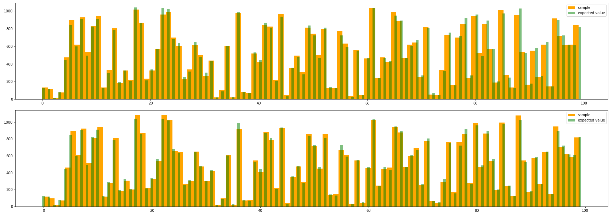
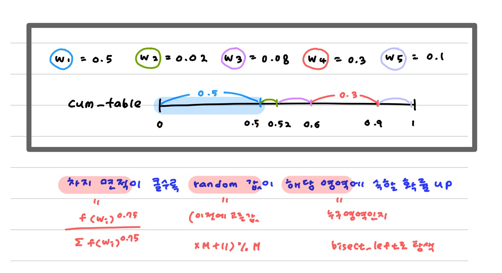

# Negative sampling 빠르게 하기

Negative sampling을 어떻게 잘 구현할 것인가 ... 는 결국 확률값이 주어졌을 때 어떻게 빠르게 sampling하도록 짤것이냐가 된다.

처음에 짤 때는 아 이건 다항분포다 .. 에 꽂혀서 `torch.multinomial`로 구현했다.

내껀 살짝 수행 시간이 좀 걸리는데 gensim과 강의자료를 통해 수행 시간을 단축시켰다 !

구구절절 설명해보겠다.


## 1 ) distribution을 이용하자.

나는 처음에 negative sampling을 data마다 5개씩 하도록 짰다. negative sampling을 이해하면서 자연스럽게 '매 데이터마다 5~20개씩 뽑으면 되겠군' 생각했다. `torch.multinomial`을 이용했다.

* 복원? 비복원? => 비복원 추출을 하자.
  * 왜? 굳이 중복된 값을 뽑을 필요가 없다. 우연의 일치로 5개가 모두 같은 단어가 나왔다면, 5개를 sampling한 의미가 없다. 하나의 정보만 가져가게 된다.

문제점이라고 한다면 ... 시간이 꽤 걸린다는 점이다.


다른 구현을 참고해보니 복원 추출 + **미리 만 개를 뽑아놓은 후 5개씩 잘라서 쓰고 있었다.**

```python
random.choices(population, sampling_weights, k=10000)
```

이래도 되나 ... 고민을 잠시 해보니 이래도 된다! 는 결론이 났다 ㅎㅎㅋㅋ

두 방법 모두 같은 기댓값을 가지며 n이 충분히 크다면 sample에 의한 관측값이 잘 근사할거니까.


##### [확인해보자! ]임의의 단어에 대해 기댓값이 같을까?

(k+1)개의 단어가 있고 각 단어가 뽑힐 확률 pi가 주어져있다.

이를 이용해서 5000개의 sample을 구성하려고 한다. 다음 두 방법에 대해 x~k+1~ 번째 단어가 등장하는 빈도의 기댓값은 다를까?

1. 5개씩 sampling하는 시행을 1000번 한다. (각 시행은 독립이다.)

   * 상황 : multinomial(n = 5, (p~1~ , ... , p~k+1~ ), 비복원) 을 독립적으로 1000번 한다.

     Y ; 1000번 시행시 X~k+1~ 의 갯수, X = 한 번 시행시 X~k+1~ 의 갯수라면 Y = 1000X

     E(Y)를 구하자.

   * E(X~k+1~) , P(X~k+1~)는? 

     나머지 단어가 어떻게 뽑히든지 **우리가 원하는 x~k+1~ 만 x개가 뽑히면 된다 !**

     결국 X~k+1~ v.s. 나머지 단어가 되고, 비복원 추출이므로 초기하 분포를 따른다. **즉 E(X~k+1~) = 5p~k+1~** 

   * **E(Y) = 1000*E(X) = 5000p~k+1~** 

2. 미리 2500개씩 뽑아놓고 차례로 5개씩 분배한다.

   * 상황 : multinomial(n = 2500, (p~1~ , ... , p~k+1~ ), 복원) 을 독립적으로 2번 한다.

     Y ; 2번 시행시 X~k+1~ 의 갯수, X = 한 번 시행시 X~k+1~ 의 갯수라면 Y = 2X

   * E(X~k+1~) , P(X~k+1~)는? 

     역시 나머지 단어가 어떻게 뽑히든지 **우리가 원하는 x~k+1~ 만 x개가 뽑히면 된다 !**

     복원 추출이므로 이항 분포를 따른다. **즉 E(X~k+1~) = 2500p~k+1~**

   * **E(Y) = 2*E(X) = 5000p~k+1~** 


기댓값이 같다. 즉 n이 충분히 크다면 sampling 결과는 비슷할 것으로 예상할 수 있다.

차이점은 ""분포를 얼마나 잘 재현해낼 수 있는가""가 되겠다.

주사위를 10번 던져서 만든 table과 10000번 던져 만든 table이 다른 것처럼 ...

전자는 1000번 실험했으니 두 번만 실험한 후자보다 원래 기댓값과 유사한 분포를 보여줄 것이다, 실험해보자 !


 vocab size = 10000으로 가정하고 먼저 임의로 만 개의 확률값을 생성한다.

```python
weight = [random.randint(1,10000) for _ in range(10000)]
prob = [w/sum(weight) for w in weight]
```


data는 10000개라고 가정하자.

```python
start = time.time()
res1 = []
for _ in range(10000):
    res1.extend(torch.multinomial(torch.tensor(prob), 5, replacement = False).tolist())
print("5개씩 10000번 :",time.time()-start)

start = time.time()
res2 = []
for _ in range(10):
    res2.extend(torch.multinomial(torch.tensor(prob), 5000, replacement = True).tolist())
print("5000개씩 10번 :",time.time()-start)
```


먼저 수행 시간부터 비교해보자. 150배쯤 차이가 난다.

```
5개씩 10000번 : 0.6916289329528809
5000개씩 10번 : 0.005267620086669922
```


sample이 실제 분포를 얼마나 잘 재현해주는지 확인해보자. 둘 다 다행히 기댓값에 잘 근사하고 있다.



수행시간이 훨~씬 빠른 두번째 방법을 채택해서 구현하였다.


## 2 ) gensim 패키지는 어떻게 구현했을까? Binary search로 더 빠르게 탐색하자.

> #### `binary_search`를 이용했다 ! 똑똑한 아이디어다.


확률을 처음 배우던 중학교 시절에 과녁의 넓이를 이용해서 확률을 설명하던 장면이 아마도 많은 이의 추억 속에 있을듯 하다.

바로 그 simple한 아이디어를 이용하면 sampling을 쉽게할 수 있다 !



1. 먼저 freq를 이용해서 각 단어에 대한 확률을 계산한다.

2. 이를 `cum_table`이라는 1차원 array에 '**누적으로**' 저장한다.

   0~1의 수직선 위에서, 확률이 큰 단어는 더 많은 면적을 할당받는다.

3. 이제 0~1 사이에서 random값 하나를 뽑는다. ( `(현재 random값>>16)%전체 단어수`  )

4. 주어진 값이 어떤 단어의 영역에 들어가있는지 binary search를 통해 탐색한다.

5. 다음 random값을 `(이전 random값 * MAX + 11)%MAX`로 할당한다.

   > gensim에서 MAX = 281474976710655ULL로 되어있는데 일단 적당히 아주 큰 수로 생각했다. (검색해도 안나온다 ㅜㅜ 더 찾아봐야징)
   >
   > 11은 데이터에서 나온 값이 아닌걸로 봐서 다음 random값 생성을 위해 임의의 수를 넣은것같다.


코드는 cython으로 짜여져있는데 나처럼 C 초짜일지라도 ... 전체 로직이 어떻게 굴러가는지는 이해할 수 있다 !


#### Data 전처리 시에 누적 table을 만들어놓는다. [gensim/models/word2vec.py](https://github.com/RaRe-Technologies/gensim/blob/develop/gensim/models/word2vec.py)

```python
    def make_cum_table(self, domain=2**31 - 1):
        """Create a cumulative-distribution table using stored vocabulary word counts for
        drawing random words in the negative-sampling training routines.
        To draw a word index, choose a random integer up to the maximum value in the table (cum_table[-1]),
        then finding that integer's sorted insertion point (as if by `bisect_left` or `ndarray.searchsorted()`).
        That insertion point is the drawn index, coming up in proportion equal to the increment at that slot.
        """
        vocab_size = len(self.wv.index_to_key)
        self.cum_table = np.zeros(vocab_size, dtype=np.uint32)
        # compute sum of all power (Z in paper)
        # sum(f**0.75 for f in word_freq)를 위한 과정
        train_words_pow = 0.0
        for word_index in range(vocab_size):
            count = self.wv.get_vecattr(word_index, 'count')
            train_words_pow += count**self.ns_exponent
            
        # 누적 확률값 계산.
        cumulative = 0.0
        for word_index in range(vocab_size):
            count = self.wv.get_vecattr(word_index, 'count')
            cumulative += count**self.ns_exponent
            # 0.000xxxx처럼 아주 작은 확률값 cum/train_pow에 domain을 곱해줘서 크기를 키운다.
            self.cum_table[word_index] = round(cumulative / train_words_pow * domain)
        if len(self.cum_table) > 0:
            # cummulative/train_words_pow는 마지막에 1이 되므로
            assert self.cum_table[-1] == domain
```


####   [gensim/models/word2vec_inner.pyx](https://github.com/RaRe-Technologies/gensim/blob/develop/gensim/models/word2vec_inner.pyx)

```c
cdef unsigned long long w2v_fast_sentence_sg_neg(
    const int negative, np.uint32_t *cum_table, unsigned long long cum_table_len,
    REAL_t *syn0, REAL_t *syn1neg, const int size, const np.uint32_t word_index,
    const np.uint32_t word2_index, const REAL_t alpha, REAL_t *work,
    unsigned long long next_random, REAL_t *words_lockf,
    const np.uint32_t lockf_len, const int _compute_loss, REAL_t *_running_training_loss_param) nogil:

    cdef long long a
    cdef long long row1 = word2_index * size, row2
    cdef unsigned long long modulo = 281474976710655ULL
    cdef REAL_t f, g, label, f_dot, log_e_f_dot
    cdef np.uint32_t target_index
    cdef int d

    memset(work, 0, size * cython.sizeof(REAL_t))

    for d in range(negative+1): /* context 1개와 negative개 만큼 돌면서 진행*/
        if d == 0:
            target_index = word_index
            label = ONEF
        else:
			/*binary search를 이용해서 negative sample 한개 추출*/
            target_index = bisect_left(cum_table, (next_random >> 16) % cum_table[cum_table_len-1], 0, cum_table_len)
                
            /*다음 random값 미리 계산*/
            next_random = (next_random * <unsigned long long>25214903917ULL + 11) & modulo
            if target_index == word_index:
                continue

	...생략...
                    
    return next_random
```

```python
"""Train on a single effective word from the current batch, using the Skip-Gram model.
    In this model we are using a given word to predict a context word (a word that is
    close to the one we are using as training). Negative sampling is used to speed-up
    training.
    Parameters
    ----------
    negative
        Number of negative words to be sampled.
    cum_table
        Cumulative-distribution table using stored vocabulary word counts for
        drawing random words (with a negative label).
    cum_table_len
        Length of the `cum_table`
    syn0
        Embeddings for the words in the vocabulary (`model.wv.vectors`)
    syn1neg
        Weights of the hidden layer in the model's trainable neural network.
    size
        Length of the embeddings.
    word_index
        Index of the current training word in the vocabulary.
    word2_index
        Index of the context word in the vocabulary.
    alpha
        Learning rate.
    work
        Private working memory for each worker.
    next_random
        Seed to produce the index for the next word to be randomly sampled.
    words_lockf
        Lock factors for each word. A value of 0 will block training.
    _compute_loss
        Whether or not the loss should be computed at this step.
    _running_training_loss_param
        Running loss, used to debug or inspect how training progresses.
    Returns
    -------
    Seed to draw the training word for the next iteration of the same routine.
    """
```


